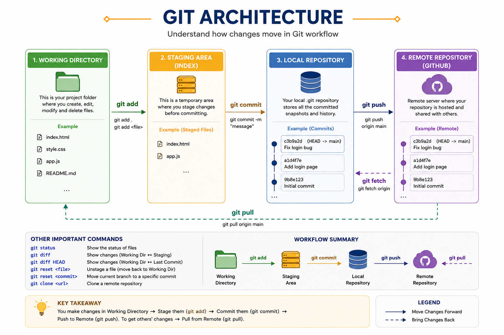

# Git Architecture

## 📖 Introduction

Git is a **Distributed Version Control System (DVCS)** that helps developers track changes, maintain version history, and collaborate efficiently.

Every change in Git moves through four major stages:

1. Working Tree (Working Directory)
2. Staging Area (Index)
3. Local Repository
4. Remote Repository

Understanding this workflow is the key to mastering Git.

---

# Git Architecture Workflow

> **Image Location:** `images/git-architecture-workflow.png`

<p align="center">
  
</p>

---

# Git Workflow Overview

```text
Working Tree
      │
      │ git add
      ▼
Staging Area
      │
      │ git commit
      ▼
Local Repository
      │
      │ git push
      ▼
Remote Repository (GitHub)
```

---

# Understanding Each Component

## 1️⃣ Working Tree (Working Directory)

The **Working Tree** is your project folder where you create, edit, rename, and delete files.

Example:

```text
Git_Project/
│
├── README.md
├── app.py
├── index.html
└── style.css
```

Whenever you modify a file, the changes exist only in the Working Tree until you stage them.

### Common Commands

```bash
git status
```

OBOBOBShows modified, deleted, and untracked files.

---

## 2️⃣ Staging Area (Index)

OBOBOBThe **Staging Area** acts as a preparation area for your next commit.

Use it to choose exactly which changes should be included in the next snapshot.

### Add all files

OBOBOB```bash
git add .
```

### Add a specific file

```bash
git add app.py
```

Workflow:

```text
OBOBOBWorking Tree
      │
 git add
      ▼
Staging Area
```

---

## 3️⃣ Local Repository

After staging your changes, create a permanent snapshot by committing them.

```bash
git commit -m "Added login functionality"
```

Each commit is stored in the hidden `.git` directory.

Workflow:

```text
Staging Area
      │
 git commit
      ▼
Local Repository
```

---

## 4️⃣ Remote Repository

The Remote Repository is hosted on services like GitHub, GitLab, or Bitbucket.

Upload your commits:

```bash
git push origin main
```

Download changes:

```bash
git pull origin main
```

Workflow:

```text
Local Repository
      │
 git push
      ▼
GitHub
```

---

# Understanding the Diagram

## git add / git mv / git rm

```text
Working Tree
      │
      ▼
Staging Area
```

These commands move changes from the Working Tree into the Staging Area.

Examples:

```bash
git add .
git add README.md
git mv old.txt new.txt
git rm temp.txt
```

---

## git commit

```text
Staging Area
      │
      ▼
Local Repository
```

Creates a permanent snapshot of staged changes.

```bash
git commit -m "Initial Commit"
```

---

## git push

```text
Local Repository
      │
      ▼
Remote Repository
```

Uploads local commits to the remote repository.

```bash
git push origin main
```

---

## git fetch

```text
Remote Repository
      │
      ▼
Local Repository
```

Downloads new commits from the remote repository **without** modifying your working files.

```bash
git fetch origin
```

---

## git pull

```text
Remote Repository
      │
      ▼
Working Tree
```

Downloads the latest changes and automatically merges them into your local branch.

```bash
git pull origin main
```

---

## git clone

Creates a complete copy of a remote repository on your local machine.

```bash
git clone https://github.com/username/project.git
```

---

## git diff

Shows differences between your Working Tree and the Staging Area.

```bash
git diff
```

Example:

```text
Working Tree
      │
 git diff
      ▼
Staging Area
```

---

## git diff HEAD

Shows differences between your current Working Tree and the latest committed version (HEAD).

```bash
git diff HEAD
```

---

## git reset <file>

Removes a file from the Staging Area without deleting your changes.

```bash
git reset app.py
```

Workflow:

```text
Staging Area
      │
 git reset app.py
      ▼
Working Tree
```

---

## git reset <commit>

Moves your branch back to a previous commit.

```bash
git reset --hard HEAD~1
```

> ⚠️ **Warning:** `--hard` permanently discards uncommitted changes.

---

# Complete Git Lifecycle

```text
Create/Edit File
        │
        ▼
Working Tree
        │
    git add
        ▼
Staging Area
        │
  git commit
        ▼
Local Repository
        │
   git push
        ▼
GitHub

GitHub
   │
git fetch
   ▼
Local Repository

GitHub
   │
git pull
   ▼
Working Tree
```

---

# Real-World Example

Imagine writing a book:

* **Working Tree** → You write and edit chapters.
* **Staging Area** → You select the chapters ready for publishing.
* **Local Repository** → You save a new edition of the book.
* **Remote Repository** → You upload the book to an online publisher for others to access.

---

# Key Takeaways

* **Working Tree**: Where you edit files.
* **Staging Area**: Where you prepare changes for a commit.
* **Local Repository**: Stores commits on your computer.
* **Remote Repository**: Stores the project online for collaboration.
* `git add` stages changes.
* `git commit` saves changes locally.
* `git push` uploads commits.
* `git fetch` downloads updates without merging.
* `git pull` downloads and merges updates.
* `git diff` compares changes.
* `git reset` unstages files or moves to previous commits.

---

# Interview Questions

### 1. What are the four main components of Git Architecture?

* Working Tree
* Staging Area
* Local Repository
* Remote Repository

---

### 2. What is the difference between `git add` and `git commit`?

* `git add` moves changes to the Staging Area.
* `git commit` saves staged changes into the Local Repository.

---

### 3. What is the difference between `git fetch` and `git pull`?

* `git fetch` downloads changes without merging them.
* `git pull` downloads and automatically merges the changes.

---

### 4. What does `git diff` do?

It compares changes between the Working Tree, Staging Area, or commits, depending on the command used.

---

### 5. What is the purpose of the Staging Area?

The Staging Area allows you to review and select changes before creating a commit.

