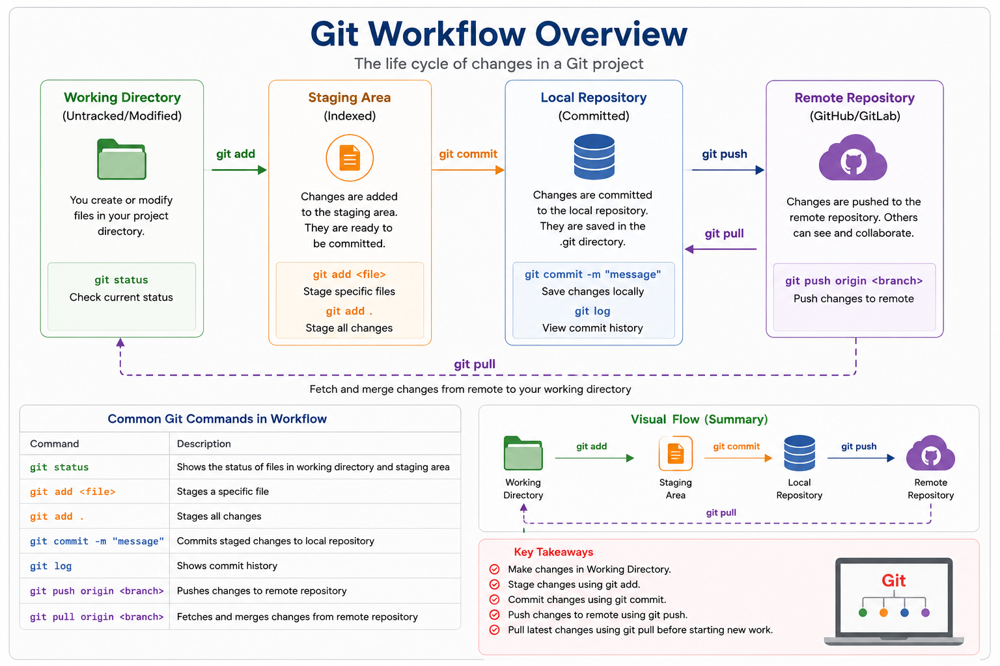

# Git Workflow

## 📖 Introduction

A **Git Workflow** is the sequence of steps developers follow to track changes, save their work, and collaborate with others using Git.

Every code change passes through multiple stages before it reaches the remote repository.

Understanding the Git workflow is essential for working on real-world software projects.

---
# Git Architecture Workflow

> **Image Location:** `images/GitWorkflowOverview.png`

<p align="center">
  
</p>

---

# Git Workflow Overview

```text
                    GIT WORKFLOW

        Create or Modify Files
                 │
                 ▼
        Working Directory
                 │
          git status
                 │
                 ▼
            git add
                 │
                 ▼
          Staging Area
                 │
         git commit -m
                 │
                 ▼
        Local Repository
                 │
          git push origin main
                 │
                 ▼
      Remote Repository (GitHub)
```

---

# Complete Git Workflow

```text
                ┌──────────────────────┐
                │  Remote Repository   │
                │       GitHub         │
                └──────────▲───────────┘
                           │
            git push       │      git pull
                           │
                ┌──────────┴───────────┐
                │   Local Repository   │
                │       (.git)         │
                └──────────▲───────────┘
                           │
                     git commit
                           │
                ┌──────────┴───────────┐
                │    Staging Area      │
                └──────────▲───────────┘
                           │
                       git add
                           │
                ┌──────────┴───────────┐
                │  Working Directory   │
                └──────────────────────┘
```

---

# Step 1: Create or Modify Files

Create or edit your project files.

Example:

```text
Project/
│
├── app.py
├── README.md
├── index.html
└── style.css
```

Check the status:

```bash
git status
```

Output:

```text
modified: app.py
modified: README.md
```

---

# Step 2: Stage Changes

Move changes from the Working Directory to the Staging Area.

Stage all files:

```bash
git add .
```

Stage a specific file:

```bash
git add app.py
```

Workflow:

```text
Working Directory
        │
    git add
        ▼
 Staging Area
```

---

# Step 3: Commit Changes

Save the staged changes into the Local Repository.

```bash
git commit -m "Added login feature"
```

Each commit creates a snapshot of your project.

Workflow:

```text
Staging Area
      │
 git commit
      ▼
Local Repository
```

---

# Step 4: Push to Remote Repository

Upload your local commits to GitHub.

```bash
git push origin main
```

Workflow:

```text
Local Repository
      │
 git push
      ▼
GitHub
```

---

# Step 5: Pull Latest Changes

Before starting new work, download the latest changes from the remote repository.

```bash
git pull origin main
```

Workflow:

```text
GitHub
    │
git pull
    ▼
Working Directory
```

---

# Daily Git Workflow

```text
Start Work
     │
     ▼
git pull
     │
     ▼
Modify Files
     │
     ▼
git status
     │
     ▼
git add .
     │
     ▼
git commit -m "Meaningful message"
     │
     ▼
git push origin main
```

---

# Example Workflow

### Create a new file

```bash
touch login.py
```

### Check status

```bash
git status
```

### Stage changes

```bash
git add login.py
```

### Commit

```bash
git commit -m "Added login module"
```

### Push

```bash
git push origin main
```

---

# Common Git Workflow Commands

| Command               | Description                             |
| --------------------- | --------------------------------------- |
| `git init`            | Initialize a Git repository             |
| `git clone`           | Download a remote repository            |
| `git status`          | View current status                     |
| `git add .`           | Stage all changes                       |
| `git add <file>`      | Stage a specific file                   |
| `git commit -m "msg"` | Save changes locally                    |
| `git log`             | View commit history                     |
| `git diff`            | View file differences                   |
| `git branch`          | List branches                           |
| `git checkout`        | Switch branches                         |
| `git merge`           | Merge branches                          |
| `git pull`            | Download and merge changes              |
| `git push`            | Upload commits to the remote repository |

---

# Best Practices

* Pull the latest changes before starting work.
* Commit frequently with meaningful messages.
* Test your code before committing.
* Push your changes regularly.
* Avoid committing sensitive files such as passwords or API keys.
* Use branches for new features and bug fixes.

---

# Real-World Example

Imagine writing a book with a team.

1. Write a new chapter (Working Directory).
2. Select the finished chapter (Staging Area).
3. Save a new edition (Local Repository).
4. Upload it to the publisher (Remote Repository).
5. Download teammates' updates before writing the next chapter.

---

# Key Takeaways

* The Git workflow follows a structured sequence from editing code to sharing it.
* `git add` stages your changes.
* `git commit` creates a local snapshot.
* `git push` uploads your commits to GitHub.
* `git pull` retrieves the latest changes from the remote repository.
* Following a consistent workflow reduces conflicts and improves collaboration.

---

# Interview Questions

### 1. What is a Git Workflow?

A Git Workflow is the sequence of steps used to track, save, and share code changes using Git.

---

### 2. What is the correct order of the Git workflow?

```text
Working Directory
        ↓
Staging Area
        ↓
Local Repository
        ↓
Remote Repository
```

---

### 3. What command stages changes?

```bash
git add .
```

---

### 4. What command creates a commit?

```bash
git commit -m "Commit message"
```

---

### 5. What command uploads changes to GitHub?

```bash
git push origin main
```

---

### 6. What command downloads the latest changes?

```bash
git pull origin main
```

---

# Summary

```text
Create Files
      │
      ▼
Working Directory
      │
git add
      ▼
Staging Area
      │
git commit
      ▼
Local Repository
      │
git push
      ▼
GitHub
      ▲
      │
git pull
```

Mastering this workflow is the foundation of using Git effectively in individual and team-based software development.

