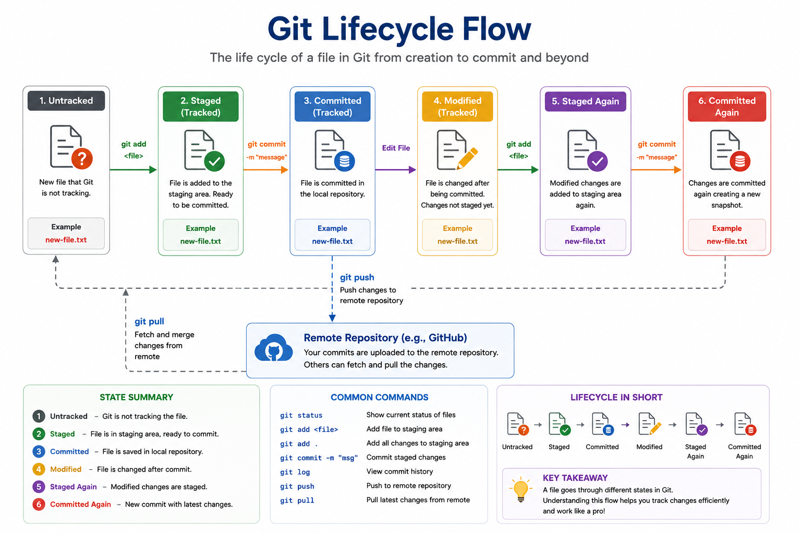

# 07 - Git Lifecycle

## 📖 What is the Git Lifecycle?

The **Git Lifecycle** represents the journey of a file from the moment it is created until it is committed and stored permanently in the Git repository.

Every file in Git moves through different states. Understanding these states helps you know exactly what Git is tracking and what actions you need to perform.

---

# Git Lifecycle Diagram

> **Save the diagram as:**

```text
images/Git-Lifecycle.png
```

Embed it in your README:

<p align="center">

</p>

---

# Git Lifecycle Flow

```text
                    GIT LIFECYCLE

          Create New File
                │
                ▼
          Untracked File
                │
          git add <file>
                │
                ▼
          Tracked (Staged)
                │
      git commit -m "message"
                │
                ▼
      Tracked (Committed)
                │
       Modify the File
                │
                ▼
      Modified (Tracked)
                │
           git add
                │
                ▼
             Staged
                │
          git commit
                │
                ▼
          Committed Again
```

---

# Git File States

Git manages files using **four primary states**.

## 1️⃣ Untracked

A newly created file that Git has never seen before.

Example:

```bash
touch app.py
```

Check status:

```bash
git status
```

Output:

```text
Untracked files:
    app.py
```

📌 Git does not include this file in commits until you add it.

---

## 2️⃣ Tracked

Once a file is added using:

```bash
git add app.py
```

Git starts tracking the file.

The file is now ready to be committed.

```text
Untracked
      │
 git add
      ▼
Tracked
```

---

## 3️⃣ Modified

If you edit a tracked file, Git detects the changes.

Example:

```python
print("Hello Git")
```

Check status:

```bash
git status
```

Output:

```text
Modified:
    app.py
```

Git knows the file has changed but those changes are **not yet staged**.

---

## 4️⃣ Staged

Move the modified file into the staging area.

```bash
git add app.py
```

Now Git is ready to include those changes in the next commit.

```text
Modified
     │
 git add
     ▼
 Staged
```

---

## 5️⃣ Committed

Save the staged changes permanently.

```bash
git commit -m "Added login functionality"
```

Git creates a snapshot of the project.

```text
Commit 1
     │
Commit 2
     │
Commit 3
```

Every commit has a unique SHA hash.

---

# Complete Lifecycle

```text
Create File
     │
     ▼
Untracked
     │
 git add
     ▼
Staged
     │
 git commit
     ▼
Committed
     │
Edit File
     ▼
Modified
     │
 git add
     ▼
Staged
     │
 git commit
     ▼
Committed
```

---

# Real Example

Create a file:

```bash
touch README.md
```

Check status:

```bash
git status
```

Stage it:

```bash
git add README.md
```

Commit it:

```bash
git commit -m "Initial README"
```

Modify the file:

```text
# Git Tutorial
```

Check status:

```bash
git status
```

Output:

```text
modified: README.md
```

Stage again:

```bash
git add README.md
```

Commit again:

```bash
git commit -m "Updated README"
```

---

# Lifecycle Commands

| File State     | Command                   |
| -------------- | ------------------------- |
| Create File    | `touch filename`          |
| Check Status   | `git status`              |
| Stage Changes  | `git add <file>`          |
| Stage All      | `git add .`               |
| Commit Changes | `git commit -m "message"` |
| View History   | `git log`                 |

---

# Git Lifecycle vs Git Workflow

| Git Lifecycle                             | Git Workflow                              |
| ----------------------------------------- | ----------------------------------------- |
| Describes the states of a file            | Describes the overall development process |
| Focuses on file tracking                  | Focuses on developer activities           |
| Untracked → Staged → Committed → Modified | Edit → Add → Commit → Push → Pull         |
| File-centric                              | Process-centric                           |

---

# Real-World Analogy

Imagine writing a school assignment.

```text
Write Assignment
      │
      ▼
Untracked

Submit for Review
      │
      ▼
Staged

Teacher Accepts
      │
      ▼
Committed

Edit Again
      │
      ▼
Modified

Resubmit
      │
      ▼
Committed Again
```

---

# Best Practices

* Check file status regularly with `git status`.
* Stage only the files you intend to commit.
* Make small, meaningful commits.
* Write clear commit messages.
* Review changes using `git diff` before staging.
* Commit frequently to maintain a clean history.

---

# Key Takeaways

* Every new file starts as **Untracked**.
* `git add` moves files to the **Staged** state.
* `git commit` creates a permanent snapshot.
* Editing a committed file changes it to **Modified**.
* Modified files must be staged again before committing.
* Understanding the lifecycle helps you use Git confidently and avoid losing work.

---

## Next Chapter

➡️ **08 - Installing Git**

