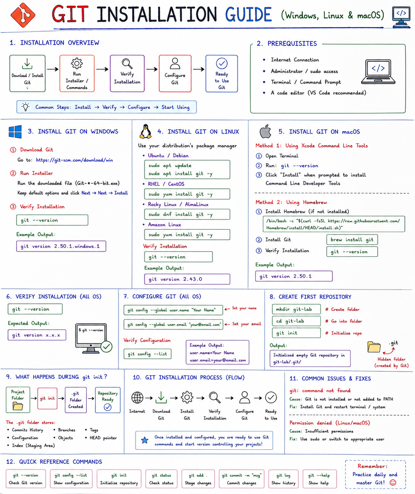

# 💻 Git Installation Guide (Windows, Linux & macOS)

## 📌 Introduction

Git is a Distributed Version Control System (DVCS) used to track code changes, collaborate with teams, and manage project history efficiently.

This guide covers Git installation on:

* Windows
* Linux
* macOS

---

# 🏗️ Git Installation Overview

```text
                 Git Installation
                         │
        ┌────────────────┼────────────────┐
        │                │                │
        ▼                ▼                ▼
    Windows          Linux            macOS
        │                │                │
        ▼                ▼                ▼
 Install Git      Package Manager    Xcode/Homebrew
        │                │                │
        └────────────────┼────────────────┘
                         │
                         ▼
                 Verify Installation
                         │
                         ▼
                  Configure Git
                         │
                         ▼
                   Ready to Use
```

---

# 🪟 Install Git on Windows

## Step 1: Download Git

Download from:

```text
https://git-scm.com/download/win
```

## Step 2: Run Installer

Execute:

```text
Git-<version>-64-bit.exe
```

Keep default settings and click:

```text
Next → Next → Install
```

## Step 3: Verify Installation

Open Command Prompt:

```bash
git --version
```

Example:

```text
git version 2.50.1.windows.1
```

---

# 🐧 Install Git on Linux

## Ubuntu / Debian

```bash
sudo apt update
sudo apt install git -y
```

## RHEL / CentOS

```bash
sudo yum install git -y
```

## Rocky Linux / AlmaLinux

```bash
sudo dnf install git -y
```

## Amazon Linux

```bash
sudo yum install git -y
```

## Verify

```bash
git --version
```

Example:

```text
git version 2.43.0
```

---

# 🍎 Install Git on macOS

## Method 1: Xcode Command Line Tools

Open Terminal:

```bash
git --version
```

If Git is not installed:

```text
Install Command Line Developer Tools?
```

Click:

```text
Install
```

---

## Method 2: Homebrew

Install Git:

```bash
brew install git
```

Verify:

```bash
git --version
```

---

# 📊 Installation Comparison

| OS              | Installation Method |
| --------------- | ------------------- |
| Windows         | Git Installer       |
| Ubuntu/Debian   | apt                 |
| RHEL/CentOS     | yum                 |
| Rocky/AlmaLinux | dnf                 |
| Amazon Linux    | yum                 |
| macOS           | Xcode Tools         |
| macOS           | Homebrew            |

---

# ✅ Verify Installation

Run:

```bash
git --version
```

Expected Output:

```text
git version x.x.x
```

---

# ⚙️ Configure Git

Configure username:

```bash
git config --global user.name "Newton Babu"
```

Configure email:

```bash
git config --global user.email "your-email@example.com"
```

Verify:

```bash
git config --list
```

Example:

```text
user.name=Newton Babu
user.email=your-email@example.com
```

---

# 📊 Git Configuration Workflow

```text
Git Installed
      │
      ▼
Configure Username
      │
      ▼
Configure Email
      │
      ▼
Ready to Use Git
```

---

# 🚀 Create First Repository

Create folder:

```bash
mkdir git-lab
cd git-lab
```

Initialize Git:

```bash
git init
```

Output:

```text
Initialized empty Git repository
```

---

# 📊 What Happens During git init?

```text
Project Folder
      │
      ▼
git init
      │
      ▼
.git Directory Created
      │
      ▼
Repository Ready
```

---

# 🔍 Verify Repository

Linux/macOS:

```bash
ls -la
```

Windows:

```cmd
dir /a
```

Output:

```text
.git
```

---

# 🌍 Real-World Example

Without Git:

```text
project-final
project-final-v2
project-final-v3
project-final-final
```

With Git:

```text
Project
   │
   ▼
Git Tracks Every Version
```

---

# ⚠️ Common Errors

## Git Not Found

```bash
git: command not found
```

Fix:

Install Git properly.

---

## Permission Denied

Use Administrator (Windows) or sudo (Linux/macOS).

---

# 📊 Git Workflow

```text
Working Directory
        │
   git add
        ▼
 Staging Area
        │
 git commit
        ▼
 Local Repository
        │
  git push
        ▼
Remote Repository
   (GitHub)
```

---

# 📝 Practice Lab

```bash
git --version

git config --global user.name "Your Name"

git config --global user.email "your@email.com"

mkdir test-repo

cd test-repo

git init

git status
```

Expected Result:

```text
Repository initialized successfully.
```

---

# 🎯 Key Takeaways

✅ Git is available on Windows, Linux, and macOS

✅ Verify installation using:

```bash
git --version
```

✅ Configure username and email before using Git

✅ Initialize repositories using:

```bash
git init
```

✅ Git tracks every change made to your project

✅ Git works locally and with GitHub

---

## 🚀 Next Topic

```text
04-Configure-Git.md
```

Learn how to configure Git, manage global settings, aliases, and user profiles.
# 💻 Git Installation Guide (Windows, Linux & macOS)

<p align="center">
  
</p>

<p align="center">
  <b>Complete Git Installation Guide for Windows, Linux, and macOS</b>
</p>

---

## 📌 Introduction

Git is a Distributed Version Control System (DVCS) that helps developers track code changes, collaborate with teams, and manage project history efficiently.

This guide covers:

- Windows Installation
- Linux Installation
- macOS Installation
- Git Configuration
- Repository Initialization
- Troubleshooting

# ✅ Verify Git Installation

## 📌 Introduction

After installing Git, it is important to verify that the installation was successful.

Verification ensures:

* Git is installed correctly
* Git commands are accessible from the terminal
* The installed version can be identified
* The system PATH is configured properly

---

# 🎯 Why Verify Git?

Verification helps confirm:

✅ Git installation completed successfully

✅ Git command is accessible

✅ Environment variables are configured

✅ Git is ready for use

---

# 📊 Verification Workflow

```text
Install Git
     │
     ▼
Open Terminal
     │
     ▼
git --version
     │
     ▼
Version Displayed
     │
     ▼
Git Ready
```

---

# 🪟 Verify on Windows

Open:

```text
Command Prompt
```

or

```text
Git Bash
```

Run:

```bash
git --version
```

Example Output:

```text
git version 2.50.1.windows.1
```

---

# 🐧 Verify on Linux

Open Terminal:

```bash
git --version
```

Example Output:

```text
git version 2.43.0
```

---

# 🍎 Verify on macOS

Open Terminal:

```bash
git --version
```

Example Output:

```text
git version 2.50.1
```

---

# 📊 Verification Diagram

```text
Windows
Linux
macOS
   │
   ▼
git --version
   │
   ▼
Git Version
Displayed
   │
   ▼
Installation Verified
```

---

# 🔍 Check Git Location

### Linux / macOS

```bash
which git
```

Example:

```text
/usr/bin/git
```

### Windows

```cmd
where git
```

Example:

```text
C:\Program Files\Git\cmd\git.exe
```

---

# 🔍 Check Git Configuration

View all Git settings:

```bash
git config --list
```

Example Output:

```text
user.name=Newton Babu
user.email=your@email.com
```

---

# 📊 Git Verification Process

```text
Git Installed
      │
      ▼
Check Version
      │
      ▼
Check Location
      │
      ▼
Check Configuration
      │
      ▼
Ready for Development
```

---

# 🚀 Test Git Repository

Create a test directory:

```bash
mkdir git-test
cd git-test
```

Initialize Git:

```bash
git init
```

Expected Output:

```text
Initialized empty Git repository
```

Check Status:

```bash
git status
```

Output:

```text
On branch main

No commits yet
nothing to commit
```

---

# ⚠️ Common Errors

## Error 1

```bash
git: command not found
```

### Cause

Git is not installed.

### Solution

Install Git using your operating system package manager.

---

## Error 2

```bash
'git' is not recognized as an internal or external command
```

### Cause

Git PATH not configured.

### Solution

Reinstall Git and enable:

```text
Git from command line
```

during installation.

---

# 📊 Success Checklist

```text
☑ Git Installed

☑ Version Displayed

☑ Git Path Found

☑ Configuration Verified

☑ Repository Initialized

☑ git status Working
```

---

# 🎯 Key Takeaways

✅ Use:

```bash
git --version
```

to verify installation.

✅ Use:

```bash
which git
```

or

```cmd
where git
```

to locate Git.

✅ Use:

```bash
git config --list
```

to verify configuration.

✅ Use:

```bash
git init
```

to test repository creation.

---

# 📝 Practice Lab

```bash
git --version

git config --list

mkdir verify-git

cd verify-git

git init

git status
```

Expected Result:

```text
Git installation verified successfully.
```

🎉 Congratulations! Your Git installation is verified and ready to use.
<p align="center">
  
</p>
