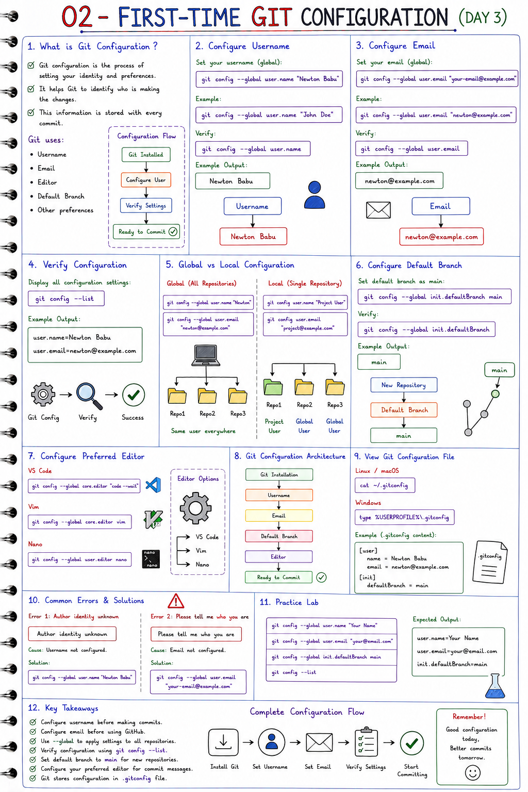

# ⚙️ First-Time Git Configuration

<p align="center">
  
</p>

<p align="center">
  <b>Git First-Time Configuration - Handwritten Study Notes</b>
</p>

---

# 📌 Introduction

After installing Git, the first step is to configure your identity.

Git uses this information to record:

- Who made the changes
- Who created commits
- Who contributed to the repository
- Commit history and ownership

Every commit contains:

- Author Name
- Author Email
- Commit Message
- Timestamp

---

# 🎯 Why Configure Git?

Without configuration, Git cannot identify the author of a commit.

### Without Configuration

```text
Git Installed
      │
      ▼
Author Unknown
      │
      ▼
Commit Failed
```

### With Configuration

```text
Git Installed
      │
      ▼
Configure Username
      │
      ▼
Configure Email
      │
      ▼
Ready to Commit
```

---

# 👤 Configure Username

Set your Git username globally:

```bash
git config --global user.name "Newton Babu"
```

Verify:

```bash
git config --global user.name
```

Example Output:

```text
Newton Babu
```

---

# 📧 Configure Email

Set your Git email globally:

```bash
git config --global user.email "your-email@example.com"
```

Verify:

```bash
git config --global user.email
```

Example Output:

```text
your-email@example.com
```

---

# 🔍 Verify Configuration

Display all configured settings:

```bash
git config --list
```

Example Output:

```text
user.name=Newton Babu
user.email=your-email@example.com
```

---

# 🌍 Global vs Local Configuration

## Global Configuration

Applies to all repositories on your system.

```bash
git config --global user.name "Newton Babu"
git config --global user.email "your-email@example.com"
```

### Diagram

```text
Computer
   │
   ├── Repo1
   ├── Repo2
   └── Repo3

Global Configuration
Applies Everywhere
```

---

## Local Configuration

Applies only to the current repository.

```bash
git config user.name "Project User"
git config user.email "project@example.com"
```

### Diagram

```text
Repo1 → Custom User
Repo2 → Global User
Repo3 → Global User
```

---

# 🚀 Configure Default Branch

Set `main` as the default branch name:

```bash
git config --global init.defaultBranch main
```

Verify:

```bash
git config --global init.defaultBranch
```

Output:

```text
main
```

---

# 📝 Configure Preferred Editor

### VS Code

```bash
git config --global core.editor "code --wait"
```

### Vim

```bash
git config --global core.editor vim
```

### Nano

```bash
git config --global core.editor nano
```

---

# 📂 View Git Configuration File

### Linux / macOS

```bash
cat ~/.gitconfig
```

### Windows

```cmd
type %USERPROFILE%\.gitconfig
```

Example:

```ini
[user]
    name = Newton Babu
    email = your-email@example.com

[init]
    defaultBranch = main
```

---

# 🌍 Real-World Example

Suppose three developers are working on the same project.

```text
Developer A
    │
    ▼
git commit
    │
    ▼
Author = Newton Babu

Developer B
    │
    ▼
git commit
    │
    ▼
Author = John Doe

Developer C
    │
    ▼
git commit
    │
    ▼
Author = Jane Smith
```

Git uses the configured username and email to identify contributors.

---

# ⚠️ Common Errors

## Error: Author Identity Unknown

```text
Author identity unknown
```

### Solution

```bash
git config --global user.name "Newton Babu"
```

---

## Error: Please Tell Me Who You Are

```text
Please tell me who you are
```

### Solution

```bash
git config --global user.email "your-email@example.com"
```

---

# 🧪 Practice Lab

Run the following commands:

```bash
git config --global user.name "Your Name"

git config --global user.email "your@email.com"

git config --global init.defaultBranch main

git config --list
```

Expected Output:

```text
user.name=Your Name
user.email=your@email.com
init.defaultBranch=main
```

---

# 📊 Configuration Workflow

```text
Install Git
     │
     ▼
Set Username
     │
     ▼
Set Email
     │
     ▼
Verify Settings
     │
     ▼
Ready for Development
```

---

# 🎯 Key Takeaways

✅ Configure username before making commits

✅ Configure email before using GitHub

✅ Use `--global` for all repositories

✅ Verify settings using:

```bash
git config --list
```

✅ Set the default branch to:

```bash
git config --global init.defaultBranch main
```

✅ Configure your preferred editor

✅ Git stores configuration in the `.gitconfig` file

---

# 🚀 Next Topic

```text
03-Basic-Git-Commands.md
```

Learn how to initialize repositories, add files, commit changes, and check repository status.
