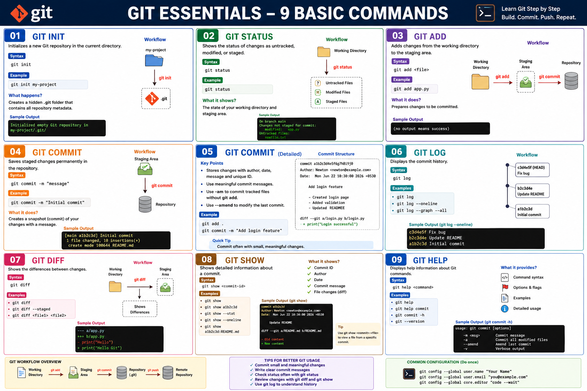

# 🚀 Git Fundamentals Master Guide

<p align="center">
  
</p>

<p align="center">
  <strong>Complete Git Learning Roadmap for Beginners, DevOps Engineers, Cloud Engineers, and Developers</strong>
</p>

---

## 📖 About This Repository

This repository contains a structured Git learning path covering the most commonly used Git commands with:

- Detailed explanations
- Real-world examples
- Workflow diagrams
- Hands-on labs
- Interview questions
- Best practices
- Quick reference guides

---

## 🎯 Learning Objectives

After completing this guide, you will be able to:

- Configure Git correctly
- Initialize repositories
- Track file changes
- Stage and commit code
- View commit history
- Compare changes
- Inspect commits
- Use Git documentation effectively
- Follow Git best practices

---

# 📚 Git Learning Modules

| No | Topic | Link |
|----|--------|------|
| 01 | Git Config | [01-Git-Config.md](./01-Git-Config.md) |
| 02 | Git Init | [02-Git-Init.md](./02-Git-Init.md) |
| 03 | Git Status | [03-Git-Status.md](./03-Git-Status.md) |
| 04 | Git Add | [04-Git-Add.md](./04-Git-Add.md) |
| 05 | Git Commit | [05-Git-Commit.md](./05-Git-Commit.md) |
| 06 | Git Log | [06-Git-Log.md](./06-Git-Log.md) |
| 07 | Git Diff | [07-Git-Diff.md](./07-Git-Diff.md) |
| 08 | Git Show | [08-Git-Show.md](./08-Git-Show.md) |
| 09 | Git Help | [09-Git-Help.md](./09-Git-Help.md) |

---

# 🏗 Git Architecture

```text
                 ┌──────────────────┐
                 │ Working Directory│
                 └─────────┬────────┘
                           │
                           │ git add
                           ▼
                 ┌──────────────────┐
                 │  Staging Area    │
                 └─────────┬────────┘
                           │
                           │ git commit
                           ▼
                 ┌──────────────────┐
                 │ Local Repository │
                 └─────────┬────────┘
                           │
                           │ git push
                           ▼
                 ┌──────────────────┐
                 │ Remote Repository│
                 └──────────────────┘
