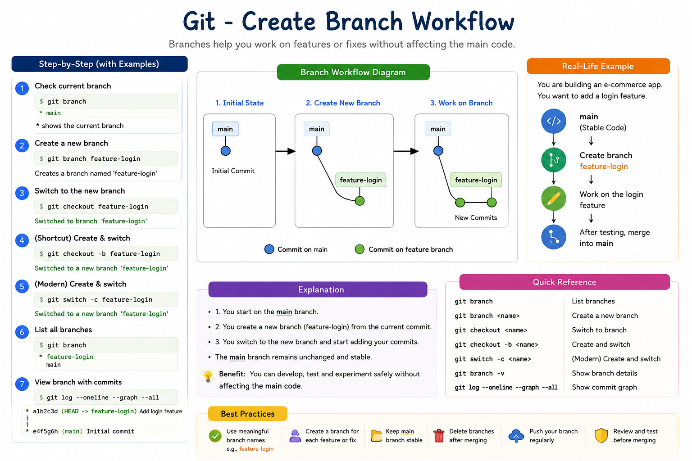

# 01 - Create Branch in Git

## Introduction

A branch in Git is an independent line of development. Branches allow developers to work on new features, bug fixes, or experiments without affecting the main codebase.

Think of a branch as a separate workspace where you can make changes safely. Once the work is completed and tested, it can be merged back into the main branch.

---

# Why Use Branches?

Using branches provides several advantages:

* Develop features independently
* Fix bugs without impacting production code
* Collaborate with multiple developers
* Test experimental changes safely
* Maintain a clean and stable main branch

---

# Git Branch Workflow

```text
                main
                  |
                  |
                  ● Initial Commit
                  |
                  ● Commit 2
                 / \
                /   \
               /     \
 feature-login     bug-fix
      |               |
      ●               ●
      ●               ●
```

Each branch can have its own commits and development history.

<p align="center">
  
</p>

<p align="center">
  <em>Figure 1: Git Create Branch Workflow with Commands, Examples, and Best Practices</em>
</p>

---

# View Existing Branches

To display all local branches:

```bash
git branch
```

Example Output:

```bash
* main
```

Explanation:

* `*` indicates the current branch.
* Currently, you are working on the `main` branch.

---

# Create a New Branch

Syntax:

```bash
git branch <branch-name>
```

Example:

```bash
git branch feature-login
```

This creates a new branch called `feature-login`.

Verify:

```bash
git branch
```

Output:

```bash
feature-login
* main
```

The branch has been created, but you are still on the `main` branch.

---

# Switch to the New Branch

Syntax:

```bash
git checkout <branch-name>
```

Example:

```bash
git checkout feature-login
```

Output:

```bash
Switched to branch 'feature-login'
```

Verify:

```bash
git branch
```

Output:

```bash
* feature-login
  main
```

---

# Create and Switch in One Command

Git provides a shortcut:

```bash
git checkout -b feature-login
```

This command:

1. Creates the branch
2. Switches to the branch

Output:

```bash
Switched to a new branch 'feature-login'
```

---

# Modern Git Method

Git now recommends:

```bash
git switch -c feature-login
```

Explanation:

* `switch` = move between branches
* `-c` = create new branch

---

# Practical Example

## Step 1: Initialize Repository

```bash
mkdir git-branch-demo
cd git-branch-demo

git init
```

---

## Step 2: Create a File

```bash
echo "Welcome to Git" > README.md
```

---

## Step 3: Commit Changes

```bash
git add .

git commit -m "Initial Commit"
```

---

## Step 4: Create Branch

```bash
git checkout -b feature-login
```

---

## Step 5: Modify File

```bash
echo "Login Feature Development" >> README.md
```

Check status:

```bash
git status
```

Output:

```bash
modified: README.md
```

---

## Step 6: Commit Changes

```bash
git add .

git commit -m "Added login feature"
```

---

# Visual Representation

Before Creating Branch:

```text
main
 |
 ● Initial Commit
```

After Creating Branch:

```text
main
 |
 ● Initial Commit
 |
 └── feature-login
```

After Adding Commits:

```text
main
 |
 ● Initial Commit
 |
 └── feature-login
         |
         ● Added login feature
```

---

# List All Branches

Local Branches:

```bash
git branch
```

Example:

```bash
* feature-login
  main
```

---

# Show Branch Details

```bash
git branch -v
```

Output:

```bash
* feature-login 7a5e9ab Added login feature
  main          2f4a1bc Initial Commit
```

---

# View Branch Graph

```bash
git log --oneline --graph --all
```

Example:

```text
* 7a5e9ab Added login feature
|
* 2f4a1bc Initial Commit
```

---

# Common Branch Naming Conventions

Feature Branch:

```text
feature-login
feature-payment
feature-dashboard
```

Bug Fix Branch:

```text
bugfix-login-error
bugfix-api-timeout
```

Hotfix Branch:

```text
hotfix-production-issue
```

Release Branch:

```text
release-v1.0
release-v2.0
```

---

# Best Practices

✔ Use meaningful branch names

✔ Create branches for every feature

✔ Keep the main branch stable

✔ Delete unused branches

✔ Commit frequently

✔ Push branches regularly

---

# Hands-On Lab

Create a repository:

```bash
mkdir branch-lab
cd branch-lab

git init
```

Create file:

```bash
echo "Git Branch Lab" > README.md
```

Commit:

```bash
git add .
git commit -m "Initial Commit"
```

Create branch:

```bash
git checkout -b feature-authentication
```

Verify:

```bash
git branch
```

Add changes:

```bash
echo "Authentication Module" >> README.md
```

Commit:

```bash
git add .
git commit -m "Added authentication module"
```

View graph:

```bash
git log --oneline --graph --all
```

---

# Key Takeaways

* A branch is an isolated development line.
* `git branch` creates a branch.
* `git checkout <branch>` switches branches.
* `git checkout -b <branch>` creates and switches.
* `git switch -c <branch>` is the modern approach.
* Branches help teams collaborate safely.
* Always use meaningful branch names.

---

# Quick Reference

```bash
# View branches
git branch

# Create branch
git branch feature-login

# Switch branch
git checkout feature-login

# Create and switch
git checkout -b feature-login

# Modern method
git switch -c feature-login

# View branch details
git branch -v

# View graph
git log --oneline --graph --all
```

