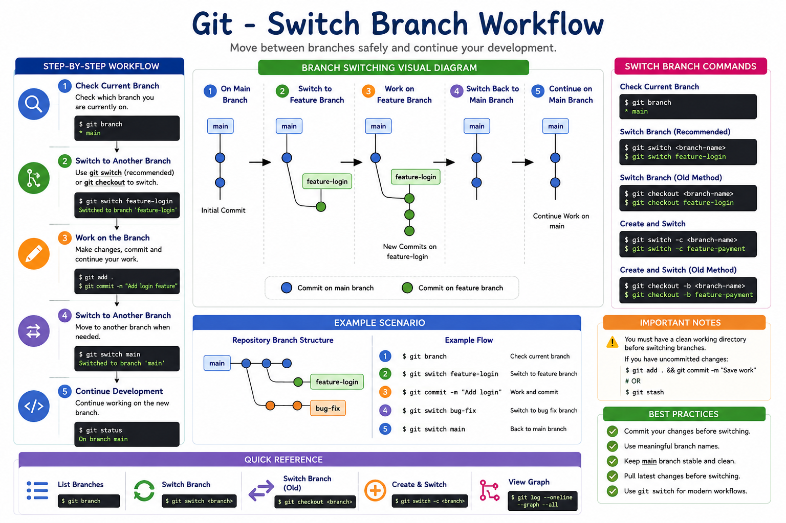

# 02 - Switch Branch in Git

## Introduction

Git allows developers to switch between branches easily. Branch switching helps you move from one line of development to another without affecting existing work.

For example, you may be working on a login feature in one branch and need to switch to a bug-fix branch to resolve an urgent issue.

---

# Learning Objectives

After completing this module, you will be able to:

* Understand branch switching
* Switch between existing branches
* Use `git checkout`
* Use `git switch`
* Verify your current branch
* Follow branch-switching best practices

---

# What is Branch Switching?

Branch switching means moving from one branch to another branch in a Git repository.

Git updates your working directory to match the selected branch.

---

# Branch Switching Workflow

```text
                  main
                    |
                    ● Initial Commit
                   / \
                  /   \
                 /     \
     feature-login     bug-fix
            ▲
            |
      Currently Here

Switch To:

                  main
                    |
                    ● Initial Commit
                   / \
                  /   \
                 /     \
     feature-login     bug-fix
                          ▲
                          |
                    Switched Here
```

---

# Check Current Branch

Before switching branches, check where you are:

```bash
git branch
```

Example:

```bash
* feature-login
  main
  bug-fix
```

Explanation:

* `*` indicates the current branch.
* Currently working on `feature-login`.

---

# Switch Branch Using Checkout

Syntax:

```bash
git checkout <branch-name>
```

Example:

```bash
git checkout main
```

Output:

```bash
Switched to branch 'main'
```

Verify:

```bash
git branch
```

Output:

```bash
* main
  feature-login
  bug-fix
```

---

# Switch Branch Using Git Switch (Recommended)

Modern Git recommends using:

```bash
git switch <branch-name>
```

Example:

```bash
git switch feature-login
```

Output:

```bash
Switched to branch 'feature-login'
```

---

# Practical Example

## Step 1: Create Repository

```bash
mkdir git-switch-demo
cd git-switch-demo

git init
```

---

## Step 2: Create File

```bash
echo "Git Branch Demo" > README.md
```

---

## Step 3: Commit Changes

```bash
git add .
git commit -m "Initial Commit"
```

---

## Step 4: Create Branches

```bash
git branch feature-login
git branch bug-fix
```

Check branches:

```bash
git branch
```

Output:

```bash
bug-fix
feature-login
* main
```

---

## Step 5: Switch to Feature Branch

```bash
git switch feature-login
```

Verify:

```bash
git branch
```

Output:

```bash
bug-fix
* feature-login
main
```

---

## Step 6: Add Changes

```bash
echo "Login Module" >> README.md
```

Commit:

```bash
git add .
git commit -m "Added login module"
```

---

## Step 7: Switch Back to Main

```bash
git switch main
```

Notice:

```bash
cat README.md
```

Output:

```text
Git Branch Demo
```

The login feature changes are not visible because they belong to the feature branch.

---

# Visual Example

## Before Switching

```text
Current Branch

* feature-login

README.md

Git Branch Demo
Login Module
```

---

## After Switching to Main

```text
Current Branch

* main

README.md

Git Branch Demo
```

---

# View All Branches

```bash
git branch
```

Example:

```bash
bug-fix
feature-login
* main
```

---

# View Branch Graph

```bash
git log --oneline --graph --all
```

Example:

```text
* a1b2c3d Added login module
|
* e4f5g6h Initial Commit
```

---

# Common Commands

### Show Current Branch

```bash
git branch
```

### Switch Branch

```bash
git switch feature-login
```

### Alternative Method

```bash
git checkout feature-login
```

### Create and Switch

```bash
git switch -c feature-payment
```

or

```bash
git checkout -b feature-payment
```

---

# Important Notes

### Clean Working Tree Required

Git may prevent switching if there are uncommitted changes.

Example:

```bash
error: Your local changes would be overwritten by checkout
```

Fix:

```bash
git add .
git commit -m "Save work"

# or

git stash
```

Then switch again.

---

# Best Practices

✔ Commit before switching branches

✔ Use meaningful branch names

✔ Keep the main branch stable

✔ Verify current branch before making changes

✔ Pull latest updates before starting work

✔ Use `git switch` for modern Git workflows

---

# Hands-On Lab

Create repository:

```bash
mkdir switch-lab
cd switch-lab

git init
```

Create file:

```bash
echo "Git Lab" > README.md
```

Commit:

```bash
git add .
git commit -m "Initial Commit"
```

Create branches:

```bash
git branch feature-auth
git branch bug-fix
```

Switch branches:

```bash
git switch feature-auth
git switch bug-fix
git switch main
```

Verify:

```bash
git branch
```

---

# Real-World Scenario

Suppose you are working on:

```text
main
│
├── Stable Production Code
│
├── feature-login
│   └── Login Development
│
└── bug-fix
    └── Production Issue Fix
```

If a production issue occurs, you can switch immediately:

```bash
git switch bug-fix
```

Fix the issue without disturbing feature development.

---

# Key Takeaways

* Branch switching allows movement between development lines.
* `git switch` is the modern command.
* `git checkout` is the traditional command.
* Always verify your current branch.
* Commit or stash changes before switching.
* Branch switching is essential for team collaboration.

---

# Quick Reference

```bash
# View branches
git branch

# Switch branch
git switch main

# Alternative
git checkout main

# Create and switch
git switch -c feature-login

# Create and switch (old method)
git checkout -b feature-login

# View commit graph
git log --oneline --graph --all
```
<hr>

<h2 align="center">Workflow Summary</h2>

<p align="center">
  
</p>

<p align="center">
  <em>Git Branch Switching Workflow with Commands, Examples, and Best Practices</em>
</p>

<hr>

<h3 align="center">Next Module → 03-Checkout.md</h3>
