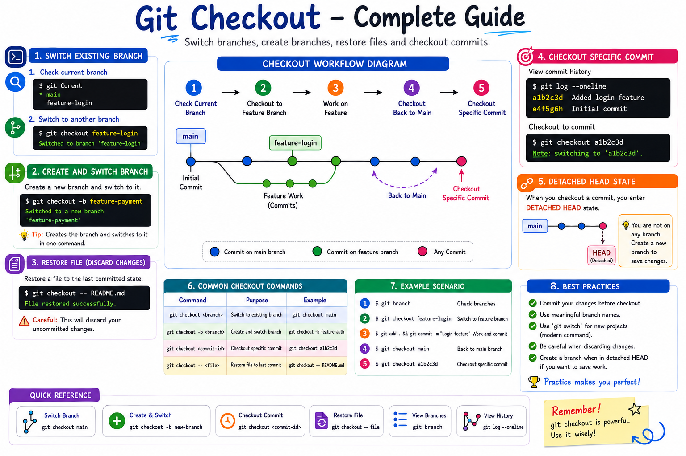

# 03 - Git Checkout

## Introduction

`git checkout` is one of the most commonly used Git commands.

It allows you to:

* Switch between branches
* Create and switch to a new branch
* Restore files from a commit
* Move to a specific commit

Although modern Git recommends using `git switch` and `git restore`, many projects and interview questions still use `git checkout`.

---

# Learning Objectives

After completing this module, you will be able to:

* Understand the purpose of `git checkout`
* Switch between branches
* Create and switch branches
* Restore files
* Checkout specific commits
* Understand detached HEAD state

---

# What is Git Checkout?

Git Checkout changes the current working state of your repository.

Think of it as telling Git:

> "Take me to this branch, commit, or file version."

---

# Git Checkout Workflow

```text
                main
                  |
                  ● Initial Commit
                 / \
                /   \
               /     \
 feature-login     bug-fix

git checkout feature-login
          ↓

Current Branch = feature-login
```

---

# Syntax

## Switch Branch

```bash
git checkout <branch-name>
```

Example:

```bash
git checkout feature-login
```

Output:

```bash
Switched to branch 'feature-login'
```

---

# Check Current Branch

```bash
git branch
```

Example:

```bash
* feature-login
  main
```

The `*` indicates your current branch.

---

# Create and Switch Branch

Syntax:

```bash
git checkout -b <branch-name>
```

Example:

```bash
git checkout -b feature-payment
```

Output:

```bash
Switched to a new branch 'feature-payment'
```

This command:

1. Creates a branch
2. Switches to it immediately

---

# Practical Example

## Create Repository

```bash
mkdir checkout-demo
cd checkout-demo

git init
```

---

## Create File

```bash
echo "Git Learning" > README.md
```

---

## Commit Changes

```bash
git add .
git commit -m "Initial Commit"
```

---

## Create Branch

```bash
git branch feature-login
```

---

## Switch Branch

```bash
git checkout feature-login
```

Verify:

```bash
git branch
```

Output:

```bash
* feature-login
  main
```

---

# Checkout a Specific Commit

View commits:

```bash
git log --oneline
```

Example:

```bash
a1b2c3d Added login feature
e4f5g6h Initial Commit
```

Checkout commit:

```bash
git checkout a1b2c3d
```

Output:

```bash
Note: switching to 'a1b2c3d'
```

---

# Detached HEAD State

When you checkout a commit instead of a branch, Git enters:

```text
Detached HEAD
```

Diagram:

```text
main
 |
 ● Initial Commit
 |
 ● Added Login
 |
 ● Added Dashboard

        ↑
        HEAD
```

After:

```bash
git checkout a1b2c3d
```

```text
main
 |
 ● Initial Commit
 |
 ● Added Login  ← HEAD
 |
 ● Added Dashboard
```

You are no longer on a branch.

---

# Restore a File

Suppose README.md has unwanted changes.

Check status:

```bash
git status
```

Restore file:

```bash
git checkout -- README.md
```

Result:

```text
File restored to last committed version
```

---

# Common Checkout Commands

### Switch Branch

```bash
git checkout main
```

### Create and Switch

```bash
git checkout -b feature-auth
```

### Checkout Commit

```bash
git checkout a1b2c3d
```

### Restore File

```bash
git checkout -- README.md
```

---

# Checkout vs Switch

| Command                 | Purpose                |
| ----------------------- | ---------------------- |
| git checkout main       | Switch branch          |
| git switch main         | Modern branch switch   |
| git checkout -b feature | Create & switch        |
| git switch -c feature   | Modern create & switch |
| git checkout -- file    | Restore file           |

---

# Real World Example

Imagine:

```text
main
 |
 ├── feature-login
 |
 ├── feature-payment
 |
 └── bug-fix
```

You are developing login functionality.

```bash
git checkout feature-login
```

Production issue reported?

```bash
git checkout bug-fix
```

Fix the issue and continue working.

---

# Best Practices

✔ Use meaningful branch names

✔ Commit changes before checkout

✔ Verify current branch

✔ Prefer `git switch` for new projects

✔ Learn checkout because it appears in interviews and legacy repositories

---

# Hands-On Lab

Create Repository:

```bash
mkdir checkout-lab
cd checkout-lab

git init
```

Create File:

```bash
echo "Git Checkout Lab" > README.md
```

Commit:

```bash
git add .
git commit -m "Initial Commit"
```

Create Branch:

```bash
git checkout -b feature-auth
```

Verify:

```bash
git branch
```

Switch Back:

```bash
git checkout main
```

View Log:

```bash
git log --oneline
```

---

# Key Takeaways

* `git checkout` is a versatile Git command.
* It can switch branches.
* It can create and switch branches.
* It can restore files.
* It can checkout specific commits.
* Checking out a commit creates a Detached HEAD state.
* Modern Git recommends `git switch` and `git restore`.

---

# Quick Reference

```bash
# Switch branch
git checkout main

# Create and switch branch
git checkout -b feature-login

# Checkout commit
git checkout <commit-id>

# Restore file
git checkout -- README.md

# View branches
git branch

# View commits
git log --oneline
```

---
---

# Workflow Summary

The following diagram summarizes the complete Git Checkout workflow, including branch switching, branch creation, file restoration, commit checkout, and Detached HEAD state.

<p align="center">
  
</p>

<p align="center">
  <em>
    Figure 1: Git Checkout Workflow - Switch Branches, Create Branches,
    Restore Files, Checkout Commits, and Understand Detached HEAD State.
  </em>
</p>

---

# Next Module

➡️ **04-Merge.md**

In the next module, you will learn:

- What is Git Merge
- Fast-Forward Merge
- Three-Way Merge
- Merge Workflow
- Merge Best Practices
- Real-World Examples
- Merge Visualization Diagrams

Happy Learning! 🚀
