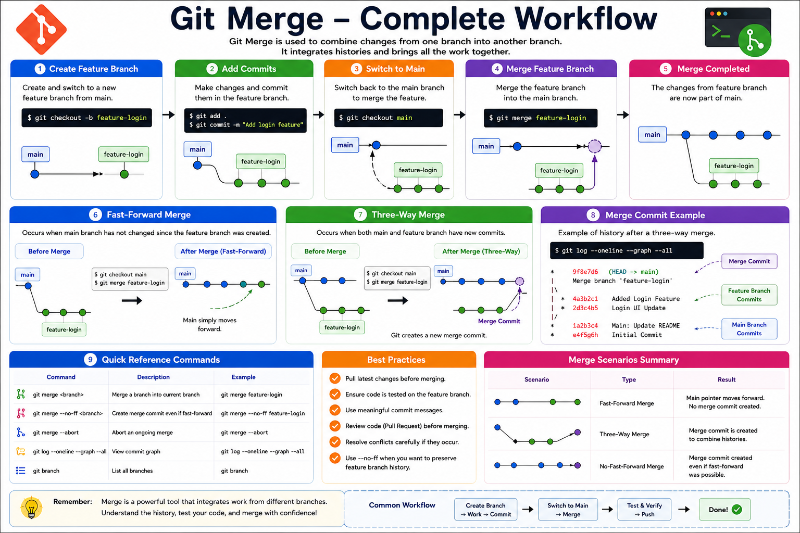

# 04 - Git Merge

## Introduction

Git Merge is used to combine changes from one branch into another branch.

It is one of the most important Git operations because it allows developers to integrate completed work from feature branches into the main branch.

For example:

* A developer creates a feature branch.
* Develops a login feature.
* Tests the feature.
* Merges the feature into the main branch.

---

# Learning Objectives

After completing this module, you will be able to:

* Understand Git Merge
* Perform a basic merge
* Understand Fast-Forward Merge
* Understand Three-Way Merge
* View merge history
* Follow merge best practices

---

# What is Git Merge?

Git Merge combines the histories of two branches.

Example:

```text
main
 |
 ├── feature-login
 |
 └── feature-payment
```

After development is completed, changes can be merged into the main branch.

---

# Git Merge Workflow

```text
Before Merge

main
 |
 ● Initial Commit
 |
 ● Commit A
 |
 └──── feature-login
         |
         ● Login Commit 1
         |
         ● Login Commit 2


After Merge

main
 |
 ● Initial Commit
 |
 ● Commit A
 |
 ● Merge Commit
 |
 └──── feature-login
         |
         ● Login Commit 1
         |
         ● Login Commit 2
```

---

# Why Use Git Merge?

Benefits:

* Combine completed features
* Integrate bug fixes
* Maintain branch history
* Support team collaboration
* Keep development organized

---

# Basic Merge Process

## Step 1: Check Current Branch

```bash
git branch
```

Example:

```bash
* feature-login
  main
```

---

## Step 2: Switch to Main Branch

```bash
git switch main
```

Output:

```bash
Switched to branch 'main'
```

---

## Step 3: Merge Feature Branch

```bash
git merge feature-login
```

Output:

```bash
Updating a1b2c3d..e4f5g6h
Fast-forward
```

---

# Practical Example

## Create Repository

```bash
mkdir merge-demo
cd merge-demo

git init
```

---

## Create Initial File

```bash
echo "Git Merge Demo" > README.md
```

Commit:

```bash
git add .
git commit -m "Initial Commit"
```

---

## Create Feature Branch

```bash
git checkout -b feature-login
```

---

## Add New Changes

```bash
echo "Login Feature" >> README.md
```

Commit:

```bash
git add .
git commit -m "Added Login Feature"
```

---

## Switch to Main

```bash
git switch main
```

---

## Merge Branch

```bash
git merge feature-login
```

---

## Verify Merge

```bash
cat README.md
```

Output:

```text
Git Merge Demo
Login Feature
```

The feature branch changes are now part of main.

---

# Fast-Forward Merge

A Fast-Forward Merge happens when the main branch has not changed since the feature branch was created.

Example:

```text
Before

main
 |
 ● Initial Commit
 |
 └── feature-login
      |
      ● Login Commit
```

Merge:

```bash
git merge feature-login
```

After:

```text
main
 |
 ● Initial Commit
 |
 ● Login Commit
```

Git simply moves the branch pointer forward.

---

# Three-Way Merge

A Three-Way Merge occurs when both branches have new commits.

Example:

```text
Before

main
 |
 ● Initial Commit
 |
 ● Main Commit
 |
 └── feature-login
      |
      ● Login Commit
```

Merge:

```bash
git merge feature-login
```

After:

```text
main
 |
 ● Initial Commit
 |
 ● Main Commit
 |\
 | \
 |  ● Login Commit
 |
 ● Merge Commit
```

Git creates a new Merge Commit.

---

# View Merge History

Show commit graph:

```bash
git log --oneline --graph --all
```

Example:

```text
*   9f8e7d6 Merge branch 'feature-login'
|\
| * 4a3b2c1 Added Login Feature
|/
* 1a2b3c4 Initial Commit
```

---

# Merge Without Fast Forward

Force Git to create a Merge Commit:

```bash
git merge --no-ff feature-login
```

Example:

```text
main
 |
 ● Initial Commit
 |
 ● Merge Commit
 |
 └── Feature History
```

Useful for preserving feature history.

---

# Common Merge Commands

Merge branch:

```bash
git merge feature-login
```

Merge with commit:

```bash
git merge --no-ff feature-login
```

Abort merge:

```bash
git merge --abort
```

View graph:

```bash
git log --oneline --graph --all
```

---

# Real-World Example

Suppose your team has:

```text
main
 |
 ├── feature-login
 ├── feature-payment
 ├── feature-dashboard
 └── bug-fix
```

After testing:

```bash
git switch main
git merge feature-login
```

The login feature becomes part of the production codebase.

---

# Best Practices

✔ Pull latest changes before merging

✔ Test feature branches before merging

✔ Use meaningful commit messages

✔ Review code before merging

✔ Prefer Pull Requests in team environments

✔ Use --no-ff when preserving feature history is important

---

# Hands-On Lab

Create repository:

```bash
mkdir merge-lab
cd merge-lab

git init
```

Create file:

```bash
echo "Merge Lab" > README.md
```

Commit:

```bash
git add .
git commit -m "Initial Commit"
```

Create branch:

```bash
git checkout -b feature-auth
```

Add changes:

```bash
echo "Authentication Module" >> README.md
```

Commit:

```bash
git add .
git commit -m "Added Authentication Module"
```

Switch to main:

```bash
git switch main
```

Merge:

```bash
git merge feature-auth
```

Verify:

```bash
cat README.md
```

---

# Key Takeaways

* Git Merge combines changes from one branch into another.
* Fast-Forward Merge moves the branch pointer.
* Three-Way Merge creates a Merge Commit.
* Merge is essential for team collaboration.
* Always test code before merging.
* Use git log --graph to visualize merge history.

---

# Quick Reference

```bash
# Switch branch
git switch main

# Merge branch
git merge feature-login

# Merge with commit
git merge --no-ff feature-login

# Abort merge
git merge --abort

# View graph
git log --oneline --graph --all

# View branches
git branch
```

---
<hr>

<h2 align="center">Workflow Summary</h2>

<p align="center">
  
</p>

<p align="center">
  <em>
    Git Merge Workflow - Fast Forward Merge, Three-Way Merge,
    Merge Commits, Commands, and Best Practices
  </em>
</p>

<hr>

<h3 align="center">
  Next Module → 05-Rebase.md
</h3>

# Next Module

➡️ 05-Rebase.md

Learn how Git Rebase rewrites commit history to create a cleaner and more linear project history.

