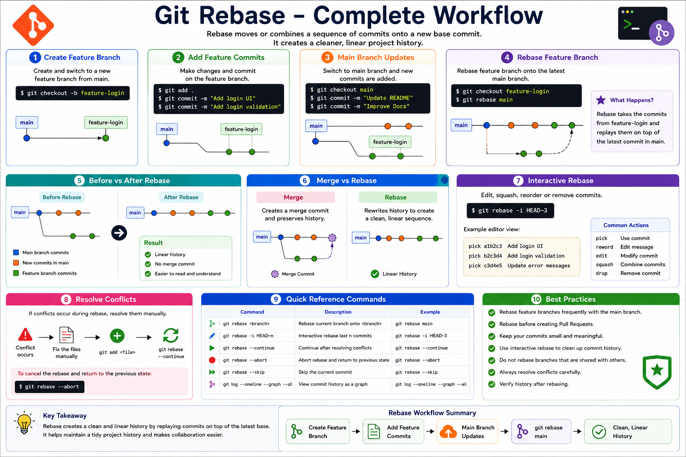

# 05 - Git Rebase

## Introduction

Git Rebase is used to move or combine a sequence of commits onto a new base commit.

Unlike Git Merge, which creates a merge commit, Git Rebase rewrites commit history to create a cleaner and more linear project history.

Rebase is commonly used to:

* Keep commit history clean
* Synchronize feature branches with the latest main branch
* Avoid unnecessary merge commits
* Prepare branches before merging

---

# Learning Objectives

After completing this module, you will be able to:

* Understand Git Rebase
* Perform a basic rebase
* Understand how rebase differs from merge
* Resolve rebase conflicts
* Use Interactive Rebase
* Follow rebase best practices

---

# What is Git Rebase?

Rebase takes commits from one branch and reapplies them on top of another branch.

Instead of combining histories like Merge, Rebase rewrites history.

Example:

```text
Before Rebase

main
 |
 ● Initial Commit
 |
 ● Commit A
 |
 └── feature-login
      |
      ● Commit B
      ● Commit C
```

After Rebase:

```text
main
 |
 ● Initial Commit
 |
 ● Commit A
 |
 ● Commit B
 |
 ● Commit C
```

The feature branch commits are moved to the latest main branch.

---

# Git Rebase Workflow

```text
Step 1

main
 |
 ● A
 |
 ● B
 |
 └── feature
      |
      ● C
      ● D

Step 2

git rebase main

Step 3

main
 |
 ● A
 |
 ● B
 |
 ● C
 |
 ● D
```

---

# Why Use Rebase?

Benefits:

* Cleaner commit history
* Easier project tracking
* Avoid unnecessary merge commits
* Better readability in Git logs
* Preferred in many DevOps workflows

---

# Basic Rebase Process

## Step 1: Switch to Feature Branch

```bash
git switch feature-login
```

---

## Step 2: Rebase onto Main

```bash
git rebase main
```

Git moves your feature commits on top of the latest main branch.

---

## Step 3: Verify History

```bash
git log --oneline --graph --all
```

---

# Practical Example

## Create Repository

```bash
mkdir rebase-demo
cd rebase-demo

git init
```

---

## Create Initial Commit

```bash
echo "Git Rebase Demo" > README.md

git add .
git commit -m "Initial Commit"
```

---

## Create Feature Branch

```bash
git checkout -b feature-login
```

---

## Add Feature Commit

```bash
echo "Login Feature" >> README.md

git add .
git commit -m "Added Login Feature"
```

---

## Switch to Main

```bash
git switch main
```

---

## Add Main Commit

```bash
echo "Main Branch Update" >> README.md

git add .
git commit -m "Updated Main Branch"
```

---

## Switch Back to Feature Branch

```bash
git switch feature-login
```

---

## Rebase Feature Branch

```bash
git rebase main
```

Git replays your feature commits on top of main.

---

# Merge vs Rebase

## Merge

```text
main
 |
 ● A
 |\
 | \
 |  ● C
 |
 ● Merge Commit
```

Command:

```bash
git merge feature-login
```

Result:

* Creates merge commit
* Preserves history

---

## Rebase

```text
main
 |
 ● A
 |
 ● C
```

Command:

```bash
git rebase main
```

Result:

* Cleaner history
* No merge commit

---

# Viewing Rebased History

```bash
git log --oneline --graph --all
```

Example:

```text
* d4e5f6 Added Login Feature
* c3d4e5 Updated Main Branch
* a1b2c3 Initial Commit
```

---

# Interactive Rebase

Interactive Rebase allows you to:

* Edit commits
* Rename commit messages
* Squash commits
* Remove commits

Command:

```bash
git rebase -i HEAD~3
```

Example:

```text
pick a1b2c3 Added Login
pick b2c3d4 Fixed Bug
pick c3d4e5 Updated README
```

Options:

```text
pick    Use commit
reword  Edit commit message
edit    Modify commit
squash  Combine commits
drop    Remove commit
```

---

# Squashing Commits

Before:

```text
Added Login UI
Fixed Login Bug
Updated Login Validation
```

Interactive Rebase:

```bash
git rebase -i HEAD~3
```

After Squash:

```text
Added Complete Login Feature
```

Cleaner history.

---

# Handling Rebase Conflicts

Sometimes Git cannot automatically apply commits.

Example:

```bash
git rebase main
```

Output:

```text
CONFLICT (content): Merge conflict in README.md
```

---

# Resolve Conflict

Edit file manually.

Then:

```bash
git add README.md

git rebase --continue
```

---

# Abort Rebase

Cancel rebase:

```bash
git rebase --abort
```

Repository returns to previous state.

---

# Common Rebase Commands

Start rebase:

```bash
git rebase main
```

Interactive rebase:

```bash
git rebase -i HEAD~3
```

Continue rebase:

```bash
git rebase --continue
```

Abort rebase:

```bash
git rebase --abort
```

Skip commit:

```bash
git rebase --skip
```

---

# Real-World Example

A DevOps engineer creates:

```text
feature-monitoring
```

Meanwhile:

```text
main
```

receives new updates.

Before creating a Pull Request:

```bash
git switch feature-monitoring
git rebase main
```

The feature branch is updated with the latest changes and maintains a clean history.

---

# Best Practices

✔ Rebase feature branches frequently

✔ Rebase before creating Pull Requests

✔ Use Interactive Rebase to clean commits

✔ Avoid rebasing shared branches

✔ Resolve conflicts carefully

✔ Verify history after rebasing

---

# Hands-On Lab

Create repository:

```bash
mkdir rebase-lab
cd rebase-lab

git init
```

Create file:

```bash
echo "Rebase Lab" > README.md
```

Commit:

```bash
git add .
git commit -m "Initial Commit"
```

Create branch:

```bash
git checkout -b feature-auth
```

Add changes:

```bash
echo "Authentication Module" >> README.md

git add .
git commit -m "Added Authentication Module"
```

Switch to main:

```bash
git switch main
```

Add update:

```bash
echo "Main Update" >> README.md

git add .
git commit -m "Main Update"
```

Rebase:

```bash
git switch feature-auth

git rebase main
```

Verify:

```bash
git log --oneline --graph --all
```

---

# Key Takeaways

* Rebase rewrites commit history.
* Rebase creates a linear history.
* Rebase does not create merge commits.
* Interactive Rebase helps clean commits.
* Resolve conflicts carefully.
* Avoid rebasing branches shared with other developers.

---

# Quick Reference

```bash
# Rebase current branch
git rebase main

# Interactive Rebase
git rebase -i HEAD~3

# Continue Rebase
git rebase --continue

# Abort Rebase
git rebase --abort

# Skip Commit
git rebase --skip

# View History
git log --oneline --graph --all
```

---

<hr>

<h2 align="center">Git Rebase Workflow Summary</h2>

<p align="center">
  
</p>

<p align="center">
  <em>
    Complete Git Rebase Workflow - Rebase, Interactive Rebase,
    Conflict Resolution, Merge vs Rebase, and Best Practices
  </em>
</p>

<hr>

<h3 align="center">
  Next Module → 06-Cherry-Pick.md
</h3>
In the next module, you will learn how to copy specific commits from one branch to another using Git Cherry-Pick.

