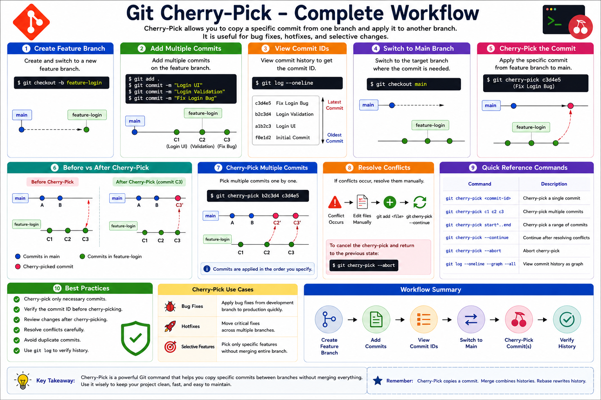

# 06 - Git Cherry-Pick

## Introduction

Git Cherry-Pick allows you to copy a specific commit from one branch and apply it to another branch.

Unlike Merge or Rebase, Cherry-Pick does not bring all commits from a branch. Instead, it selects only the commit you need.

This is useful when:

* A bug fix is needed in multiple branches
* A feature commit must be copied to another branch
* You want only one specific change from a branch

---

# Learning Objectives

After completing this module, you will be able to:

* Understand Git Cherry-Pick
* Copy commits between branches
* Cherry-pick multiple commits
* Handle Cherry-Pick conflicts
* View Cherry-Pick history
* Follow Cherry-Pick best practices

---

# What is Git Cherry-Pick?

Cherry-Pick applies an existing commit from another branch to the current branch.

Example:

```text
main
 |
 ● A
 |
 ● B

feature-login
 |
 ● C
 |
 ● D
```

Cherry-Pick Commit C:

```bash
git cherry-pick <commit-id>
```

Result:

```text
main
 |
 ● A
 |
 ● B
 |
 ● C
```

Only commit C is copied.

---

# Git Cherry-Pick Workflow

```text
feature-login
 |
 ● Login UI
 |
 ● Login Validation
 |
 ● Login Bug Fix
      |
      | Cherry-Pick
      V

main
 |
 ● Initial Commit
 |
 ● Login Bug Fix
```

Only the selected commit moves to the target branch.

---

# Why Use Cherry-Pick?

Benefits:

* Copy individual commits
* Avoid unnecessary merges
* Move bug fixes quickly
* Apply fixes across multiple branches
* Select only required changes

---

# Basic Cherry-Pick Process

## Step 1: View Commit History

```bash
git log --oneline
```

Example:

```text
a1b2c3 Added Login UI
b2c3d4 Added Validation
c3d4e5 Fixed Login Bug
```

---

## Step 2: Switch Target Branch

```bash
git switch main
```

---

## Step 3: Cherry-Pick Commit

```bash
git cherry-pick c3d4e5
```

Output:

```text
[main 7f8e9d]
Fixed Login Bug
```

---

## Step 4: Verify History

```bash
git log --oneline
```

Result:

```text
7f8e9d Fixed Login Bug
a1b2c3 Initial Commit
```

---

# Practical Example

## Create Repository

```bash
mkdir cherry-pick-demo
cd cherry-pick-demo

git init
```

---

## Create Initial Commit

```bash
echo "Git Cherry Pick Demo" > README.md

git add .
git commit -m "Initial Commit"
```

---

## Create Feature Branch

```bash
git checkout -b feature-login
```

---

## Add New Feature

```bash
echo "Login UI" >> README.md

git add .
git commit -m "Added Login UI"
```

---

## Add Bug Fix

```bash
echo "Bug Fixed" >> README.md

git add .
git commit -m "Fixed Login Bug"
```

---

## View Commit IDs

```bash
git log --oneline
```

Example:

```text
c3d4e5 Fixed Login Bug
b2c3d4 Added Login UI
a1b2c3 Initial Commit
```

---

## Switch to Main

```bash
git switch main
```

---

## Cherry-Pick Bug Fix

```bash
git cherry-pick c3d4e5
```

Now the bug fix is copied into main.

---

# Cherry-Pick Multiple Commits

Single Command:

```bash
git cherry-pick commit1 commit2 commit3
```

Example:

```bash
git cherry-pick a1b2c3 b2c3d4 c3d4e5
```

---

# Cherry-Pick Commit Range

Syntax:

```bash
git cherry-pick start_commit^..end_commit
```

Example:

```bash
git cherry-pick a1b2c3^..c3d4e5
```

Copies all commits in the range.

---

# Viewing Cherry-Picked History

```bash
git log --oneline --graph --all
```

Example:

```text
* 7f8e9d Fixed Login Bug
* a1b2c3 Initial Commit
```

---

# Handling Cherry-Pick Conflicts

Sometimes Git cannot automatically apply a commit.

Example:

```bash
git cherry-pick c3d4e5
```

Output:

```text
CONFLICT (content): Merge conflict in README.md
```

---

# Resolve Conflict

Edit the file manually.

Then:

```bash
git add README.md
git cherry-pick --continue
```

---

# Abort Cherry-Pick

Cancel operation:

```bash
git cherry-pick --abort
```

Repository returns to previous state.

---

# Common Cherry-Pick Commands

Cherry-Pick single commit:

```bash
git cherry-pick <commit-id>
```

Cherry-Pick multiple commits:

```bash
git cherry-pick commit1 commit2
```

Continue:

```bash
git cherry-pick --continue
```

Abort:

```bash
git cherry-pick --abort
```

View history:

```bash
git log --oneline --graph --all
```

---

# Merge vs Rebase vs Cherry-Pick

| Feature              | Merge     | Rebase | Cherry-Pick |
| -------------------- | --------- | ------ | ----------- |
| Combine Branches     | Yes       | No     | No          |
| Rewrite History      | No        | Yes    | No          |
| Copy Specific Commit | No        | No     | Yes         |
| Creates Merge Commit | Sometimes | No     | No          |
| Selective Changes    | No        | No     | Yes         |

---

# Real-World Example

Suppose production contains:

```text
main
```

A critical bug fix exists in:

```text
feature-payment
```

Instead of merging the entire branch:

```bash
git cherry-pick c3d4e5
```

Only the bug-fix commit is copied into production.

---

# Best Practices

✔ Cherry-pick only necessary commits

✔ Verify commit IDs before cherry-picking

✔ Review changes after cherry-picking

✔ Resolve conflicts carefully

✔ Avoid duplicate commits

✔ Use Git Log to verify history

---

# Hands-On Lab

Create Repository:

```bash
mkdir cherry-pick-lab
cd cherry-pick-lab

git init
```

Create Branch:

```bash
git checkout -b feature-auth
```

Add Feature:

```bash
echo "Authentication Module" > auth.txt

git add .
git commit -m "Added Authentication Module"
```

View Commits:

```bash
git log --oneline
```

Switch Branch:

```bash
git switch main
```

Cherry-Pick:

```bash
git cherry-pick <commit-id>
```

Verify:

```bash
git log --oneline --graph --all
```

---

# Key Takeaways

* Cherry-Pick copies specific commits.
* It does not merge entire branches.
* Useful for bug fixes and selective changes.
* Multiple commits can be cherry-picked.
* Conflicts may occur and must be resolved.
* Cherry-Pick is widely used in production support environments.

---

# Quick Reference

```bash
# Cherry-Pick single commit
git cherry-pick <commit-id>

# Cherry-Pick multiple commits
git cherry-pick commit1 commit2

# Continue
git cherry-pick --continue

# Abort
git cherry-pick --abort

# View history
git log --oneline --graph --all
```

---
<hr>

<h2 align="center">Git Cherry-Pick Workflow Summary</h2>

<p align="center">
  
</p>

<p align="center">
  <em>
    Complete Git Cherry-Pick Workflow - Copy Specific Commits,
    Resolve Conflicts, View History, and Follow Best Practices
  </em>
</p>

<hr>

<h3 align="center">
  Next Module → 07-Delete-Branch.md
</h3>


