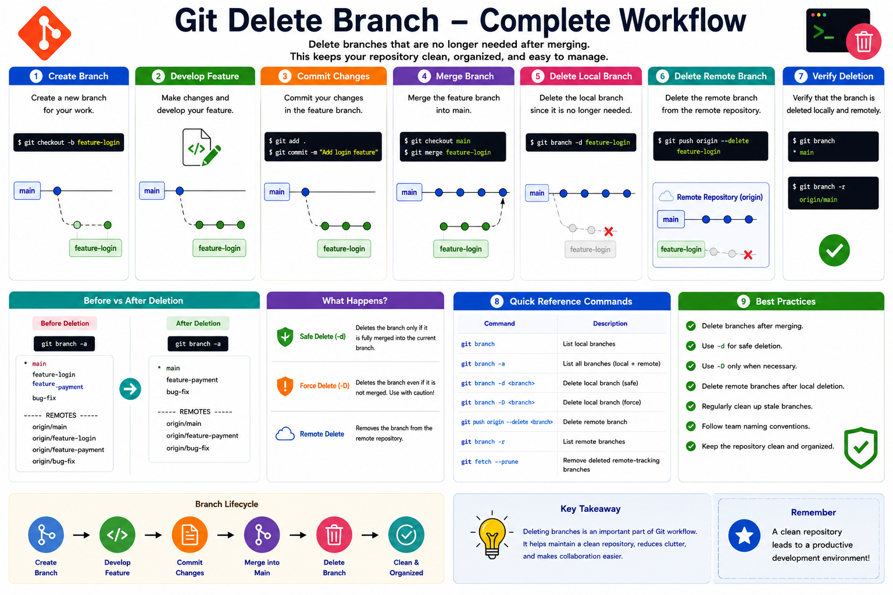

# 07 - Delete Branch in Git

## Introduction

Git allows developers to create branches for features, bug fixes, experiments, and releases. Once the work is completed and merged, the branch is no longer needed.

Deleting unused branches helps:

* Keep repositories clean
* Reduce confusion
* Improve branch management
* Maintain organized workflows

This module explains how to delete both local and remote Git branches safely.

---

# Learning Objectives

After completing this module, you will be able to:

* Delete local branches
* Delete remote branches
* Understand safe vs force deletion
* Verify branch deletion
* Follow branch cleanup best practices

---

# Why Delete Branches?

After a branch is merged into the main branch, keeping it serves little purpose.

Example:

```text
Before Cleanup

main
 |
 ├── feature-login
 ├── feature-payment
 ├── bug-fix
 └── release-v1.0
```

After Cleanup:

```text
main
 |
 └── Active Development
```

Removing old branches keeps the repository easier to manage.

---

# Git Delete Branch Workflow

```text
Create Branch
      |
      V
Develop Feature
      |
      V
Commit Changes
      |
      V
Merge Branch
      |
      V
Delete Branch
```

---

# View Existing Branches

Before deleting a branch:

```bash
git branch
```

Example:

```text
feature-login
feature-payment
* main
```

---

# Delete Local Branch

## Syntax

```bash
git branch -d <branch-name>
```

Example:

```bash
git branch -d feature-login
```

Output:

```text
Deleted branch feature-login (was a1b2c3d).
```

---

# Safe Delete (-d)

The `-d` option deletes a branch only if it has already been merged.

Example:

```bash
git branch -d feature-login
```

Benefits:

* Prevents accidental data loss
* Recommended for most situations

---

# Force Delete Branch

Sometimes a branch has not been merged.

Git will display:

```text
error: The branch 'feature-login' is not fully merged.
```

Force delete:

```bash
git branch -D feature-login
```

Output:

```text
Deleted branch feature-login (was a1b2c3d).
```

---

# Difference Between -d and -D

| Command                   | Purpose      |
| ------------------------- | ------------ |
| git branch -d branch-name | Safe delete  |
| git branch -D branch-name | Force delete |

---

# Practical Example

## Create Repository

```bash
mkdir delete-branch-demo
cd delete-branch-demo

git init
```

---

## Create Branch

```bash
git checkout -b feature-login
```

---

## Verify Branch

```bash
git branch
```

Output:

```text
* feature-login
main
```

---

## Switch to Main

```bash
git switch main
```

---

## Delete Branch

```bash
git branch -d feature-login
```

Output:

```text
Deleted branch feature-login
```

---

# Delete Multiple Branches

Example:

```bash
git branch -d feature-login feature-payment bug-fix
```

Git deletes all specified branches.

---

# Delete Remote Branch

Deleting a local branch does not remove it from GitHub.

Delete remote branch:

```bash
git push origin --delete feature-login
```

Output:

```text
To github.com:user/repo.git
 - [deleted] feature-login
```

---

# Verify Remote Branches

View remote branches:

```bash
git branch -r
```

Example:

```text
origin/main
origin/feature-payment
```

---

# View All Branches

```bash
git branch -a
```

Example:

```text
* main
remotes/origin/main
remotes/origin/feature-payment
```

---

# Real-World Example

A development team creates:

```text
main
 |
 ├── feature-login
 ├── feature-payment
 ├── feature-dashboard
 └── bug-fix
```

After merging:

```bash
git switch main

git merge feature-login
```

Cleanup:

```bash
git branch -d feature-login

git push origin --delete feature-login
```

Result:

```text
main
 |
 ├── feature-payment
 ├── feature-dashboard
 └── bug-fix
```

---

# Common Delete Branch Commands

Delete local branch:

```bash
git branch -d feature-login
```

Force delete:

```bash
git branch -D feature-login
```

Delete remote branch:

```bash
git push origin --delete feature-login
```

List branches:

```bash
git branch
```

List remote branches:

```bash
git branch -r
```

List all branches:

```bash
git branch -a
```

---

# Best Practices

✔ Delete merged branches regularly

✔ Verify branch is merged before deletion

✔ Use `-d` whenever possible

✔ Use `-D` carefully

✔ Delete remote branches after merge

✔ Periodically clean stale branches

✔ Follow team branch naming conventions

---

# Hands-On Lab

Create Repository:

```bash
mkdir delete-branch-lab
cd delete-branch-lab

git init
```

Create Branch:

```bash
git checkout -b feature-auth
```

Switch Back:

```bash
git switch main
```

Delete Branch:

```bash
git branch -d feature-auth
```

Verify:

```bash
git branch
```

Expected Output:

```text
* main
```

---

# Key Takeaways

* Branches should be deleted after merging.
* `git branch -d` performs a safe delete.
* `git branch -D` performs a force delete.
* Local and remote branches are deleted separately.
* Repository cleanup improves maintainability.
* Regular branch management is a Git best practice.

---

# Quick Reference

```bash
# View branches
git branch

# Delete local branch
git branch -d feature-login

# Force delete branch
git branch -D feature-login

# Delete remote branch
git push origin --delete feature-login

# View remote branches
git branch -r

# View all branches
git branch -a
```

---

<hr>

<h2 align="center">Git Delete Branch Workflow Summary</h2>

<p align="center">
  
</p>

<p align="center">
  <em>
    Complete Git Branch Deletion Workflow - Local Branch Deletion,
    Remote Branch Deletion, Verification, Commands, and Best Practices
  </em>
</p>

<hr>

<h3 align="center">
  Next Module → 08-Merge-Conflict.md
</h3>


