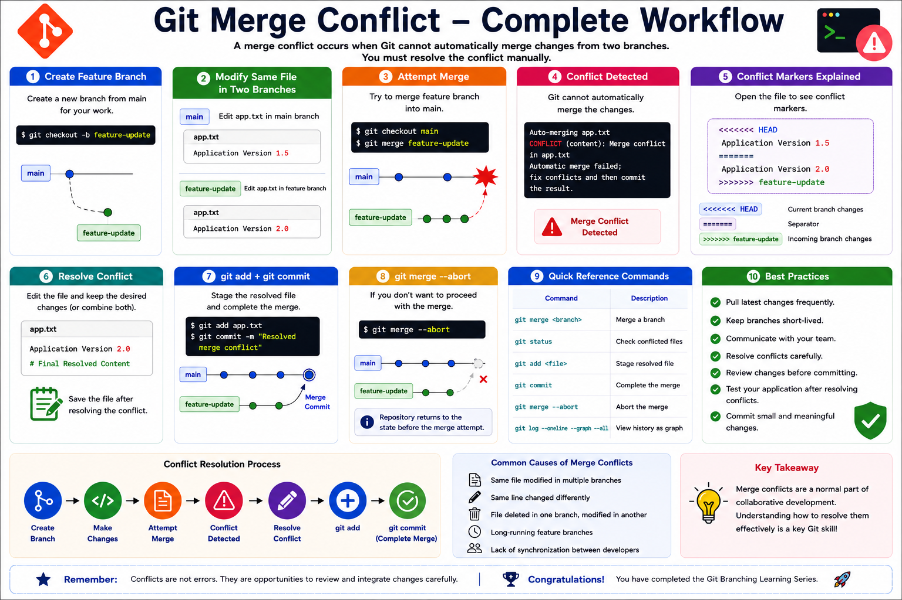

# 08 - Merge Conflict in Git

## Introduction

A Merge Conflict occurs when Git cannot automatically merge changes from two branches.

This typically happens when:

* Two developers modify the same line of code
* Two branches change the same file differently
* Git cannot determine which change should be kept

Merge conflicts are a normal part of collaborative development and every DevOps Engineer, Developer, and SRE should know how to resolve them.

---

# Learning Objectives

After completing this module, you will be able to:

* Understand Merge Conflicts
* Identify conflict situations
* Resolve Merge Conflicts manually
* Continue the merge process
* Abort a merge if necessary
* Follow conflict resolution best practices

---

# What is a Merge Conflict?

Git automatically merges changes whenever possible.

However, if two branches modify the same section of a file, Git needs human intervention.

Example:

### Main Branch

```text
Application Version 1.0
```

### Feature Branch

```text
Application Version 2.0
```

Git cannot determine which version should be retained.

Result:

```text
Merge Conflict
```

---

# Why Do Merge Conflicts Occur?

Common Causes:

* Same file modified in multiple branches
* Same line changed differently
* Deleted file modified elsewhere
* Long-running feature branches
* Poor synchronization between developers

---

# Merge Conflict Workflow

```text
Create Branch
      |
      V
Make Changes
      |
      V
Main Branch Changes
      |
      V
Attempt Merge
      |
      V
Conflict Detected
      |
      V
Resolve Conflict
      |
      V
Commit Merge
```

---

# Practical Example

## Create Repository

```bash
mkdir merge-conflict-demo
cd merge-conflict-demo

git init
```

---

## Create Initial File

```bash
echo "Application Version 1.0" > app.txt

git add .
git commit -m "Initial Commit"
```

---

## Create Feature Branch

```bash
git checkout -b feature-update
```

---

## Modify File

```bash
echo "Application Version 2.0" > app.txt

git add .
git commit -m "Updated Version in Feature Branch"
```

---

## Switch Back to Main

```bash
git switch main
```

---

## Modify Same File

```bash
echo "Application Version 1.5" > app.txt

git add .
git commit -m "Updated Version in Main Branch"
```

---

## Attempt Merge

```bash
git merge feature-update
```

Output:

```text
Auto-merging app.txt
CONFLICT (content): Merge conflict in app.txt
Automatic merge failed
```

---

# Understanding Conflict Markers

Open the file:

```text
<<<<<<< HEAD
Application Version 1.5
=======
Application Version 2.0
>>>>>>> feature-update
```

Explanation:

```text
<<<<<<< HEAD
Current branch changes

=======
Separator

>>>>>>> feature-update
Incoming branch changes
```

---

# Resolve Conflict Manually

Choose the desired content:

```text
Application Version 2.0
```

Or combine both:

```text
Application Version 1.5
Application Version 2.0
```

Save the file.

---

# Mark Conflict as Resolved

Stage the file:

```bash
git add app.txt
```

Complete merge:

```bash
git commit -m "Resolved merge conflict"
```

---

# Verify Merge

Check history:

```bash
git log --oneline --graph --all
```

Example:

```text
*   a1b2c3 Resolved merge conflict
|\
| * d4e5f6 Updated Version in Feature Branch
* | c3d4e5 Updated Version in Main Branch
|/
* 123456 Initial Commit
```

---

# Abort Merge

If you want to cancel the merge:

```bash
git merge --abort
```

Git restores the repository to the previous state.

---

# Conflict Resolution Workflow

```text
Conflict Detected
      |
      V
Open File
      |
      V
Review Markers
      |
      V
Edit File
      |
      V
git add
      |
      V
git commit
```

---

# Common Merge Conflict Commands

Check status:

```bash
git status
```

Merge branch:

```bash
git merge feature-update
```

Abort merge:

```bash
git merge --abort
```

Stage resolved file:

```bash
git add app.txt
```

Commit resolution:

```bash
git commit -m "Resolved conflict"
```

View history:

```bash
git log --oneline --graph --all
```

---

# Real-World Example

Developer A changes:

```text
Database Connection Timeout = 30
```

Developer B changes:

```text
Database Connection Timeout = 60
```

When merging:

```bash
git merge feature-db
```

Git cannot decide which value is correct.

A merge conflict occurs and must be resolved manually.

---

# Merge Conflict vs Merge vs Rebase

| Feature                    | Merge     | Rebase    | Merge Conflict      |
| -------------------------- | --------- | --------- | ------------------- |
| Combines Branches          | Yes       | No        | During Merge/Rebase |
| Creates Merge Commit       | Sometimes | No        | No                  |
| May Cause Conflict         | Yes       | Yes       | Yes                 |
| Manual Resolution Required | Sometimes | Sometimes | Always              |

---

# Best Practices

✔ Pull latest changes frequently

✔ Keep branches short-lived

✔ Communicate with team members

✔ Resolve conflicts immediately

✔ Review changes carefully

✔ Test application after conflict resolution

✔ Use Pull Requests for code reviews

✔ Commit frequently

---

# Hands-On Lab

Create Repository:

```bash
mkdir conflict-lab
cd conflict-lab

git init
```

Create Branch:

```bash
git checkout -b feature-auth
```

Modify file:

```bash
echo "Authentication v2" > auth.txt
```

Commit:

```bash
git add .
git commit -m "Feature Update"
```

Switch to Main:

```bash
git switch main
```

Modify Same File:

```bash
echo "Authentication v1.5" > auth.txt
```

Commit:

```bash
git add .
git commit -m "Main Update"
```

Merge:

```bash
git merge feature-auth
```

Resolve conflict and complete merge.

---

# Key Takeaways

* Merge conflicts occur when Git cannot automatically merge changes.
* Conflict markers identify competing changes.
* Developers must manually resolve conflicts.
* Use `git add` and `git commit` after resolution.
* Use `git merge --abort` to cancel a merge.
* Frequent synchronization reduces conflicts.
* Merge conflicts are a normal part of collaborative development.

---

# Quick Reference

```bash
# Merge branch
git merge feature-branch

# View status
git status

# Abort merge
git merge --abort

# Stage resolved file
git add <file>

# Complete merge
git commit -m "Resolved conflict"

# View history
git log --oneline --graph --all
```

---

# Congratulations 🎉

You have completed the Git Branching Learning Series:

```text
01-Create-Branch.md      ✅
02-Switch-Branch.md      ✅
03-Checkout.md           ✅
04-Merge.md              ✅
05-Rebase.md             ✅
06-Cherry-Pick.md        ✅
07-Delete-Branch.md      ✅
08-Merge-Conflict.md     ✅
```

You now understand:

* Git Branching
* Branch Navigation
* Checkout
* Merge
* Rebase
* Cherry-Pick
* Branch Cleanup
* Merge Conflict Resolution

These are core Git skills used daily by DevOps Engineers, SREs, Cloud Engineers, and Software Developers.
<hr>

<h2 align="center">Git Merge Conflict Workflow Summary</h2>

<p align="center">
  
</p>

<p align="center">
  <em>
    Complete Git Merge Conflict Workflow - Conflict Detection,
    Conflict Markers, Resolution Process, Commands, and Best Practices
  </em>
</p>

<hr>

<h3 align="center">
  🎉 Git Branching Learning Series Completed
</h3>
