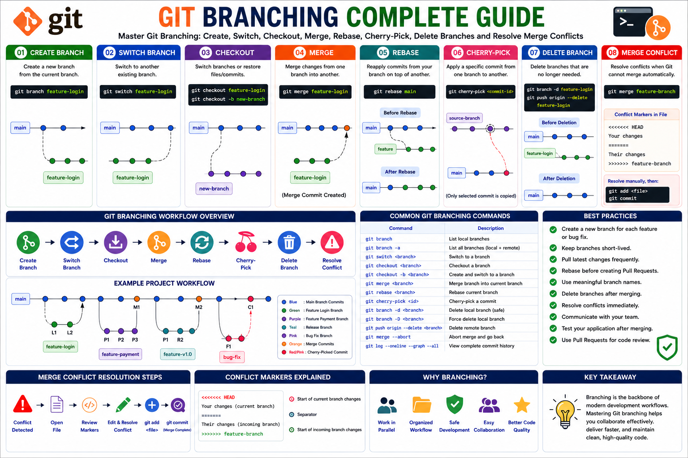

---

# Git Branching Visual Roadmap

The following infographic provides a complete overview of Git Branching concepts covered in this learning series.

<p align="center">
  
</p>

<p align="center">
  <em>
    Complete Git Branching Roadmap - Create Branch, Switch Branch,
    Checkout, Merge, Rebase, Cherry-Pick, Delete Branch,
    and Merge Conflict Resolution
  </em>
</p>

---

# Learning Flow

```text
Create Branch
      ↓
Switch Branch
      ↓
Checkout
      ↓
Merge
      ↓
Rebase
      ↓
Cherry-Pick
      ↓
Delete Branch
      ↓
Merge Conflict
```

This roadmap summarizes the complete Git Branching workflow used by DevOps Engineers, Cloud Engineers, SREs, and Software Developers in real-world projects.

---

## Repository Structure

```text
03-Branching/
│
├── README.md
│
├── 01-Create-Branch.md
├── 02-Switch-Branch.md
├── 03-Checkout.md
├── 04-Merge.md
├── 05-Rebase.md
├── 06-Cherry-Pick.md
├── 07-Delete-Branch.md
├── 08-Merge-Conflict.md
│
└── images/
    ├── git-branching-roadmap.png
    ├── create-branch-workflow.png
    ├── switch-branch-workflow.png
    ├── 03-checkout-workflow.png
    ├── 04-merge-workflow.png
    ├── 05-rebase-workflow.png
    ├── 06-cherry-pick-workflow.png
    ├── 07-delete-branch-workflow.png
    └── 08-merge-conflict-workflow.png
```

---

<h3 align="center">
🚀 Git Branching Learning Series Completed
</h3>

<p align="center">
From Beginner to Advanced Git Branching Concepts
</p>
