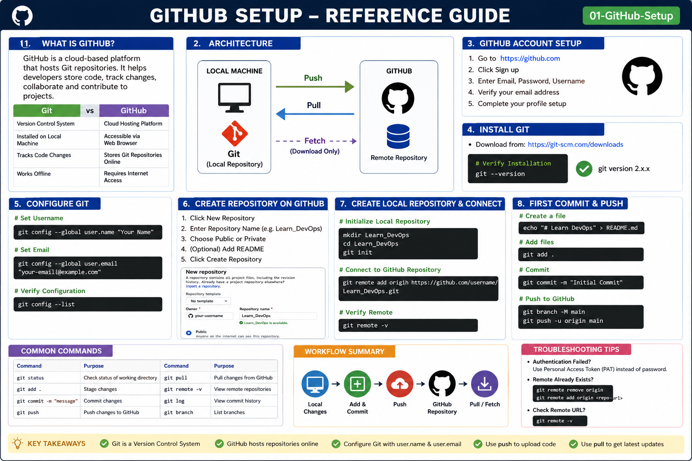

# GitHub Setup

## Objective

Learn how to create a GitHub account, create repositories, connect Git with GitHub, and verify the setup.

---

# What is GitHub?

GitHub is a cloud-based platform that hosts Git repositories. It helps developers store code, track changes, collaborate with teams, and contribute to open-source projects.

## Git vs GitHub

| Git                        | GitHub                         |
| -------------------------- | ------------------------------ |
| Version Control System     | Cloud Hosting Platform         |
| Installed on Local Machine | Accessible through Web Browser |
| Tracks Code Changes        | Stores Git Repositories Online |
| Works Offline              | Requires Internet Access       |

---

# GitHub Architecture

```text
+-------------------+
|   Developer PC    |
|      (Git)        |
+---------+---------+
          |
          | Push / Pull
          |
          v
+-------------------+
|      GitHub       |
| Remote Repository |
+-------------------+
```

---

# Step 1: Create a GitHub Account

1. Open https://github.com
2. Click Sign Up
3. Enter:

   * Email Address
   * Password
   * Username
4. Verify your email address.
5. Complete account creation.

---

# Step 2: Install Git

### Windows

Download Git from:

https://git-scm.com/downloads

Verify Installation:

```bash
git --version
```

Example Output:

```bash
git version 2.50.1
```

---

# Step 3: Configure Git

Configure your username:

```bash
git config --global user.name "Newton"
```

Configure your email:

```bash
git config --global user.email "your-email@example.com"
```

Verify Configuration:

```bash
git config --list
```

View Specific Values:

```bash
git config --global user.name
git config --global user.email
```

---

# Step 4: Create a Repository on GitHub

1. Login to GitHub.
2. Click New Repository.
3. Enter Repository Name:

```text
Learn_DevOps
```

4. Select:

* Public Repository
* Add README (Optional)

5. Click Create Repository.

---

# Step 5: Create Local Repository

Create a project folder:

```bash
mkdir Learn_DevOps
cd Learn_DevOps
```

Initialize Git:

```bash
git init
```

Output:

```text
Initialized empty Git repository
```

---

# Step 6: Connect Local Repository to GitHub

Add Remote Repository:

```bash
git remote add origin https://github.com/username/Learn_DevOps.git
```

Verify Remote:

```bash
git remote -v
```

Example Output:

```text
origin https://github.com/username/Learn_DevOps.git (fetch)
origin https://github.com/username/Learn_DevOps.git (push)
```

---

# Step 7: First Commit

Create a README file:

```bash
echo "# Learn DevOps" > README.md
```

Add Files:

```bash
git add .
```

Commit Changes:

```bash
git commit -m "Initial Commit"
```

---

# Step 8: Push Code to GitHub

Rename Branch:

```bash
git branch -M main
```

Push Code:

```bash
git push -u origin main
```

---

# Verification

Check Repository Status:

```bash
git status
```

Expected Output:

```text
nothing to commit, working tree clean
```

Verify on GitHub:

* Open your repository.
* Confirm README.md is visible.

---

# Common Commands

```bash
git config --list
git remote -v
git status
git add .
git commit -m "message"
git push
git pull
```

---

# Troubleshooting

## Authentication Failed

Generate a Personal Access Token (PAT) from GitHub and use it instead of your password.

## Remote Already Exists

```bash
git remote remove origin
git remote add origin <repository-url>
```

## Check Remote URL

```bash
git remote -v
```

---

# Hands-On Lab

### Task 1

Create a GitHub account.

### Task 2

Create a repository named:

```text
Learn_Git
```

### Task 3

Initialize a local repository.

### Task 4

Create README.md.

### Task 5

Commit changes.

### Task 6

Push code to GitHub.

---

# Key Takeaways

* Git is a Version Control System.
* GitHub hosts Git repositories online.
* Configure Git using user.name and user.email.
* Use `git init` to initialize repositories.
* Use `git remote add origin` to connect GitHub.
* Use `git push` to upload code.
* Use `git pull` to download updates.
<h2>Reference Guide (Visual Summary)</h2>

<p align="center">
  
</p>
