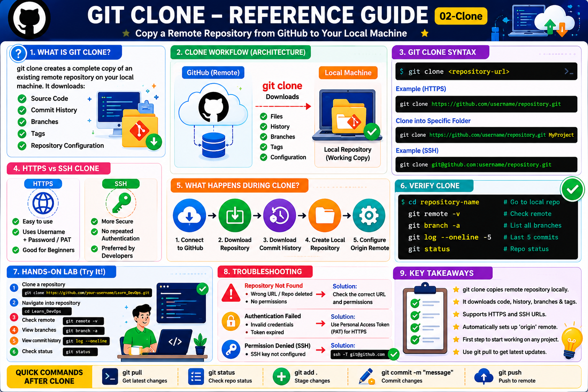

# Git Clone

## Objective

Learn how to copy an existing Git repository from GitHub to your local machine using the `git clone` command.

---

# What is Git Clone?

`git clone` creates a complete copy of a remote repository on your local machine.

When you clone a repository, Git downloads:

* Source Code
* Commit History
* Branches
* Tags
* Repository Configuration

---

# Why Use Git Clone?

Common use cases:

* Download existing projects
* Contribute to open-source repositories
* Collaborate with teams
* Create a local working copy

---

# Architecture

```text
GitHub Repository
        │
        │ git clone
        ▼
Local Repository
```

---

# Syntax

```bash
git clone <repository-url>
```

Example:

```bash
git clone https://github.com/username/repository.git
```

---

# Clone Public Repository

Example:

```bash
git clone https://github.com/newton9979/Learn_DevOps.git
```

Output:

```text
Cloning into 'Learn_DevOps'...
remote: Enumerating objects...
Receiving objects: 100%
Resolving deltas: 100%
```

---

# Clone into Specific Folder

Syntax:

```bash
git clone <repository-url> <directory-name>
```

Example:

```bash
git clone https://github.com/newton9979/Learn_DevOps.git MyProject
```

Result:

```text
MyProject/
├── README.md
├── Learn_Git/
└── Learn_AWS/
```

---

# Verify Clone

Navigate into repository:

```bash
cd Learn_DevOps
```

Check remote repository:

```bash
git remote -v
```

Output:

```text
origin  https://github.com/newton9979/Learn_DevOps.git (fetch)
origin  https://github.com/newton9979/Learn_DevOps.git (push)
```

---

# Clone Using SSH

HTTPS:

```bash
git clone https://github.com/username/repository.git
```

SSH:

```bash
git clone git@github.com:username/repository.git
```

Advantages of SSH:

* More secure
* No repeated authentication
* Preferred for developers

---

# What Happens During Clone?

```text
1. Connect to GitHub
          │
2. Download Repository
          │
3. Download Commit History
          │
4. Create Local Repository
          │
5. Configure Origin Remote
```

---

# Check Repository Status

```bash
git status
```

Output:

```text
On branch main
nothing to commit, working tree clean
```

---

# Common Commands After Clone

View remotes:

```bash
git remote -v
```

View branches:

```bash
git branch -a
```

View commit history:

```bash
git log --oneline
```

Pull latest changes:

```bash
git pull
```

Push changes:

```bash
git push
```

---

# Troubleshooting

## Repository Not Found

Cause:

* Wrong URL
* Repository deleted
* No permissions

Solution:

```bash
git clone <correct-repository-url>
```

---

## Authentication Failed

Cause:

* Invalid credentials
* Token expired

Solution:

Use GitHub Personal Access Token (PAT).

---

## Permission Denied (SSH)

Cause:

* SSH key not configured

Verify:

```bash
ssh -T git@github.com
```

---

# Hands-On Lab

### Task 1

Clone your Learn_DevOps repository:

```bash
git clone https://github.com/your-username/Learn_DevOps.git
```

### Task 2

Navigate into repository:

```bash
cd Learn_DevOps
```

### Task 3

Verify remote:

```bash
git remote -v
```

### Task 4

View commit history:

```bash
git log --oneline
```

### Task 5

Check repository status:

```bash
git status
```

---

# Key Takeaways

* `git clone` copies a remote repository locally.
* Downloads source code and commit history.
* Automatically configures `origin`.
* Supports HTTPS and SSH.
* First step in collaborating with existing repositories.

---

## Reference Guide (Visual Summary)



*Figure: Git Clone - Complete Reference Guide*
<hr>

<h2>Reference Guide (Visual Summary)</h2>

<p align="center">
  
</p>

<p align="center">
  <em>Figure: Git Clone - Complete Reference Guide</em>
</p>
