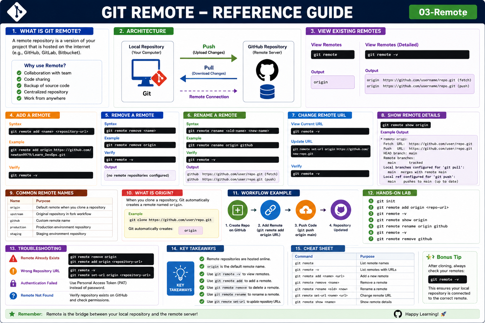

# Git Remote

## Objective

Learn how to manage remote repositories using the `git remote` command.

---

# What is a Remote Repository?

A remote repository is a Git repository hosted on a remote server such as GitHub, GitLab, or Bitbucket.

It enables:

* Collaboration with teams
* Code sharing
* Backup of source code
* Centralized version control

---

# What is Git Remote?

The `git remote` command manages connections between your local repository and remote repositories.

Think of it as a link between:

```text
Local Repository  <------>  GitHub Repository
```

---

# Architecture

```text
+-------------------+
| Local Repository  |
|      (Git)        |
+---------+---------+
          |
          | Remote Connection
          |
          v
+-------------------+
| GitHub Repository |
|      origin       |
+-------------------+
```

---

# View Existing Remotes

Command:

```bash
git remote
```

Output:

```text
origin
```

View detailed information:

```bash
git remote -v
```

Example:

```text
origin  https://github.com/username/repo.git (fetch)
origin  https://github.com/username/repo.git (push)
```

---

# Add a Remote Repository

Syntax:

```bash
git remote add <name> <repository-url>
```

Example:

```bash
git remote add origin https://github.com/newton9979/Learn_DevOps.git
```

Verify:

```bash
git remote -v
```

---

# Remove a Remote Repository

Syntax:

```bash
git remote remove <name>
```

Example:

```bash
git remote remove origin
```

Verify:

```bash
git remote -v
```

Output:

```text
(no remote repositories configured)
```

---

# Rename a Remote

Syntax:

```bash
git remote rename <old-name> <new-name>
```

Example:

```bash
git remote rename origin github
```

Verify:

```bash
git remote -v
```

Output:

```text
github  https://github.com/user/repo.git
```

---

# Change Remote URL

Sometimes repository URLs change.

View current URL:

```bash
git remote -v
```

Update URL:

```bash
git remote set-url origin https://github.com/new-repo.git
```

Verify:

```bash
git remote -v
```

---

# Show Remote Details

Command:

```bash
git remote show origin
```

Example Output:

```text
* remote origin
  Fetch URL: https://github.com/user/repo.git
  Push URL: https://github.com/user/repo.git
  HEAD branch: main
```

---

# Common Remote Names

| Name       | Purpose                               |
| ---------- | ------------------------------------- |
| origin     | Default remote repository             |
| upstream   | Original repository in fork workflows |
| github     | Custom remote name                    |
| production | Production repository                 |

---

# What is Origin?

When cloning a repository:

```bash
git clone https://github.com/user/repo.git
```

Git automatically creates:

```text
origin
```

Origin is simply the default name assigned to the remote repository.

---

# Workflow Example

```text
Create Repository on GitHub
            │
            ▼
Add Remote
            │
git remote add origin URL
            │
            ▼
Push Code
            │
git push origin main
            │
            ▼
Repository Updated
```

---

# Hands-On Lab

### Task 1

Initialize repository:

```bash
git init
```

### Task 2

Add remote:

```bash
git remote add origin https://github.com/your-username/Learn_DevOps.git
```

### Task 3

Verify remote:

```bash
git remote -v
```

### Task 4

Display remote details:

```bash
git remote show origin
```

### Task 5

Rename remote:

```bash
git remote rename origin github
```

### Task 6

Verify renamed remote:

```bash
git remote -v
```

### Task 7

Remove remote:

```bash
git remote remove github
```

---

# Troubleshooting

## Remote Already Exists

Error:

```text
remote origin already exists
```

Solution:

```bash
git remote remove origin

git remote add origin <repository-url>
```

---

## Wrong Repository URL

Check:

```bash
git remote -v
```

Update:

```bash
git remote set-url origin <repository-url>
```

---

## Remote Not Found

Verify repository exists on GitHub and confirm permissions.

---

# Key Takeaways

* Remote repositories are hosted online.
* `origin` is the default remote name.
* Use `git remote -v` to view remotes.
* Use `git remote add` to add a remote.
* Use `git remote remove` to delete a remote.
* Use `git remote rename` to rename a remote.
* Use `git remote set-url` to update repository URLs.

---

## Reference Guide (Visual Summary)



*Figure: Git Remote - Complete Reference Guide*
<hr>

<h2>Reference Guide (Visual Summary)</h2>

<p align="center">
  
</p>
