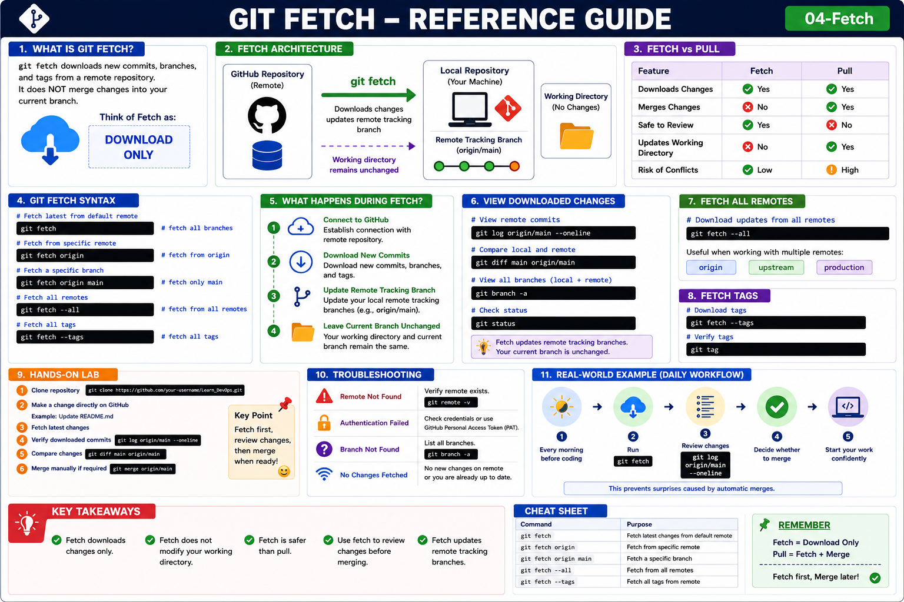

# Git Fetch

## Objective

Learn how to download changes from a remote repository without modifying your local working branch.

---

# What is Git Fetch?

`git fetch` downloads new commits, branches, and tags from a remote repository.

Unlike `git pull`, it does **NOT** merge changes into your current branch.

Think of Fetch as:

```text
Download Only
```

---

# Why Use Git Fetch?

Benefits:

* Safely inspect remote changes
* Review updates before merging
* Prevent unexpected merge conflicts
* Keep local repository updated

---

# Architecture

```text
GitHub Repository
        │
        │ Fetch
        ▼
Local Repository
(Remote Tracking Branch Updated)

Working Directory
(No Changes)
```

---

# Fetch vs Pull

| Feature                   | Fetch | Pull |
| ------------------------- | ----- | ---- |
| Downloads Changes         | Yes   | Yes  |
| Merges Changes            | No    | Yes  |
| Safe to Review            | Yes   | No   |
| Updates Working Directory | No    | Yes  |

---

# Syntax

Basic fetch:

```bash
git fetch
```

Fetch from specific remote:

```bash
git fetch origin
```

Fetch a specific branch:

```bash
git fetch origin main
```

---

# Example Workflow

Current Situation:

```text
GitHub Repository
      │
      ├── Commit A
      ├── Commit B
      └── Commit C

Local Repository
      │
      ├── Commit A
      └── Commit B
```

Fetch latest changes:

```bash
git fetch origin
```

Result:

```text
GitHub Repository
      │
      ├── Commit A
      ├── Commit B
      └── Commit C

Local Repository
      │
      ├── Commit A
      └── Commit B

Remote Tracking Branch
      │
      ├── Commit A
      ├── Commit B
      └── Commit C
```

Notice:

Current branch is unchanged.

---

# View Fetched Changes

Display remote commits:

```bash
git log origin/main --oneline
```

Compare local and remote:

```bash
git diff main origin/main
```

View all branches:

```bash
git branch -a
```

---

# Fetch All Remotes

Download updates from all remotes:

```bash
git fetch --all
```

Useful when working with:

```text
origin
upstream
production
```

---

# Fetch Tags

Download tags:

```bash
git fetch --tags
```

Verify:

```bash
git tag
```

---

# Check Repository Status

```bash
git status
```

Example:

```text
Your branch is behind 'origin/main' by 2 commits.
```

---

# What Happens During Fetch?

```text
1. Connect to GitHub
          │
2. Download New Commits
          │
3. Update Remote Tracking Branch
          │
4. Leave Current Branch Unchanged
```

---

# Common Commands

Fetch latest updates:

```bash
git fetch
```

Fetch specific remote:

```bash
git fetch origin
```

Fetch branch:

```bash
git fetch origin main
```

Fetch everything:

```bash
git fetch --all
```

Fetch tags:

```bash
git fetch --tags
```

---

# Hands-On Lab

### Step 1

Clone repository:

```bash
git clone https://github.com/your-username/Learn_DevOps.git
```

### Step 2

Make a change directly on GitHub.

Example:

```text
Update README.md
```

### Step 3

Run:

```bash
git fetch
```

### Step 4

Verify downloaded commits:

```bash
git log origin/main --oneline
```

### Step 5

Compare changes:

```bash
git diff main origin/main
```

### Step 6

Merge manually if required:

```bash
git merge origin/main
```

---

# Troubleshooting

## Remote Not Found

Verify remote:

```bash
git remote -v
```

---

## Authentication Failed

Check credentials or GitHub Personal Access Token (PAT).

---

## Branch Not Found

List branches:

```bash
git branch -a
```

---

# Real-World Example

Before starting work every morning:

```bash
git fetch
```

Review changes:

```bash
git log origin/main --oneline
```

Then decide whether to merge.

This prevents surprises caused by automatic merges.

---

# Key Takeaways

* Fetch downloads changes only.
* Fetch does not modify your working directory.
* Fetch is safer than pull.
* Use fetch to review changes before merging.
* Fetch updates remote tracking branches.

---

## Reference Guide (Visual Summary)



*Figure: Git Fetch - Complete Reference Guide*
<hr>

<h2>Reference Guide (Visual Summary)</h2>

<p align="center">
  
</p>
