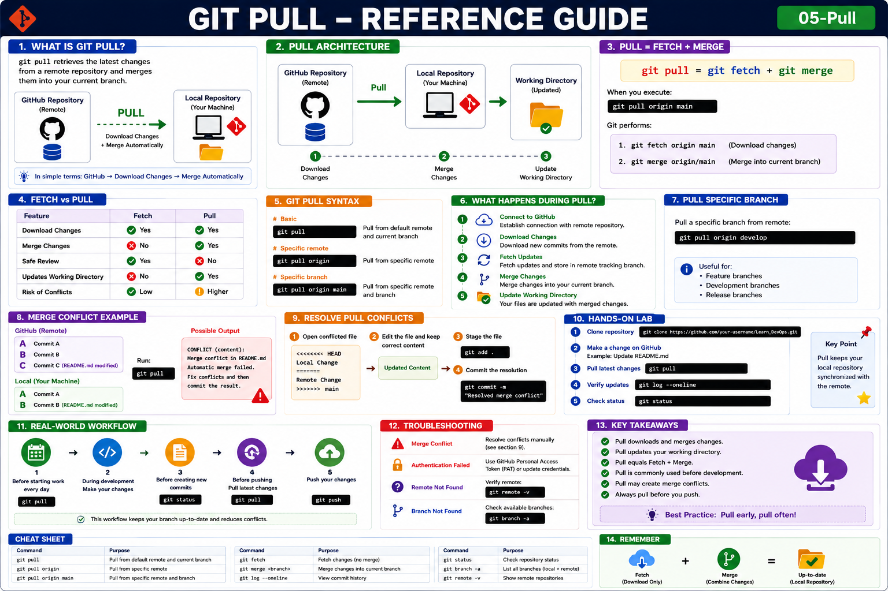

# Git Pull

## Objective

Learn how to download and automatically merge changes from a remote repository into your local branch.

---

# What is Git Pull?

`git pull` retrieves the latest changes from a remote repository and merges them into your current branch.

In simple terms:

```text
GitHub → Download Changes → Merge Automatically
```

---

# Git Pull Formula

```bash
git pull = git fetch + git merge
```

When you execute:

```bash
git pull origin main
```

Git performs:

```bash
git fetch origin main
git merge origin/main
```

---

# Why Use Git Pull?

Benefits:

* Get latest changes from teammates
* Synchronize local repository
* Update local branch quickly
* Reduce manual steps

---

# Architecture

```text
GitHub Repository
        │
        │ Pull
        ▼
Local Repository
        │
        ▼
Working Directory Updated
```

---

# Fetch vs Pull

| Feature                   | Fetch | Pull   |
| ------------------------- | ----- | ------ |
| Download Changes          | Yes   | Yes    |
| Merge Changes             | No    | Yes    |
| Safe Review               | Yes   | No     |
| Updates Working Directory | No    | Yes    |
| Risk of Conflicts         | Low   | Higher |

---

# Syntax

Basic:

```bash
git pull
```

Specific remote:

```bash
git pull origin
```

Specific branch:

```bash
git pull origin main
```

---

# Example Workflow

GitHub:

```text
Commit A
Commit B
Commit C
```

Local:

```text
Commit A
Commit B
```

Run:

```bash
git pull origin main
```

Result:

```text
Commit A
Commit B
Commit C
```

Your local repository is updated automatically.

---

# What Happens During Pull?

```text
1. Connect to GitHub
        │
2. Download Changes
        │
3. Fetch Updates
        │
4. Merge Changes
        │
5. Update Working Directory
```

---

# Verify Updates

Check commit history:

```bash
git log --oneline
```

Check status:

```bash
git status
```

Output:

```text
On branch main
nothing to commit, working tree clean
```

---

# Pull a Specific Branch

```bash
git pull origin develop
```

Useful for:

* Feature branches
* Development branches
* Release branches

---

# Pull All Latest Changes

Switch to main:

```bash
git checkout main
```

Pull latest updates:

```bash
git pull origin main
```

---

# Merge Conflict Example

GitHub:

```text
README.md modified
```

Local:

```text
README.md modified
```

Run:

```bash
git pull
```

Possible output:

```text
CONFLICT (content): Merge conflict in README.md
Automatic merge failed.
```

Resolve conflict manually.

---

# Resolve Pull Conflicts

Open conflicted file:

```text
<<<<<<< HEAD
Local Change
=======
Remote Change
>>>>>>> main
```

Edit:

```text
Updated Content
```

Stage file:

```bash
git add .
```

Commit:

```bash
git commit -m "Resolved merge conflict"
```

---

# Common Commands

Pull latest changes:

```bash
git pull
```

Pull from origin:

```bash
git pull origin
```

Pull specific branch:

```bash
git pull origin main
```

Fetch only:

```bash
git fetch
```

View history:

```bash
git log --oneline
```

---

# Hands-On Lab

### Step 1

Clone repository:

```bash
git clone https://github.com/your-username/Learn_DevOps.git
```

### Step 2

Make a change directly on GitHub.

Example:

```text
Update README.md
```

### Step 3

Pull latest changes:

```bash
git pull
```

### Step 4

Verify updates:

```bash
git log --oneline
```

### Step 5

Check repository status:

```bash
git status
```

---

# Real-World Workflow

Before starting work:

```bash
git pull
```

Before creating new commits:

```bash
git status
```

Before pushing:

```bash
git pull
```

This ensures your branch stays synchronized.

---

# Troubleshooting

## Merge Conflict

Resolve conflicts manually.

---

## Authentication Failed

Use GitHub Personal Access Token (PAT).

---

## Remote Not Found

Verify:

```bash
git remote -v
```

---

## Branch Not Found

Check:

```bash
git branch -a
```

---

# Key Takeaways

* Pull downloads and merges changes.
* Pull updates your working directory.
* Pull equals Fetch + Merge.
* Pull is commonly used before development.
* Pull may create merge conflicts.

---

## Reference Guide (Visual Summary)



*Figure: Git Pull - Complete Reference Guide*
<hr>

<h2>Reference Guide (Visual Summary)</h2>

<p align="center">
  
</p>
