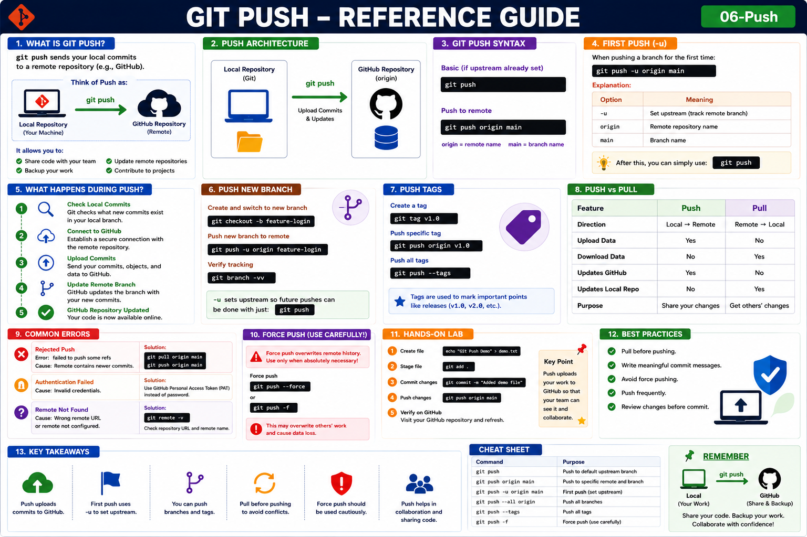

# Git Push

## Objective

Learn how to upload local commits from your Git repository to a remote repository such as GitHub.

---

# What is Git Push?

`git push` sends your local commits to a remote repository.

Think of Push as:

```text
Local Repository → GitHub Repository
```

It allows you to:

* Share code with your team
* Backup your work
* Update remote repositories
* Contribute to projects

---

# Why Use Git Push?

Benefits:

* Publish local changes
* Collaborate with others
* Keep GitHub updated
* Share completed features

---

# Architecture

```text
+-------------------+
| Local Repository  |
|     (Git)         |
+---------+---------+
          |
          | git push
          |
          ▼
+-------------------+
| GitHub Repository |
|      origin       |
+-------------------+
```

---

# Syntax

Basic:

```bash
git push
```

Push to remote:

```bash
git push origin main
```

---

# First Push

When pushing a branch for the first time:

```bash
git push -u origin main
```

Explanation:

| Option | Meaning             |
| ------ | ------------------- |
| -u     | Set upstream branch |
| origin | Remote repository   |
| main   | Branch name         |

---

# Example Workflow

Create a file:

```bash
echo "Hello Git" > app.txt
```

Stage:

```bash
git add .
```

Commit:

```bash
git commit -m "Added app.txt"
```

Push:

```bash
git push origin main
```

---

# What Happens During Push?

```text
1. Check Local Commits
          │
2. Connect to GitHub
          │
3. Upload Commits
          │
4. Update Remote Branch
          │
5. GitHub Repository Updated
```

---

# Verify Push

Check GitHub repository.

Or verify locally:

```bash
git status
```

Output:

```text
Your branch is up to date with 'origin/main'
nothing to commit, working tree clean
```

---

# Push New Branch

Create branch:

```bash
git checkout -b feature-login
```

Push branch:

```bash
git push -u origin feature-login
```

Verify:

```bash
git branch -vv
```

---

# Push All Branches

```bash
git push --all origin
```

Useful when migrating repositories.

---

# Push Tags

Create tag:

```bash
git tag v1.0
```

Push tag:

```bash
git push origin v1.0
```

Push all tags:

```bash
git push --tags
```

---

# Push vs Pull

| Feature            | Push           | Pull           |
| ------------------ | -------------- | -------------- |
| Direction          | Local → Remote | Remote → Local |
| Upload Data        | Yes            | No             |
| Download Data      | No             | Yes            |
| Updates GitHub     | Yes            | No             |
| Updates Local Repo | No             | Yes            |

---

# Common Errors

## Rejected Push

Error:

```text
failed to push some refs
```

Cause:

Remote contains newer commits.

Solution:

```bash
git pull origin main
git push origin main
```

---

## Authentication Failed

Cause:

Invalid credentials.

Solution:

Use GitHub Personal Access Token (PAT).

---

## Remote Not Found

Verify:

```bash
git remote -v
```

Check repository URL.

---

# Force Push

⚠ Use carefully.

```bash
git push --force
```

or

```bash
git push -f
```

Warning:

```text
May overwrite remote history.
```

Use only when absolutely necessary.

---

# Hands-On Lab

### Step 1

Create file:

```bash
echo "Git Push Demo" > demo.txt
```

### Step 2

Stage file:

```bash
git add .
```

### Step 3

Commit changes:

```bash
git commit -m "Added demo file"
```

### Step 4

Push changes:

```bash
git push origin main
```

### Step 5

Verify on GitHub.

---

# Real-World Workflow

Start day:

```bash
git pull
```

Make changes:

```bash
git add .
git commit -m "Feature completed"
```

Upload work:

```bash
git push
```

---

# Best Practices

* Pull before pushing.
* Write meaningful commit messages.
* Avoid force pushing.
* Push frequently.
* Review changes before commit.

---

# Key Takeaways

* Push uploads commits to GitHub.
* First push uses `-u`.
* Push can upload branches and tags.
* Pull before pushing.
* Force push should be used cautiously.

---

## Reference Guide (Visual Summary)



*Figure: Git Push - Complete Reference Guide*
