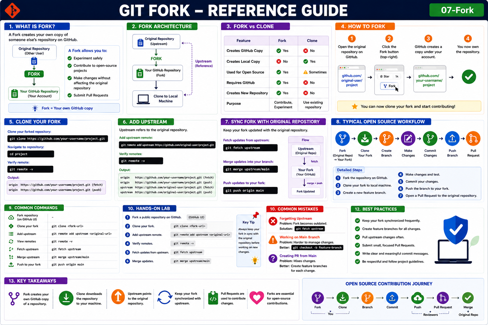

# Git Fork

## Objective

Learn how to create a personal copy of someone else's repository and contribute to open-source projects using GitHub Forks.

---

# What is a Fork?

A Fork creates your own copy of another person's repository on GitHub.

Think of Fork as:

```text id="f3g8n1"
Original Repository
          │
          ▼
         Fork
          │
          ▼
Your GitHub Repository
```

A Fork allows you to:

* Experiment safely
* Contribute to open-source projects
* Make changes without affecting the original repository
* Submit Pull Requests

---

# Why Use Fork?

Benefits:

* No write access required
* Safe environment for development
* Contribute to public projects
* Learn open-source workflows

---

# Fork Architecture

```text id="x8jk21"
Original Repository
        │
        ▼
      Fork
        │
        ▼
Your GitHub Repository
        │
        ▼
Clone to Local Machine
```

---

# Fork vs Clone

| Feature                | Fork | Clone     |
| ---------------------- | ---- | --------- |
| Creates GitHub Copy    | Yes  | No        |
| Creates Local Copy     | No   | Yes       |
| Used for Open Source   | Yes  | Sometimes |
| Requires GitHub        | Yes  | No        |
| Creates New Repository | Yes  | No        |

---

# How to Fork a Repository

### Step 1

Open repository:

```text id="4n0swr"
https://github.com/original-user/project
```

### Step 2

Click:

```text id="7zc7wy"
Fork
```

GitHub creates:

```text id="m8n3ri"
https://github.com/your-username/project
```

---

# Clone Your Fork

After forking:

```bash id="2wwzrl"
git clone https://github.com/your-username/project.git
```

Navigate:

```bash id="d8h19y"
cd project
```

Verify:

```bash id="i4z0bc"
git remote -v
```

Output:

```text id="n9cxvg"
origin https://github.com/your-username/project.git
```

---

# Add Upstream Repository

Upstream refers to the original repository.

Add upstream:

```bash id="7mjlwm"
git remote add upstream https://github.com/original-user/project.git
```

Verify:

```bash id="syj5zy"
git remote -v
```

Output:

```text id="2b0r4s"
origin   https://github.com/your-username/project.git
upstream https://github.com/original-user/project.git
```

---

# Why Upstream?

Without upstream:

```text id="6e1oqv"
You won't receive updates
from the original project.
```

With upstream:

```text id="7sqn08"
Original Repository
          │
          ▼
      Upstream
          │
          ▼
Your Fork
```

---

# Sync Fork with Original Repository

Fetch updates:

```bash id="sp11u1"
git fetch upstream
```

Merge updates:

```bash id="9o4hcx"
git merge upstream/main
```

Push updates:

```bash id="y8w8w2"
git push origin main
```

---

# Typical Open Source Workflow

Fork:

```text id="z7k2lp"
Original Repo
      │
      ▼
Fork
```

Clone:

```bash id="mrlhqb"
git clone https://github.com/your-username/project.git
```

Create branch:

```bash id="17k1wu"
git checkout -b feature-update
```

Make changes.

Commit:

```bash id="6i0u0y"
git add .
git commit -m "Added new feature"
```

Push:

```bash id="jpc6oq"
git push origin feature-update
```

Create Pull Request.

---

# Real Example

Open Source Project:

```text id="8ch76u"
Kubernetes
```

Workflow:

```text id="kzht4k"
Kubernetes Repo
       │
       ▼
Fork
       │
       ▼
Your Fork
       │
       ▼
Clone
       │
       ▼
Create Branch
       │
       ▼
Make Changes
       │
       ▼
Push
       │
       ▼
Pull Request
```

---

# Common Commands

Fork repository from GitHub UI.

Clone fork:

```bash id="a95b6i"
git clone <fork-url>
```

Add upstream:

```bash id="4t3n4i"
git remote add upstream <original-url>
```

View remotes:

```bash id="nqvljg"
git remote -v
```

Fetch upstream:

```bash id="3v6cq4"
git fetch upstream
```

Merge updates:

```bash id="h3tq9l"
git merge upstream/main
```

Push changes:

```bash id="fc3g6u"
git push origin main
```

---

# Hands-On Lab

### Step 1

Fork a public repository on GitHub.

### Step 2

Clone your fork.

```bash id="e2k5yx"
git clone <fork-url>
```

### Step 3

Add upstream.

```bash id="3x2trn"
git remote add upstream <original-url>
```

### Step 4

Verify remotes.

```bash id="p3i5jt"
git remote -v
```

### Step 5

Fetch updates.

```bash id="rw25do"
git fetch upstream
```

### Step 6

Merge updates.

```bash id="vtvlkq"
git merge upstream/main
```

---

# Common Mistakes

## Forgetting Upstream

Problem:

```text id="mbzprl"
Fork becomes outdated.
```

Solution:

```bash id="jlh80w"
git fetch upstream
```

---

## Working on Main Branch

Better:

```bash id="a1hzcx"
git checkout -b feature-branch
```

---

## Creating PR from Main

Recommended:

```text id="1sxyl3"
Create feature branches
for each change.
```

---

# Best Practices

* Keep fork synchronized.
* Create feature branches.
* Pull upstream changes frequently.
* Submit small Pull Requests.
* Write meaningful commit messages.

---

# Key Takeaways

* Fork creates your own GitHub copy.
* Clone downloads the repository locally.
* Upstream points to the original repository.
* Forks are essential for open-source contributions.
* Pull Requests are used to contribute changes.

---

## Reference Guide (Visual Summary)



*Figure: Git Fork - Complete Reference Guide*
<hr>

<h2>Reference Guide (Visual Summary)</h2>

<p align="center">
  
</p>
