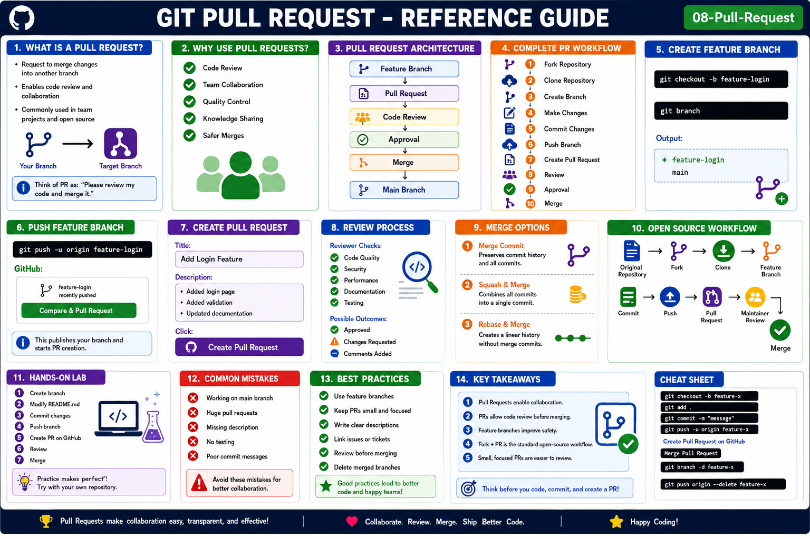

# Git Pull Request (PR)

## Objective

Learn how to create, review, and merge Pull Requests (PRs) to contribute code changes to a Git repository.

---

# What is a Pull Request?

A Pull Request (PR) is a request to merge changes from one branch into another branch.

Think of it as:

```text
"Please review my code and merge it."
```

A PR enables:

* Code Review
* Team Collaboration
* Quality Checks
* Safe Code Merges

---

# Why Use Pull Requests?

Benefits:

* Peer review before merging
* Detect bugs early
* Maintain code quality
* Discuss changes
* Track contributions

---

# Pull Request Architecture

```text
Feature Branch
       │
       ▼
Pull Request
       │
       ▼
Code Review
       │
       ▼
Approval
       │
       ▼
Merge
       │
       ▼
Main Branch
```

---

# Pull Request Workflow

```text
Fork Repository
       │
       ▼
Clone Repository
       │
       ▼
Create Branch
       │
       ▼
Make Changes
       │
       ▼
Commit Changes
       │
       ▼
Push Branch
       │
       ▼
Create Pull Request
       │
       ▼
Review & Approval
       │
       ▼
Merge
```

---

# Create a Feature Branch

Always avoid working directly on main.

Create branch:

```bash
git checkout -b feature-login
```

Verify:

```bash
git branch
```

Output:

```text
* feature-login
  main
```

---

# Make Changes

Example:

```bash
echo "Login Feature" > login.txt
```

Stage:

```bash
git add .
```

Commit:

```bash
git commit -m "Added login feature"
```

---

# Push Feature Branch

```bash
git push -u origin feature-login
```

GitHub Output:

```text
Branch 'feature-login' published.
```

---

# Create Pull Request

Open GitHub repository.

Click:

```text
Compare & Pull Request
```

Provide:

### Title

```text
Add Login Feature
```

### Description

```text
Implemented login feature.
Added validation logic.
Updated documentation.
```

Click:

```text
Create Pull Request
```

---

# Pull Request Lifecycle

```text
Open
  │
  ▼
Review
  │
  ▼
Approve
  │
  ▼
Merge
  │
  ▼
Close
```

---

# Code Review Process

Reviewer checks:

* Coding Standards
* Security Issues
* Performance
* Documentation
* Testing

Possible outcomes:

```text
Approved
Changes Requested
Comment Added
```

---

# Merge Pull Request

After approval:

Click:

```text
Merge Pull Request
```

Options:

### Create Merge Commit

```text
Preserves all commits.
```

### Squash and Merge

```text
Combines commits into one.
```

### Rebase and Merge

```text
Maintains linear history.
```

---

# Delete Feature Branch

After merge:

GitHub:

```text
Delete Branch
```

Or locally:

```bash
git branch -d feature-login
```

Delete remote branch:

```bash
git push origin --delete feature-login
```

---

# Pull Request Example

```text
main
 │
 ├── feature-login
 │
 ├── Commit 1
 ├── Commit 2
 │
 ▼
Pull Request
 │
 ▼
Review
 │
 ▼
Merge
 │
 ▼
main updated
```

---

# Open Source Contribution Workflow

```text
Original Repository
         │
         ▼
Fork
         │
         ▼
Clone
         │
         ▼
Feature Branch
         │
         ▼
Commit
         │
         ▼
Push
         │
         ▼
Pull Request
         │
         ▼
Maintainer Review
         │
         ▼
Merge
```

---

# Common Commands

Create branch:

```bash
git checkout -b feature-branch
```

Commit changes:

```bash
git add .
git commit -m "message"
```

Push branch:

```bash
git push -u origin feature-branch
```

Delete branch:

```bash
git branch -d feature-branch
```

Delete remote branch:

```bash
git push origin --delete feature-branch
```

---

# Hands-On Lab

### Step 1

Create branch:

```bash
git checkout -b feature-readme
```

### Step 2

Update README.md

### Step 3

Commit changes:

```bash
git add .
git commit -m "Updated README"
```

### Step 4

Push branch:

```bash
git push -u origin feature-readme
```

### Step 5

Create Pull Request on GitHub.

### Step 6

Review and Merge.

---

# Common Mistakes

## Working Directly on Main

Avoid:

```bash
git checkout main
```

Create feature branches instead.

---

## Large Pull Requests

Problem:

```text
Hard to review.
```

Solution:

```text
Create smaller PRs.
```

---

## Missing Description

Always provide:

* What changed
* Why it changed
* Testing performed

---

# Best Practices

* Use feature branches.
* Write meaningful commit messages.
* Keep PRs small.
* Add clear descriptions.
* Review before merging.
* Delete merged branches.

---

# Key Takeaways

* Pull Requests enable collaboration.
* PRs allow code review before merging.
* Feature branches improve safety.
* Fork + PR is the standard open-source workflow.
* Small, focused PRs are easier to review.

---

## Reference Guide (Visual Summary)



*Figure: Git Pull Request - Complete Reference Guide*

