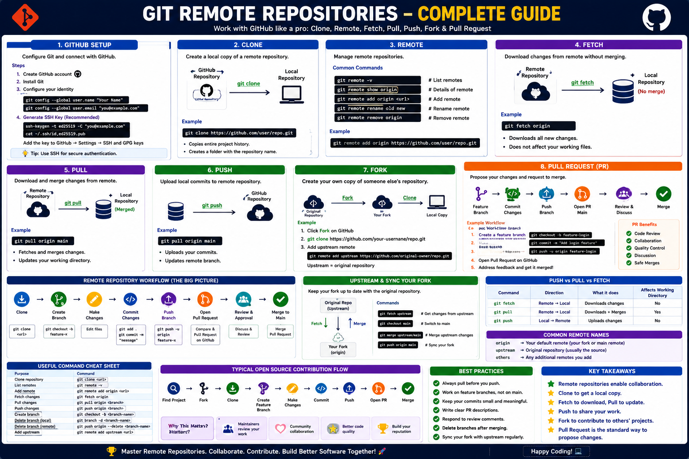

# Git Remote Repositories

This module covers the essential Git and GitHub remote repository concepts required for collaboration, version control, and open-source contributions.

## Learning Objectives

By completing this module, you will learn:

* How Git connects with GitHub
* How to clone repositories
* How remote repositories work
* How to fetch and pull changes
* How to push local commits to GitHub
* How to work with forks
* How to create and manage Pull Requests
* Real-world Git collaboration workflows

---

## Module Structure

| No | Topic        | Description                                |
| -- | ------------ | ------------------------------------------ |
| 01 | GitHub Setup | Configure Git and connect with GitHub      |
| 02 | Clone        | Create a local copy of a remote repository |
| 03 | Remote       | Manage remote repositories                 |
| 04 | Fetch        | Download changes without merging           |
| 05 | Pull         | Download and merge remote changes          |
| 06 | Push         | Upload local commits to GitHub             |
| 07 | Fork         | Create personal copies of repositories     |
| 08 | Pull Request | Submit changes for review and merge        |

---

## Learning Path

```text
GitHub Setup
      │
      ▼
Clone Repository
      │
      ▼
Remote Repository
      │
      ▼
Fetch Changes
      │
      ▼
Pull Changes
      │
      ▼
Push Changes
      │
      ▼
Fork Repository
      │
      ▼
Pull Request
```

---

## Repository Structure

```text
04-Remote-Repositories/
│
├── 01-GitHub-Setup.md
├── 02-Clone.md
├── 03-Remote.md
├── 04-Fetch.md
├── 05-Pull.md
├── 06-Push.md
├── 07-Fork.md
├── 08-Pull-Request.md
│
└── images/
    ├── 01-GitHub-Setup.png
    ├── 02-Clone.png
    ├── 03-Remote.png
    ├── 04-Fetch.png
    ├── 05-Pull.png
    ├── 06-Push.png
    ├── 07-Fork.png
    └── 08-Pull-Request.png
```

---

## Git Remote Workflow

```text
Developer
    │
    ▼
Local Repository
    │
    ├── git add
    ├── git commit
    ├── git push
    │
    ▼
GitHub Repository
    │
    ├── git fetch
    ├── git pull
    │
    ▼
Collaboration
```

---

## Key Commands Covered

### Clone Repository

```bash
git clone <repository-url>
```

### Add Remote

```bash
git remote add origin <repository-url>
```

### Fetch Changes

```bash
git fetch
```

### Pull Changes

```bash
git pull origin main
```

### Push Changes

```bash
git push origin main
```

### Create Branch

```bash
git checkout -b feature-branch
```

### Fork Workflow

```bash
git remote add upstream <repository-url>
```

### Create Pull Request

```text
GitHub → Compare & Pull Request
```

---

## Hands-On Labs

This module includes practical exercises for:

* GitHub Setup
* Repository Cloning
* Remote Management
* Fetch Operations
* Pull Operations
* Push Operations
* Fork Workflow
* Pull Request Creation

---

## Real-World Use Cases

* Team Collaboration
* Source Code Management
* Open Source Contributions
* CI/CD Integration
* Release Management
* Code Reviews

---

## Prerequisites

Before starting this module, you should understand:

* Git Basics
* Git Configuration
* Git Commit Workflow
* Branching Concepts

---

## Key Takeaways

* Remote repositories enable collaboration.
* Fetch downloads changes safely.
* Pull downloads and merges changes.
* Push uploads local commits.
* Forks are commonly used in open-source projects.
* Pull Requests enable code review and collaboration.
* GitHub is the most widely used Git hosting platform.

---

## Next Module

```text
05-Git-Branching
```

Topics:

* Branch
* Checkout
* Switch
* Merge
* Rebase
* Cherry Pick
* Stash
* Tag
* Branching Strategies

---
<hr>

<h2 align="center">📚 Git Remote Repositories - Complete Guide</h2>

<p align="center">
  
</p>

<p align="center">
  <em>
    Complete visual guide covering GitHub Setup, Clone, Remote, Fetch, Pull,
    Push, Fork, Pull Requests, Open Source Contribution Workflow,
    Best Practices, and Command Cheat Sheet.
  </em>
</p>

<hr>

⭐ If you found this module useful, consider starring the repository and following the complete Learn DevOps roadmap.

