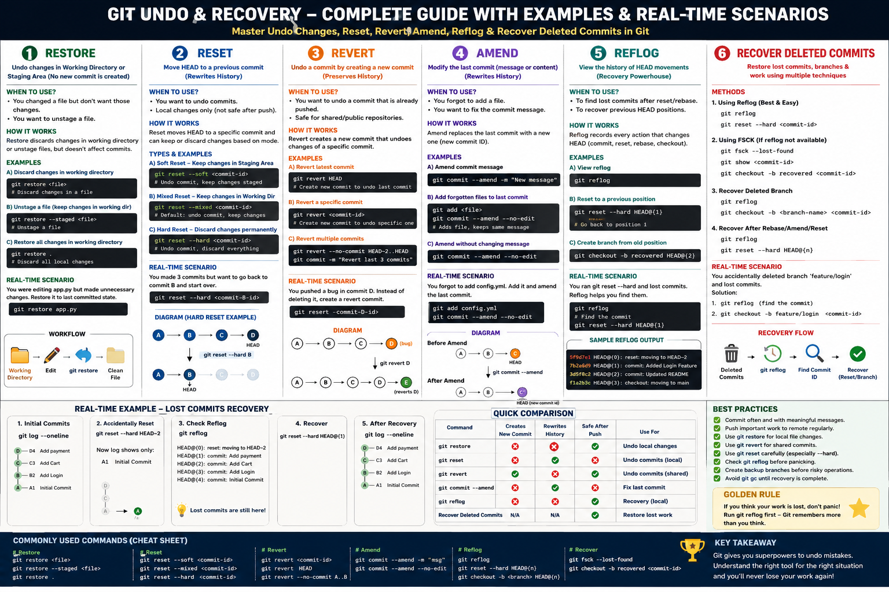

# 🔄 Git Undo & Recovery

<div align="center">

# Git Undo Changes – Complete Guide 🚀

Master Git undo operations including **Restore, Reset, Revert, Amend, Reflog, and Recover Deleted Commits** with practical examples, real-world scenarios, diagrams, and interview-focused explanations.

<br>



<br>


</div>

---

# 📖 About This Module

Undoing changes safely is one of the most important skills in Git. Whether you accidentally modified a file, committed incorrect code, reset your branch, or lost commits after a rebase, Git provides multiple recovery mechanisms.

This module explains each undo operation with:

- 📘 Beginner-friendly explanations
- 💻 Practical command examples
- 🌍 Real-world DevOps scenarios
- 📊 Easy-to-understand diagrams
- 🎯 Interview questions
- ✅ Best practices
- ⚠️ Common mistakes to avoid

---

# 📂 Project Structure

```
05-Undo-Changes
│
├── README.md
├── images
│   └── git-undo-recovery-guide.png
│
├── 01-Restore.md
├── 02-Reset.md
├── 03-Revert.md
├── 04-Amend.md
├── 05-Reflog.md
└── 06-Recover-Deleted-Commits.md
```

---

# 📚 Topics Covered

| File | Description |
|------|-------------|
| 📄 01-Restore.md | Restore local file changes and unstage files |
| 📄 02-Reset.md | Undo commits using Soft, Mixed, and Hard Reset |
| 📄 03-Revert.md | Safely undo commits without rewriting history |
| 📄 04-Amend.md | Modify the latest commit message or content |
| 📄 05-Reflog.md | Recover lost commits using Git Reflog |
| 📄 06-Recover-Deleted-Commits.md | Recover deleted commits using Reflog and FSCK |

---

# 🎯 Learning Objectives

After completing this module, you will be able to:

- Understand different Git undo commands.
- Restore accidentally modified files.
- Undo commits safely.
- Recover deleted commits.
- Recover after accidental hard resets.
- Recover deleted branches.
- Understand Git history.
- Choose the correct undo command in different situations.
- Answer Git interview questions confidently.

---

# 🔄 Git Undo Decision Flow

```
Modified a File?
        │
        ▼
git restore

──────────────

Committed Locally?
        │
        ▼
git reset

──────────────

Already Pushed?
        │
        ▼
git revert

──────────────

Need to Fix Last Commit?
        │
        ▼
git commit --amend

──────────────

Lost Commits?
        │
        ▼
git reflog

──────────────

Cannot Find Commit?
        │
        ▼
git fsck --lost-found
```

---

# 💻 Frequently Used Commands

## Restore

```bash
git restore file.txt
git restore .
git restore --staged file.txt
```

---

## Reset

```bash
git reset --soft HEAD~1
git reset --mixed HEAD~1
git reset --hard HEAD~1
```

---

## Revert

```bash
git revert HEAD
git revert <commit-id>
```

---

## Amend

```bash
git commit --amend
git commit --amend --no-edit
git commit --amend -m "New Message"
```

---

## Reflog

```bash
git reflog
git reset --hard HEAD@{1}
```

---

## Recover Deleted Commits

```bash
git reflog

git fsck --lost-found

git checkout -b recovery <commit-id>
```

---

# 🆚 Which Command Should You Use?

| Situation | Recommended Command |
|------------|---------------------|
| Discard local file changes | `git restore` |
| Undo local commits | `git reset` |
| Undo pushed commits | `git revert` |
| Fix latest commit | `git commit --amend` |
| Recover lost commits | `git reflog` |
| Recover unreachable commits | `git fsck` |

---

# 🌍 Real-World DevOps Scenarios

### ✅ Scenario 1

Developer accidentally modified configuration files.

Solution:

```bash
git restore config.yml
```

---

### ✅ Scenario 2

Committed sensitive data locally but haven't pushed.

Solution:

```bash
git reset --soft HEAD~1
```

---

### ✅ Scenario 3

Bug introduced after deployment.

Solution:

```bash
git revert <commit-id>
```

---

### ✅ Scenario 4

Forgot to add a configuration file.

Solution:

```bash
git add config.yml
git commit --amend --no-edit
```

---

OAOAOA### ✅ Scenario 5

Accidentally deleted two commits.
OAOAOA
Solution:
OAOAOA
OAOAOA```bash
OAOAOAgit reflog

OAOAOAgit reset --hard HEAD@{2}
OAOAOA```

---

OAOAOA# ⚠️ Common Mistakes

❌ Using `git reset --hard` without understanding its impact.

❌ Force pushing rewritten history.

❌ Forgetting to check `git reflog`.

❌ Running `git gc` before recovering commits.

❌ Recovering the wrong commit.

---

# ✅ Best Practices

- Commit your work frequently.
- Push important work to GitHub.
- Create backup branches before risky operations.
- Verify commits before resetting.
- Prefer `git revert` for shared branches.
- Use `git reflog` before assuming work is lost.
- Practice recovery commands in a test repository.

---

# 🎯 Interview Tips

Be prepared to explain:

- Difference between Restore and Reset
- Difference between Reset and Revert
- Soft vs Mixed vs Hard Reset
- What Reflog is
- How to recover deleted commits
- How Git stores commits
- Recovering after accidental reset
- Recovering deleted branches
- When to use Amend
- When NOT to use Force Push

---

# 📚 Prerequisites

- Basic Git commands
- Repository initialization
- Staging files
- Creating commits
- Understanding Git branches

---

# 🚀 What You'll Learn Next

After mastering Undo & Recovery, you can continue with:

- Git Branching
- Git Merge
- Git Rebase
- Cherry Pick
- Stash
- Tags
- Git Hooks
- Git Workflows (Git Flow, GitHub Flow)

---

<div align="center">

## ⭐ If this repository helped you, consider giving it a Star!

**Happy Learning! 🚀**

</div>
