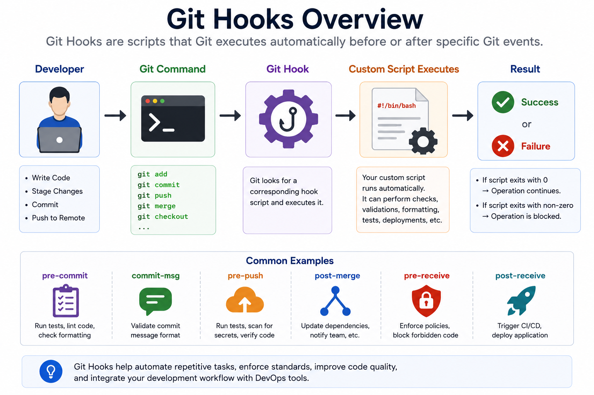
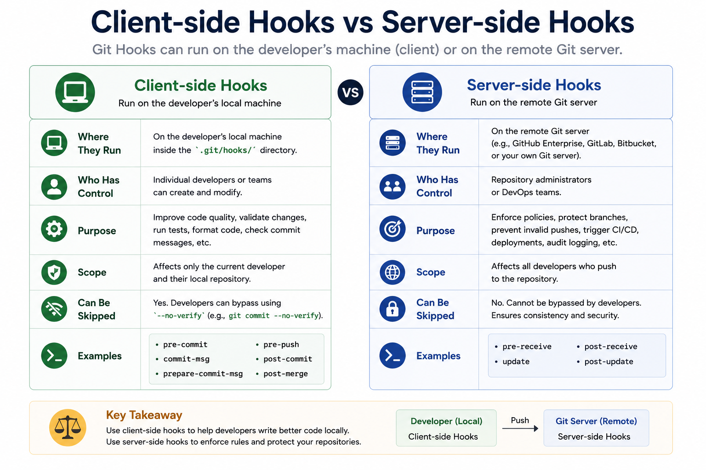
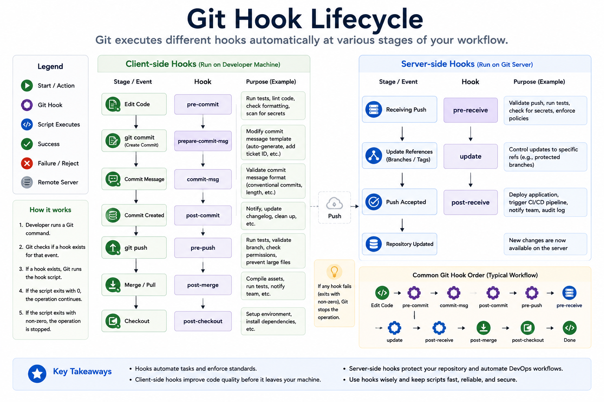
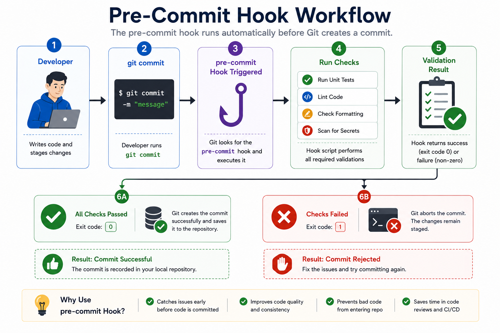
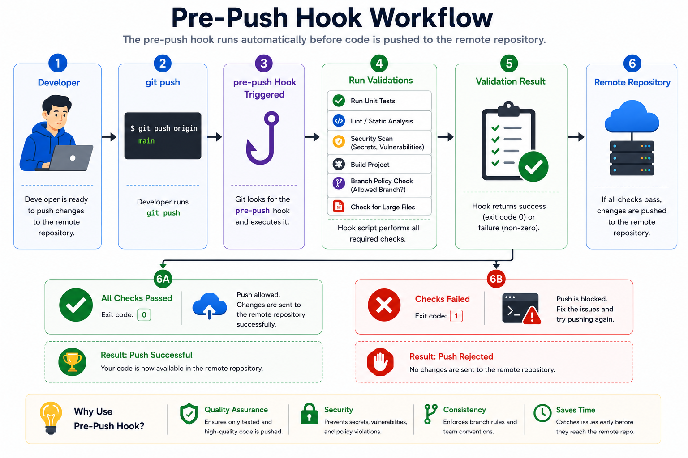

# 🪝 Git Hooks

## 📖 Introduction

Modern software development involves much more than writing code. Before code is committed or pushed to a remote repository, teams often need to perform various automated tasks such as:

* Running unit tests
* Checking coding standards
* Formatting source code
* Scanning for secrets or passwords
* Running security checks
* Preventing invalid commit messages
* Verifying branch naming conventions

Performing these tasks manually is time-consuming and error-prone.

**Git Hooks** solve this problem by allowing developers to execute custom scripts automatically when specific Git events occur.

A Git Hook is simply a script that Git executes automatically before or after certain Git operations such as:

* Commit
* Push
* Merge
* Checkout
* Receive (Server)

Git Hooks help teams automate repetitive tasks, improve code quality, and enforce development standards without requiring developers to remember every step manually.

They are widely used in enterprise software development, DevOps pipelines, and open-source projects.

---

# 🎯 Learning Objectives

After completing this chapter, you will understand:

* What Git Hooks are
* Why Git Hooks are useful
* How Git Hooks work
* Client-side Hooks
* Server-side Hooks
* Creating custom Git Hooks
* Real-world DevOps use cases
* Best practices
* Common mistakes

---

# 🤔 Why Do We Need Git Hooks?

Imagine a development team working on a large application.

Every developer should:

* Run unit tests
* Check code formatting
* Scan for secrets
* Verify commit messages
* Ensure coding standards

Without Git Hooks:

```text
Developer
     │
     ▼
Writes Code
     │
     ▼
Forgets Tests ❌
Forgets Formatting ❌
Pushes Broken Code ❌
```

This results in:

* Failed builds
* Production bugs
* Poor code quality
* Security risks

Git Hooks automate these checks.

---

# ⚙️ What Are Git Hooks?

Git Hooks are executable scripts stored inside a Git repository.

Git automatically executes these scripts when specific Git events occur.

Examples:

| Git Event      | Hook Executes |
| -------------- | ------------- |
| Before Commit  | pre-commit    |
| Commit Message | commit-msg    |
| After Commit   | post-commit   |
| Before Push    | pre-push      |
| After Merge    | post-merge    |

Because Git executes these scripts automatically, developers do not need to remember to perform repetitive checks.

---

# 📊 Git Hooks Overview

The following diagram illustrates how Git Hooks automatically execute scripts during the Git workflow.



Example Workflow

```text
Developer
     │
     ▼
Git Command
     │
     ▼
Git Hook
     │
     ▼
Custom Script Executes
     │
     ▼
Success ✔
or
Failure ✖
```

---

# 📂 Where Are Git Hooks Stored?

Git stores hook scripts inside the repository's `.git/hooks` directory.

Example:

```text
my-project/
│
├── .git/
│   └── hooks/
│       ├── pre-commit.sample
│       ├── commit-msg.sample
│       ├── pre-push.sample
│       ├── post-merge.sample
│       └── ...
│
└── src/
```

View the hooks directory:

```bash
ls .git/hooks
```

By default, Git provides sample hook files ending with `.sample`.

These files are inactive until you rename or create executable hook scripts.

---

# 🏗️ Types of Git Hooks

Git Hooks are divided into two categories:

## 1️⃣ Client-side Hooks

These hooks run on the developer's local machine.

Examples:

* pre-commit
* prepare-commit-msg
* commit-msg
* post-commit
* pre-push
* post-checkout
* post-merge

Typical uses:

* Code formatting
* Unit testing
* Linting
* Secret scanning
* Commit message validation

---

## 2️⃣ Server-side Hooks

These hooks run on the Git server.

Examples:

* pre-receive
* update
* post-receive

Typical uses:

* Access control
* Branch protection
* Deployment automation
* CI/CD integration
* Audit logging

---

# 📊 Client-side vs Server-side Hooks

The following diagram compares where each type of Git Hook executes.



| Client-side   | Server-side        |
| ------------- | ------------------ |
| Runs locally  | Runs on Git server |
| Before commit | Before receive     |
| Before push   | After receive      |
| Code quality  | Deployment         |
| Linting       | Branch protection  |
| Formatting    | Security policies  |

---

# 🔄 Git Hook Lifecycle

Git executes different hooks depending on the Git command.

The following lifecycle illustrates a typical workflow.



```text
Developer
      │
      ▼
git add
      │
      ▼
pre-commit
      │
      ▼
commit-msg
      │
      ▼
post-commit
      │
      ▼
git push
      │
      ▼
pre-push
      │
      ▼
Remote Repository
      │
      ▼
pre-receive
      │
      ▼
update
      │
      ▼
post-receive
```

---

# ⭐ Most Common Git Hooks

| Hook               | Purpose                  |
| ------------------ | ------------------------ |
| pre-commit         | Run checks before commit |
| prepare-commit-msg | Modify commit message    |
| commit-msg         | Validate commit message  |
| post-commit        | Execute after commit     |
| pre-push           | Validate before push     |
| post-merge         | Execute after merge      |
| pre-receive        | Validate incoming push   |
| update             | Update references        |
| post-receive       | Deployment automation    |

---

# 🌍 Real-World Example

A company wants to prevent developers from committing passwords into Git.

A **pre-commit** hook scans every file before the commit.

Workflow:

```text
Developer
     │
     ▼
git commit
     │
     ▼
pre-commit Hook
     │
     ▼
Password Found?
     │
 ┌───┴────┐
 │        │
Yes      No
 │        │
 ▼        ▼
Reject   Commit
Commit   Successfully
```

This simple automation can prevent accidental exposure of sensitive credentials.

---

# 🛠️ Creating Your First Git Hook

Git Hooks are simple executable scripts placed inside the `.git/hooks` directory.

To view the available hook files:

```bash
ls .git/hooks
```

Example Output:

```text
applypatch-msg.sample
commit-msg.sample
fsmonitor-watchman.sample
post-update.sample
pre-applypatch.sample
pre-commit.sample
pre-merge-commit.sample
pre-push.sample
pre-rebase.sample
pre-receive.sample
prepare-commit-msg.sample
update.sample
```

Git provides these sample files by default.

To activate a hook, create a file with the hook name **without the `.sample` extension**.

Example:

```text
.git/hooks/pre-commit
```

Make it executable:

```bash
chmod +x .git/hooks/pre-commit
```

---

# 🧪 Creating a Pre-Commit Hook

A **pre-commit** hook runs automatically before Git creates a commit.

It is commonly used for:

* Running unit tests
* Linting code
* Checking formatting
* Preventing secrets from being committed

Create the file:

```text
.git/hooks/pre-commit
```

Example:

```bash
#!/bin/bash

echo "Running pre-commit checks..."

echo "Checking source code..."

exit 0
```

Make it executable:

```bash
chmod +x .git/hooks/pre-commit
```

Now whenever you run:

```bash
git commit -m "Initial Commit"
```

Git executes the script before creating the commit.

---

# 📊 Pre-Commit Workflow

The following diagram illustrates the execution flow of a pre-commit hook.



Workflow:

```text
Developer
      │
      ▼
git commit
      │
      ▼
pre-commit Hook
      │
      ▼
Run Tests
      │
      ▼
Run Linter
      │
      ▼
Run Formatter
      │
 ┌────┴─────┐
 │          │
Pass      Fail
 │          │
 ▼          ▼
Commit    Reject Commit
```

---

# 📝 Creating a Commit Message Hook

The **commit-msg** hook validates commit messages before Git stores them.

Example:

```bash
#!/bin/bash

MESSAGE_FILE=$1

MESSAGE=$(cat "$MESSAGE_FILE")

if [[ ${#MESSAGE} -lt 10 ]]; then
    echo "Commit message must contain at least 10 characters."
    exit 1
fi

exit 0
```

Example:

```bash
git commit -m "Fix Login Bug"
```

Accepted ✔

Example:

```bash
git commit -m "Fix"
```

Rejected ✖

---

# 🚀 Creating a Pre-Push Hook

The **pre-push** hook executes before code is pushed to the remote repository.

Typical uses:

* Run unit tests
* Check branch names
* Prevent large files
* Scan for secrets
* Verify build status

Example:

```bash
#!/bin/bash

echo "Running tests before push..."

./run-tests.sh

if [ $? -ne 0 ]; then
    echo "Tests Failed."

    exit 1
fi

echo "Tests Passed."

exit 0
```

Make executable:

```bash
chmod +x .git/hooks/pre-push
```

---

# 📊 Pre-Push Workflow

The following diagram illustrates a typical pre-push validation process.



Workflow:

```text
Developer
      │
      ▼
git push
      │
      ▼
pre-push Hook
      │
      ▼
Run Tests
      │
      ▼
Security Scan
      │
      ▼
Build Project
      │
 ┌────┴─────┐
 │          │
Pass      Fail
 │          │
 ▼          ▼
Push      Reject Push
```

---

# 🌍 Real-World DevOps Examples

## Example 1 – Prevent Committing Secrets

A pre-commit hook scans files for:

* AWS Access Keys
* Passwords
* API Tokens
* SSH Private Keys

If a secret is detected, the commit is blocked.

---

## Example 2 – Run Unit Tests

Before every push:

```bash
./run-tests.sh
```

If any test fails:

```text
Push Rejected
```

This prevents unstable code from reaching the remote repository.

---

## Example 3 – Code Formatting

Automatically execute:

```bash
black .
```

or

```bash
prettier --write .
```

before allowing commits.

---

## Example 4 – Branch Name Validation

Only allow pushes from approved branches.

Example:

```text
main
develop
release/*
hotfix/*
```

Reject pushes from invalid branch names.

---

## Example 5 – Prevent Large Files

Reject files larger than 100 MB.

Example:

```bash
if [ "$FILE_SIZE" -gt 100000000 ]; then
    echo "Large files are not allowed."

    exit 1
fi
```

---

# 💻 Hands-on Lab

Create a sample repository.

```bash
mkdir git-hooks-demo

cd git-hooks-demo

git init
```

Create a pre-commit hook.

```bash
touch .git/hooks/pre-commit
```

Edit the file.

```bash
nano .git/hooks/pre-commit
```

Paste:

```bash
#!/bin/bash

echo "Git Hook Executed Successfully!"

exit 0
```

Save the file.

Make it executable.

```bash
chmod +x .git/hooks/pre-commit
```

Commit a file.

```bash
git add .

git commit -m "Testing Git Hooks"
```

Expected Output:

```text
Git Hook Executed Successfully!
```

The message confirms that Git executed your hook before creating the commit.

---

# 📌 Key Takeaways

* Hooks are executable scripts.
* Hooks automate repetitive tasks.
* `pre-commit` improves code quality before commits.
* `commit-msg` enforces commit message standards.
* `pre-push` validates code before it reaches the remote repository.
* Git Hooks are widely used in DevOps and CI/CD workflows.

---

# ✅ Best Practices

Git Hooks are powerful automation tools. Following these best practices helps maintain consistency, improve code quality, and avoid unnecessary issues.

## 1. Keep Hooks Fast

Developers expect Git operations such as `git commit` and `git push` to complete quickly.

Avoid long-running scripts inside hooks.

**Good Examples:**

* Run a linter
* Validate commit messages
* Check code formatting
* Scan for secrets

**Avoid:**

* Running full regression test suites
* Downloading dependencies
* Lengthy build processes

---

## 2. Write Clear Error Messages

When a hook blocks an operation, explain **why**.

Poor example:

```text
Error
```

Better example:

```text
❌ Commit rejected.

Reason:
- Unit tests failed.
- Fix the failing tests before committing.
```

Clear feedback saves developers time.

---

## 3. Store Shared Hooks in the Repository

The `.git/hooks` directory is **not version-controlled**.

To share hooks across a team:

```text
project/
│
├── scripts/
│   └── git-hooks/
│       ├── pre-commit
│       ├── pre-push
│       └── commit-msg
```

Use tools such as:

* Husky (JavaScript/Node.js projects)
* pre-commit (Python projects)

to install hooks automatically.

---

## 4. Use Hooks for Validation, Not Business Logic

Hooks should validate code quality and repository standards.

Examples:

* Linting
* Formatting
* Commit message validation
* Secret scanning
* Branch naming checks

Avoid embedding application business logic in Git Hooks.

---

## 5. Keep Hooks Cross-Platform

If your team uses Windows, Linux, and macOS, ensure your scripts work across all operating systems.

Prefer portable shell commands where possible.

---

# 🔐 Security Considerations

Git Hooks can improve repository security by preventing sensitive data from being committed.

Common security checks include:

* AWS Access Keys
* API Tokens
* SSH Private Keys
* Passwords
* Certificates
* `.env` files
* Database credentials

Example:

```text
AWS_SECRET_ACCESS_KEY=xxxxxxxxxxxxxxxx
```

A `pre-commit` hook can detect this pattern and reject the commit before it reaches the repository.

---

# ❌ Common Mistakes

## Forgetting to Make the Hook Executable

Creating a hook file is not enough.

Run:

```bash
chmod +x .git/hooks/pre-commit
```

Without execute permissions, Git ignores the hook.

---

## Editing the Sample File

Incorrect:

```text
pre-commit.sample
```

Correct:

```text
pre-commit
```

Git only executes hook files without the `.sample` extension.

---

## Assuming Hooks Are Shared Automatically

The `.git/hooks` directory is local to each repository clone.

If teammates clone the repository, they will **not** receive your hooks automatically.

Use shared hook management tools or installation scripts.

---

## Performing Heavy Operations

Running lengthy builds or complete test suites in every hook slows down development.

Instead:

* Run quick validations locally.
* Run full regression tests in your CI/CD pipeline.

---

## Ignoring Hook Failures

If a hook blocks a commit or push, don't bypass it without understanding the reason.

Investigate the error, fix the issue, and retry.

---

# 🌍 Real-World DevOps Use Cases

## CI/CD Pipelines

Use `pre-push` hooks to:

* Run unit tests
* Validate code quality
* Prevent broken builds

---

## Secret Detection

Block commits containing:

* AWS keys
* Azure credentials
* GCP service account keys
* API tokens

---

## Code Formatting

Automatically enforce formatting with tools such as:

```bash
black .
```

or

```bash
prettier --write .
```

---

## Commit Message Standards

Enforce commit message conventions.

Example:

```text
feat: Add login feature

fix: Resolve payment issue

docs: Update README
```

---

## Branch Protection

Allow pushes only from approved branches.

Example:

```text
main
develop
release/*
hotfix/*
```

---

# 📊 Git Hooks Summary

The following diagram summarizes how Git Hooks integrate into a typical Git workflow.


Example:

```text
Developer
      │
      ▼
Git Command
      │
      ▼
Git Hook
      │
      ▼
Validation Script
      │
 ┌────┴────┐
 │         │
Pass      Fail
 │         │
 ▼         ▼
Continue  Reject
```

---

# 📌 Hook Summary Table

| Hook                 | Trigger                        | Common Use Case                      |
| -------------------- | ------------------------------ | ------------------------------------ |
| `pre-commit`         | Before commit                  | Linting, formatting, secret scanning |
| `prepare-commit-msg` | Before commit message editor   | Populate default messages            |
| `commit-msg`         | After entering commit message  | Validate message format              |
| `post-commit`        | After commit                   | Notifications, logging               |
| `pre-push`           | Before push                    | Run tests, validate code             |
| `post-merge`         | After merge                    | Dependency installation              |
| `pre-receive`        | Before accepting push (server) | Access control                       |
| `update`             | During server update           | Branch policies                      |
| `post-receive`       | After accepting push           | Deployment automation                |

---

# 💻 Command Summary

```bash
ls .git/hooks

chmod +x .git/hooks/pre-commit

chmod +x .git/hooks/pre-push

git commit

git push
```

---

# 🎤 Interview Questions

## 1. What are Git Hooks?

Git Hooks are scripts that Git executes automatically before or after specific Git events such as commits, pushes, merges, and receives.

---

## 2. Where are Git Hooks stored?

Inside the repository's:

```text
.git/hooks/
```

---

## 3. What is the difference between client-side and server-side hooks?

| Client-side                         | Server-side                                       |
| ----------------------------------- | ----------------------------------------------- |
| Run on the developer's machine      | Run on the Git server                             |
| Validate code before commit or push | Validate incoming pushes and automate deployments |

---

## 4. What is the purpose of a `pre-commit` hook?

It runs before a commit is created and is commonly used for linting, formatting, testing, and secret scanning.

---

## 5. What does a `commit-msg` hook do?

It validates or modifies the commit message before Git creates the commit.

---

## 6. Why is a `pre-push` hook useful?

It prevents untested or invalid code from being pushed to the remote repository.

---

## 7. Are Git Hooks version-controlled?

No. The `.git/hooks` directory is not tracked by Git. Teams typically use hook management tools or installation scripts to distribute shared hooks.

---

## 8. Can Git Hooks replace CI/CD pipelines?

No.

Git Hooks provide **local validation**, while CI/CD pipelines perform centralized builds, testing, security scanning, and deployment. They complement each other.

---

# 📝 Summary

Git Hooks enable developers to automate actions before and after Git events, helping teams improve code quality, enforce standards, and strengthen security.

Key takeaways:

* Automate repetitive Git tasks.
* Validate code before commits and pushes.
* Enforce commit message standards.
* Detect secrets before they enter the repository.
* Improve development consistency.
* Integrate smoothly with CI/CD workflows.
* Keep hooks lightweight and focused on validation.

Mastering Git Hooks is an essential skill for developers, DevOps engineers, and production support professionals because it enables early detection of issues and promotes reliable software delivery.

---

# 🎯 What's Next?

➡️ **05-Submodules.md**

In the next chapter, you'll learn:

* What Git Submodules are
* Why Submodules are useful
* Adding and removing submodules
* Updating submodules
* Cloning repositories with submodules
* Nested repositories
* Best practices
* Interview questions
