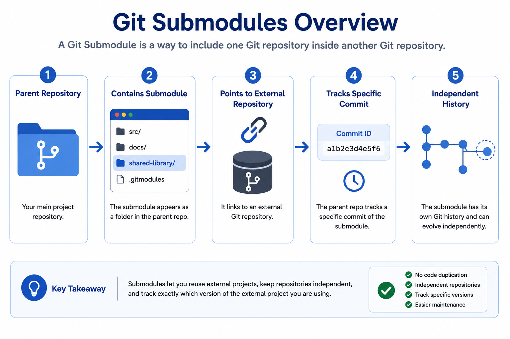
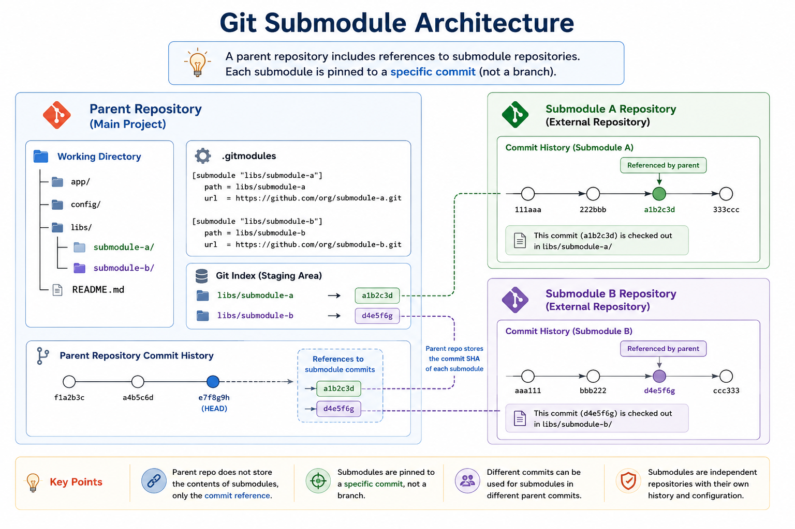

# 📦 Git Submodules

## 📖 Introduction

A **Git Submodule** allows you to include one Git repository inside another Git repository. It is useful when your project depends on another project that is maintained separately.

Instead of copying code into multiple repositories, Git Submodules let you reference an external repository while keeping its commit history independent.

---

# 🎯 Learning Objectives

By the end of this chapter, you will be able to:

* Understand Git Submodules
* Add a submodule to a repository
* Clone repositories containing submodules
* Update submodules
* Remove submodules
* Apply best practices

---

# 🤔 Why Use Git Submodules?

Consider two projects that use the same shared library.

Without Submodules:

```text
Project-A
│
└── auth-library (Copied)

Project-B
│
└── auth-library (Copied)
```

Problems:

* Duplicate code
* Difficult maintenance
* Manual updates
* Version inconsistencies

With Submodules:

```text
Project-A
│
└── auth-library (Git Submodule)

Project-B
│
└── auth-library (Git Submodule)

            │
            ▼
Shared Git Repository
```

Benefits:

* Reuse code across projects
* Maintain a single source of truth
* Track specific versions
* Easier updates

---

# 📦 What is a Git Submodule?

A Git Submodule is a pointer to another Git repository. The parent repository stores only the commit reference of the submodule instead of its complete history.

Repository structure:

```text
MyProject/
│
├── app/
├── docs/
├── shared-library/
├── .gitmodules
└── .git/
```

The `.gitmodules` file stores information about each submodule, including its path and remote repository URL.

---

# 📊 Git Submodules Overview



Example Flow:

```text
Main Repository
      │
      ▼
Contains Submodule
      │
      ▼
Points to External Repository
      │
      ▼
Tracks a Specific Commit
```

---

# 🏗️ Git Submodule Architecture



```text
Parent Repository
        │
        ├── Source Code
        ├── Documentation
        ├── Configuration
        └── Shared Library (Submodule)
                    │
                    ▼
           External Git Repository
```

---

# 🌍 Real-World Use Cases

Git Submodules are commonly used to:

* Share common libraries across multiple projects.
* Include third-party SDKs without copying their source code.
* Maintain infrastructure modules separately from application code.
* Keep reusable DevOps scripts in a dedicated repository.
* Manage shared configuration files across multiple teams.

---

# ✅ Advantages

* Avoids code duplication.
* Keeps repositories independent.
* Makes dependency management easier.
* Tracks a fixed version of external code.
* Simplifies maintenance of shared components.

---

# ⚠️ Limitations

* Slightly more complex than a normal repository.
* Requires additional commands when cloning and updating.
* Team members must understand submodule workflows.

---

# 📝 Summary

Git Submodules provide a clean way to include one Git repository inside another while keeping both repositories independent. They are ideal for managing shared libraries, reusable components, and external dependencies without duplicating code.

---

➡️ **Next:** In Part 2, you'll learn how to:

* Add a submodule
* Clone repositories with submodules
* Update submodules
* Remove submodules
* Practice with hands-on examples

---

# ➕ Adding a Git Submodule

Use the following command to add an external repository as a submodule:

```bash
git submodule add <repository-url>
```

Example:

```bash
git submodule add https://github.com/example/shared-library.git
```

Git creates:

* A new submodule directory
* A `.gitmodules` file
* A reference to the submodule commit

---

# 📊 Adding a Submodule Workflow


```text
Main Repository
      │
      ▼
git submodule add
      │
      ▼
Clone External Repository
      │
      ▼
Create .gitmodules
      │
      ▼
Track Specific Commit
```

---

# 📥 Cloning a Repository with Submodules

If a repository contains submodules, clone it using:

```bash
git clone --recurse-submodules <repository-url>
```

Example:

```bash
git clone --recurse-submodules https://github.com/example/project.git
```

If you've already cloned the repository:

```bash
git submodule init

git submodule update
```

---

# 🔄 Updating a Submodule

To fetch the latest changes from the submodule:

```bash
git submodule update --remote
```

---

# 📊 Updating Submodule Workflow


```text
Submodule Updated
        │
        ▼
git submodule update --remote
        │
        ▼
Latest Commit Downloaded
        │
        ▼
Parent Repository Updated
```

---

# 🗑️ Removing a Submodule

To remove a submodule:

```bash
git submodule deinit -f <submodule-name>

git rm <submodule-name>
```

Commit the changes:

```bash
git commit -m "Remove submodule"
```

---

# 💻 Hands-on Lab

### Step 1 – Initialize a Repository

```bash
mkdir submodule-demo

cd submodule-demo

git init
```

### Step 2 – Add a Submodule

```bash
git submodule add https://github.com/example/shared-library.git
```

### Step 3 – Verify

```bash
git status
```

You should see:

* `.gitmodules`
* Submodule directory

### Step 4 – Commit

```bash
git add .

git commit -m "Added Git Submodule"
```

---

# 🌍 Real-World Example

Suppose multiple applications use a common authentication library.

```text
Application A
        │
Application B
        │
Application C
        │
        ▼
Authentication Library
(Git Submodule)
```

Each application references the same repository instead of maintaining separate copies.

---

# 📌 Key Takeaways

* Use `git submodule add` to add a submodule.
* Clone with `--recurse-submodules`.
* Update using `git submodule update --remote`.
* Commit submodule changes like any other Git change.
* Use submodules for shared libraries and reusable components.

---

➡️ **Next:** Part 3 covers **Best Practices**, **Common Mistakes**, **Interview Questions**, and **Summary**.


---

# ✅ Best Practices

Follow these best practices when working with Git Submodules:

* Keep submodules focused on reusable components.
* Track stable releases instead of unstable branches.
* Commit both the `.gitmodules` file and the updated submodule reference.
* Document submodule setup steps in your project README.
* Update submodules regularly to receive bug fixes and security patches.

---

# ⚠️ Common Mistakes

### 1. Forgetting to Clone Submodules

Incorrect:

```bash
git clone https://github.com/example/project.git
```

Correct:

```bash
git clone --recurse-submodules https://github.com/example/project.git
```

---

### 2. Forgetting to Update Submodules

```bash
git submodule update --remote
```

This ensures your submodules are updated to the desired version.

---

### 3. Editing the Submodule Without Committing

Remember that changes inside a submodule are stored in a different Git repository.

After updating the submodule:

1. Commit changes inside the submodule.
2. Commit the updated submodule reference in the parent repository.

---

# 🌍 Real-World DevOps Use Cases

Git Submodules are widely used to:

* Share common libraries across applications.
* Store Infrastructure as Code (IaC) modules.
* Manage reusable Terraform modules.
* Maintain shared CI/CD pipeline scripts.
* Include third-party SDKs while keeping version control separate.

---

# 📊 Git Submodules Summary


```text
Parent Repository
        │
        ▼
Contains Submodule
        │
        ▼
External Git Repository
        │
        ▼
Tracks Specific Commit
```

---

# 📌 Command Summary

| Command                                | Purpose                            |
| -------------------------------------- | ---------------------------------- |
| `git submodule add <url>`              | Add a submodule                    |
| `git clone --recurse-submodules <url>` | Clone repository with submodules   |
| `git submodule init`                   | Initialize submodules              |
| `git submodule update`                 | Download submodule content         |
| `git submodule update --remote`        | Update to the latest remote commit |
| `git submodule deinit -f <name>`       | Remove submodule configuration     |
| `git rm <name>`                        | Remove a submodule                 |

---

# 🎤 Interview Questions

### 1. What is a Git Submodule?

A Git Submodule is a Git repository embedded inside another Git repository, allowing reusable code to be managed independently.

---

### 2. Why use Git Submodules?

To reuse shared code, avoid duplication, and manage external dependencies while preserving independent version history.

---

### 3. Which file stores submodule information?

```text
.gitmodules
```

---

### 4. How do you clone a repository with submodules?

```bash
git clone --recurse-submodules <repository-url>
```

---

### 5. How do you update a submodule?

```bash
git submodule update --remote
```

---

### 6. What are common use cases for Git Submodules?

* Shared libraries
* Infrastructure modules
* Third-party dependencies
* Common DevOps scripts
* Reusable application components

---

# 📝 Summary

Git Submodules provide a reliable way to include one Git repository inside another while keeping each repository independent. They help teams share code, reduce duplication, and manage external dependencies more effectively.

**Key Takeaways:**

* Use submodules for reusable code.
* Clone with `--recurse-submodules`.
* Update with `git submodule update --remote`.
* Commit both submodule changes and parent repository references.
* Follow best practices to keep dependencies consistent.

---

# 🎯 What's Next?

➡️ **06-Git-Aliases.md**

In the next chapter, you'll learn:

* What Git Aliases are
* Creating custom shortcuts
* Repository-specific vs global aliases
* Productivity tips
* Best practices
* Interview questions

