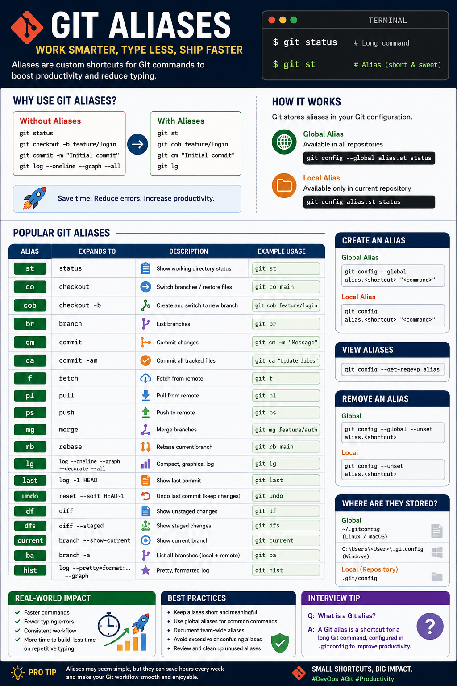

# Git Aliases

## Overview

Git aliases allow you to create custom shortcuts for frequently used Git commands. Instead of typing long commands every time, you can define short, memorable aliases that improve productivity and reduce typing errors.

Aliases are especially useful for developers and DevOps engineers who work with Git daily.

---

# Why Use Git Aliases?

Without aliases:

```bash
git status
git checkout
git checkout -b feature/login
git commit -m "Initial commit"
git log --oneline --graph --decorate --all
```

With aliases:

```bash
git st
git co
git cob feature/login
git cm "Initial commit"
git lg
```

This saves time and makes Git workflows much faster.

---

# How Git Aliases Work

Git stores aliases inside your Git configuration file.

There are two types of aliases:

- Local Alias (Current Repository)
- Global Alias (Available Everywhere)

---

# View Existing Aliases

```bash
git config --get-regexp alias
```

Example Output

```text
alias.st status
alias.co checkout
alias.br branch
alias.cm commit -m
```

---

# Create a Global Alias

Syntax

```bash
git config --global alias.<shortcut> "<command>"
```

Example

```bash
git config --global alias.st status
```

Now instead of

```bash
git status
```

You can simply run

```bash
git st
```

---

# Create a Local Alias

A local alias is available only inside the current repository.

```bash
git config alias.st status
```

Verify

```bash
git config --get-regexp alias
```

---

# Remove an Alias

Global

```bash
git config --global --unset alias.st
```

Local

```bash
git config --unset alias.st
```

---

# Common Git Aliases

## Status

```bash
git config --global alias.st status
```

Usage

```bash
git st
```

---

## Checkout

```bash
git config --global alias.co checkout
```

Usage

```bash
git co main
```

---

## Create Branch

```bash
git config --global alias.cob "checkout -b"
```

Usage

```bash
git cob feature/authentication
```

---

## Branch List

```bash
git config --global alias.br branch
```

Usage

```bash
git br
```

---

## Commit

```bash
git config --global alias.cm commit
```

Usage

```bash
git cm -m "Added login page"
```

---

## Commit All Tracked Files

```bash
git config --global alias.ca "commit -am"
```

Usage

```bash
git ca "Bug fixed"
```

---

## Fetch

```bash
git config --global alias.f fetch
```

Usage

```bash
git f
```

---

## Pull

```bash
git config --global alias.pl pull
```

Usage

```bash
git pl
```

---

## Push

```bash
git config --global alias.ps push
```

Usage

```bash
git ps
```

---

## Merge

```bash
git config --global alias.mg merge
```

Usage

```bash
git mg feature/payment
```

---

## Rebase

```bash
git config --global alias.rb rebase
```

Usage

```bash
git rb main
```

---

## Last Commit

```bash
git config --global alias.last "log -1 HEAD"
```

Usage

```bash
git last
```

---

## Short Log

```bash
git config --global alias.lg "log --oneline --graph --decorate --all"
```

Usage

```bash
git lg
```

Example Output

```text
* 54ef2bc Added Jenkins pipeline
* a2d1451 Fixed deployment issue
* 9ac231f Updated README
```

---

## Undo Last Commit (Keep Changes)

```bash
git config --global alias.undo "reset --soft HEAD~1"
```

Usage

```bash
git undo
```

---

## View Differences

```bash
git config --global alias.df diff
```

Usage

```bash
git df
```

---

## View Staged Differences

```bash
git config --global alias.dfs "diff --staged"
```

Usage

```bash
git dfs
```

---

# Advanced Aliases

## Show Current Branch

```bash
git config --global alias.current "branch --show-current"
```

Usage

```bash
git current
```

---

## List All Branches

```bash
git config --global alias.ba "branch -a"
```

Usage

```bash
git ba
```

---

## Pretty Log

```bash
git config --global alias.hist "log --pretty=format:'%h %ad | %s%d [%an]' --graph --date=short"
```

Usage

```bash
git hist
```

Example

```text
* 4e2ad71 2025-06-28 | Added Git Hooks [Newton]
* 8d32ab9 2025-06-27 | Fixed Dockerfile [Newton]
```

---

# View Git Configuration

```bash
git config --global --list
```

or

```bash
git config --list
```

---

# Where Git Stores Aliases

Global aliases are stored in

Linux/macOS

```text
~/.gitconfig
```

Windows

```text
C:\Users\<Username>\.gitconfig
```

Example

```ini
[alias]
    st = status
    co = checkout
    cob = checkout -b
    br = branch
    cm = commit
    lg = log --oneline --graph --decorate --all
    last = log -1 HEAD
```

---

# Real-World Scenario

Imagine you are a DevOps engineer working on multiple repositories every day.

Without aliases:

```bash
git checkout feature/login
git status
git add .
git commit -m "Updated login service"
git push origin feature/login
```

With aliases:

```bash
git co feature/login
git st
git add .
git cm -m "Updated login service"
git ps origin feature/login
```

Across hundreds of Git operations every day, aliases can save a significant amount of time and make workflows more efficient.

---

# Best Practices

- Keep alias names short and intuitive.
- Use global aliases for commonly used commands.
- Document team-wide aliases if everyone follows the same workflow.
- Avoid creating aliases that are confusing or conflict with existing Git commands.
- Periodically review and clean up unused aliases.

---

# Advantages

- Faster command execution
- Less typing
- Fewer typing mistakes
- Consistent Git workflow
- Improved developer productivity

---

# Limitations

- New team members may not recognize custom aliases.
- Excessive or unclear aliases can reduce readability.
- Aliases are user-specific unless shared with the team.

---

# Interview Questions

### 1. What is a Git alias?

A Git alias is a custom shortcut that maps a short command to a longer Git command.

---

### 2. Where are global Git aliases stored?

In the user's `.gitconfig` file.

---

### 3. How do you create a global Git alias?

```bash
git config --global alias.st status
```

---

### 4. How do you list all configured aliases?

```bash
git config --get-regexp alias
```

---

### 5. What is the difference between local and global aliases?

| Local Alias | Global Alias |
|-------------|--------------|
| Available only in the current repository | Available in all repositories |
| Stored in `.git/config` | Stored in `.gitconfig` |

---

# Git Aliases

Master Git faster with custom shortcuts to simplify everyday commands and improve your workflow.

---

<p align="center">
  
</p>

---

## Overview

Git aliases allow you to create custom shortcuts for frequently used Git commands...

---
# Summary

Git aliases are a powerful productivity feature that lets you replace long Git commands with short, memorable shortcuts. They streamline daily workflows, reduce typing, and improve efficiency for developers and DevOps engineers. By configuring a thoughtful set of aliases, you can make version control operations faster and more consistent across all your projects

.
