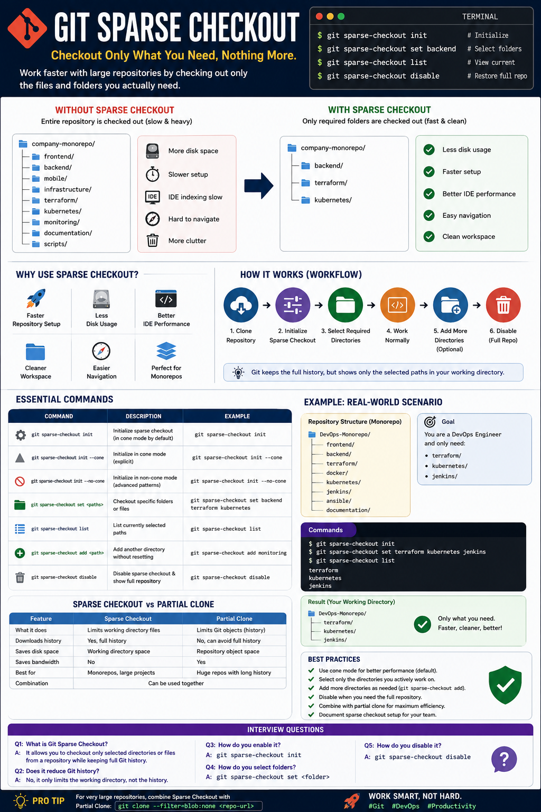

# Git Sparse Checkout

Master large Git repositories by checking out only the files and folders you actually need.

---

<p align="center">
  
</p>

---

# Overview

Git Sparse Checkout is a Git feature that allows you to check out only selected directories or files from a repository instead of downloading the entire working tree.

The complete Git history is still available locally, but only the specified paths appear in your working directory.

This feature is especially useful for large monolithic repositories (monorepos) containing multiple applications, services, or teams.

---

# Why Use Sparse Checkout?

Imagine a repository with the following structure:

```
company-monorepo/
│
├── frontend/
├── backend/
├── mobile/
├── infrastructure/
├── terraform/
├── kubernetes/
├── monitoring/
├── documentation/
└── scripts/
```

If you're working only on the **backend**, downloading every folder wastes:

- Disk space
- File indexing time
- IDE performance
- Build time

Instead, Sparse Checkout allows Git to expose only:

```
backend/
```

while hiding everything else.

---

# Benefits

- Faster repository setup
- Better IDE performance
- Less disk usage
- Cleaner workspace
- Easier navigation
- Perfect for monorepos

---

# Prerequisites

Git version:

```bash
git --version
```

Git 2.25 or later is recommended.

---

# Clone Repository

Clone normally first.

```bash
git clone https://github.com/company/project.git

cd project
```

---

# Initialize Sparse Checkout

Enable Sparse Checkout.

```bash
git sparse-checkout init
```

This creates the required configuration.

---

# Checkout a Specific Folder

Example:

```bash
git sparse-checkout set backend
```

Working directory becomes

```
project/

backend/
```

Only the backend folder is checked out.

---

# Checkout Multiple Directories

Example

```bash
git sparse-checkout set backend infrastructure terraform
```

Working tree

```
backend/
infrastructure/
terraform/
```

Everything else remains hidden.

---

# View Current Sparse Configuration

```bash
git sparse-checkout list
```

Example

```
backend
terraform
infrastructure
```

---

# Add Another Directory

```bash
git sparse-checkout add monitoring
```

Now Git checks out

```
backend/
terraform/
infrastructure/
monitoring/
```

---

# Disable Sparse Checkout

Return to the full repository.

```bash
git sparse-checkout disable
```

Everything becomes visible again.

---

# Sparse Checkout Workflow

```
Clone Repository
        │
        ▼
Initialize Sparse Checkout
        │
        ▼
Select Required Directories
        │
        ▼
Work Normally
        │
        ▼
Add More Directories (Optional)
        │
        ▼
Disable Sparse Checkout
```

---

# Real-World Example

Repository

```
DevOps-Monorepo

frontend/
backend/
terraform/
docker/
kubernetes/
jenkins/
ansible/
documentation/
```

A DevOps Engineer only needs:

```
terraform/
kubernetes/
jenkins/
```

Commands

```bash
git sparse-checkout init

git sparse-checkout set terraform kubernetes jenkins
```

Result

```
terraform/
kubernetes/
jenkins/
```

No unnecessary folders are downloaded into the working directory.

---

# Cone Mode

Modern Git uses **Cone Mode** by default.

Enable

```bash
git sparse-checkout init --cone
```

Benefits

- Faster
- Simpler
- Optimized for directories
- Recommended for most users

---

# Non-Cone Mode

Useful for advanced path matching.

```bash
git sparse-checkout init --no-cone
```

Example

```
src/**/*.java
```

Usually not required unless working with complex file patterns.

---

# Check Sparse Status

```bash
git sparse-checkout list
```

---

# Sparse Checkout vs Partial Clone

| Sparse Checkout | Partial Clone |
|-----------------|---------------|
| Downloads all Git history | Can avoid downloading full history |
| Hides unnecessary files | Reduces downloaded Git objects |
| Saves working directory space | Saves bandwidth and storage |
| Best for monorepos | Best for extremely large repositories |

---

# Common Commands

Initialize

```bash
git sparse-checkout init
```

Select directories

```bash
git sparse-checkout set backend terraform
```

List

```bash
git sparse-checkout list
```

Add folder

```bash
git sparse-checkout add monitoring
```

Disable

```bash
git sparse-checkout disable
```

---

# Best Practices

- Use Sparse Checkout for large repositories.
- Prefer Cone Mode unless advanced path patterns are needed.
- Keep selected folders limited to your current work.
- Document Sparse Checkout usage for team members.
- Combine with Partial Clone for very large repositories.

---

# Advantages

- Faster development
- Reduced disk usage
- Cleaner working directory
- Better IDE performance
- Easier navigation
- Excellent for enterprise monorepos

---

# Limitations

- Repository history is still downloaded.
- Hidden files are not deleted from Git; they are simply omitted from the working tree.
- Some tools expect the full repository layout.
- New team members may need guidance on Sparse Checkout workflows.

---

# Real-World DevOps Scenario

A company maintains a monorepo containing:

```
frontend/
backend/
terraform/
helm/
kubernetes/
jenkins/
ansible/
monitoring/
security/
```

You are responsible only for Kubernetes deployments.

Instead of checking out the full repository:

```bash
git sparse-checkout init

git sparse-checkout set kubernetes helm monitoring
```

Your workspace contains only the directories you need, making navigation faster and reducing IDE indexing time.

---

# Interview Questions

### 1. What is Git Sparse Checkout?

It allows you to check out only selected directories or files from a repository while keeping the full Git history.

---

### 2. Why is Sparse Checkout useful?

It improves performance, reduces disk usage, and simplifies working with large repositories.

---

### 3. Does Sparse Checkout reduce Git history?

No. It only limits the working tree. The Git history is still available locally.

---

### 4. How do you enable Sparse Checkout?

```bash
git sparse-checkout init
```

---

### 5. How do you select folders?

```bash
git sparse-checkout set backend terraform
```

---

### 6. How do you disable Sparse Checkout?

```bash
git sparse-checkout disable
```

---

# Summary

Git Sparse Checkout is a powerful feature for working efficiently with large repositories. By checking out only the files and directories relevant to your task, developers and DevOps engineers can improve workspace organization, reduce resource usage, and speed up development workflows. It is particularly valuable in enterprise monorepos where different teams work on separate components of the same codebase.
