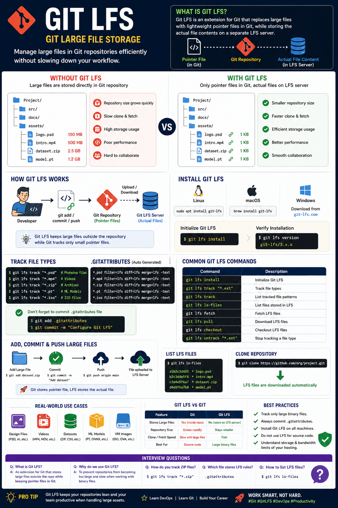

# Git Large File Storage (Git LFS)

Store and manage large files efficiently in Git repositories without slowing down your workflow.

---

<p align="center">
  
</p>

---

# Overview

Git Large File Storage (Git LFS) is an extension to Git that replaces large files with lightweight pointer files inside the Git repository while storing the actual file contents on a separate LFS server.

Git LFS is designed for projects that contain large binary files such as images, videos, datasets, machine learning models, game assets, and design files.

---

# Why Git LFS?

Git performs exceptionally well with text files but struggles with large binary files because every version of a binary file is stored in the repository history.

Example repository:

```
Project/
│
├── src/
├── docs/
├── README.md
├── logo.psd
├── intro.mp4
├── dataset.zip
└── model.pt
```

Without Git LFS:

- Repository size grows rapidly.
- Clone and fetch operations become slower.
- Storage usage increases significantly.
- Git history becomes unnecessarily large.

Git LFS solves this by storing only pointers in Git while keeping the actual files on an LFS server.

---

# How Git LFS Works

```
Developer
     │
     ▼
Git Repository
(pointer files)
     │
     ▼
Git LFS Server
(actual large files)
```

Git tracks only small pointer files, while Git LFS automatically uploads and downloads the actual file contents.

---

# Benefits

- Smaller Git repositories
- Faster cloning
- Faster fetching
- Efficient storage management
- Better collaboration
- Supports large binary assets

---

# Install Git LFS

Linux

```bash
sudo apt install git-lfs
```

macOS

```bash
brew install git-lfs
```

Windows

Download and install Git LFS from:

https://git-lfs.com/

Initialize Git LFS

```bash
git lfs install
```

---

# Verify Installation

```bash
git lfs version
```

Example

```
git-lfs/3.x.x
```

---

# Track File Types

Track Photoshop files

```bash
git lfs track "*.psd"
```

Track videos

```bash
git lfs track "*.mp4"
```

Track ZIP files

```bash
git lfs track "*.zip"
```

Track Machine Learning models

```bash
git lfs track "*.pt"
```

Track ISO files

```bash
git lfs track "*.iso"
```

---

# View Tracked File Types

```bash
git lfs track
```

Example

```
Listing tracked patterns

*.zip
*.psd
*.mp4
*.iso
```

---

# .gitattributes File

After tracking files, Git creates or updates:

```
.gitattributes
```

Example

```
*.zip filter=lfs diff=lfs merge=lfs -text
*.psd filter=lfs diff=lfs merge=lfs -text
*.mp4 filter=lfs diff=lfs merge=lfs -text
```

Commit this file.

```bash
git add .gitattributes

git commit -m "Configure Git LFS"
```

---

# Add Large Files

```bash
git add dataset.zip

git commit -m "Add dataset"

git push origin main
```

Git automatically uploads the file to the LFS server.

---

# Clone Repository with Git LFS

```bash
git clone https://github.com/company/project.git
```

Git LFS automatically downloads the required large files.

---

# Pull Latest LFS Files

```bash
git lfs pull
```

---

# Fetch LFS Files

```bash
git lfs fetch
```

---

# Checkout LFS Files

```bash
git lfs checkout
```

---

# List LFS Files

```bash
git lfs ls-files
```

Example

```
logo.psd

intro.mp4

dataset.zip

model.pt
```

---

# Remove a File from Git LFS Tracking

Stop tracking

```bash
git lfs untrack "*.zip"
```

Commit changes

```bash
git add .gitattributes

git commit -m "Remove ZIP tracking"
```

---

# Common Git LFS Commands

Install

```bash
git lfs install
```

Track

```bash
git lfs track "*.zip"
```

List tracked

```bash
git lfs track
```

List files

```bash
git lfs ls-files
```

Fetch

```bash
git lfs fetch
```

Pull

```bash
git lfs pull
```

Checkout

```bash
git lfs checkout
```

Untrack

```bash
git lfs untrack "*.zip"
```

---

# Real-World DevOps Scenario

A DevOps team manages infrastructure code along with deployment artifacts.

Repository

```
Infrastructure/

terraform/

ansible/

scripts/

images/

ISO/

VM-Templates/

database-backups/
```

Large files include:

- Virtual machine images
- ISO files
- Backup archives
- Kubernetes snapshots

Configure Git LFS

```bash
git lfs track "*.iso"

git lfs track "*.ova"

git lfs track "*.zip"

git lfs track "*.tar.gz"
```

Result

- Repository remains lightweight.
- Team members download large files only when needed.
- Faster Git operations.

---

# Git LFS Workflow

```
Install Git LFS
       │
       ▼
Initialize Repository
       │
       ▼
Track File Types
       │
       ▼
Commit .gitattributes
       │
       ▼
Add Large Files
       │
       ▼
Commit & Push
       │
       ▼
Git uploads large files to LFS Server
```

---

# Git LFS vs Git

| Git | Git LFS |
|------|----------|
| Stores every file version in Git | Stores pointers in Git |
| Repository grows quickly | Repository stays smaller |
| Slow for large binaries | Optimized for binary files |
| Best for source code | Best for large assets |

---

# Best Practices

- Track binary files only.
- Commit the `.gitattributes` file.
- Install Git LFS before cloning repositories that use it.
- Avoid storing source code in Git LFS.
- Use Git LFS for media files, datasets, backups, virtual machine images, and machine learning models.

---

# Advantages

- Faster cloning
- Smaller repositories
- Efficient storage
- Better collaboration
- Supports large binary files
- Reduces repository bloat

---

# Limitations

- Requires Git LFS to be installed on all contributors' machines.
- Some Git hosting providers enforce storage and bandwidth limits for Git LFS.
- Existing large files are not automatically migrated; additional migration commands may be needed.
- Not intended for normal source code files.

---

# Interview Questions

### 1. What is Git LFS?

Git LFS is an extension that stores large files outside the Git repository while keeping lightweight pointer files in Git.

---

### 2. Why is Git LFS needed?

It prevents repositories from becoming slow and excessively large when working with binary files.

---

### 3. What kinds of files should be tracked with Git LFS?

Examples include:

- Videos
- Images
- ZIP archives
- ISO files
- Machine learning models
- Photoshop files
- Virtual machine images

---

### 4. How do you initialize Git LFS?

```bash
git lfs install
```

---

### 5. How do you track ZIP files?

```bash
git lfs track "*.zip"
```

---

### 6. Which file stores Git LFS tracking rules?

```
.gitattributes
```

---

### 7. How do you list all files managed by Git LFS?

```bash
git lfs ls-files
```

---

# Summary

Git Large File Storage (Git LFS) extends Git by replacing large binary files with lightweight pointers while storing the actual content on a dedicated LFS server. It helps keep repositories smaller, improves Git performance, and enables efficient collaboration on projects containing large assets such as videos, datasets, virtual machine images, design files, backups, and machine learning models. Git LFS is an essential tool for modern DevOps, game development, data science, and multimedia projects.
