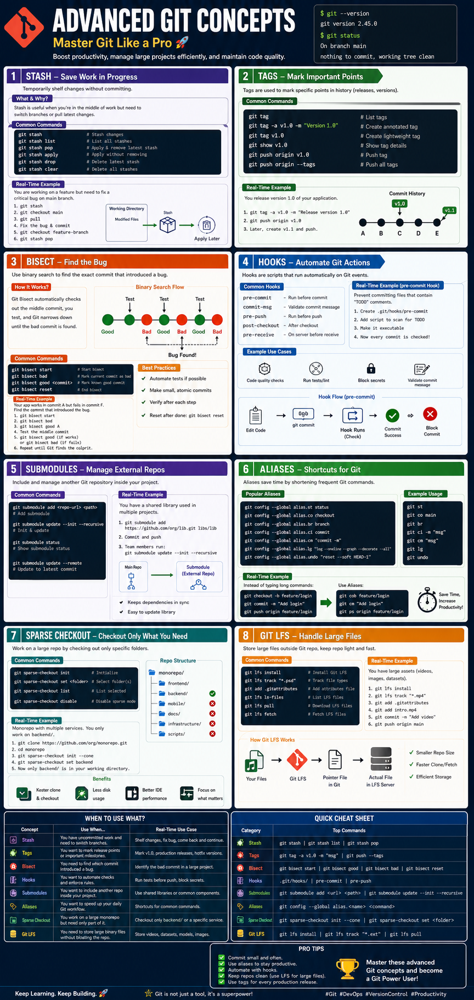

# 🚀 Advanced Git Concepts

Master Advanced Git concepts with practical examples, real-world DevOps scenarios, interview questions, and professional cheat sheets.

This repository is part of my **Learn DevOps** series and is designed to help beginners and experienced developers understand Git beyond the basics.

---

<p align="center">
  
</p>

---

## 📚 Topics Covered

| # | Topic | Description |
|---|--------|-------------|
| 01 | **Git Stash** | Temporarily save work without committing changes. |
| 02 | **Git Tags** | Mark important commits like releases and versions. |
| 03 | **Git Bisect** | Use binary search to quickly identify the commit that introduced a bug. |
| 04 | **Git Hooks** | Automate Git workflows using scripts executed before or after Git events. |
| 05 | **Git Submodules** | Manage external repositories inside your project. |
| 06 | **Git Aliases** | Create shortcuts for frequently used Git commands. |
| 07 | **Git Sparse Checkout** | Check out only the folders you need from a large repository. |
| 08 | **Git Large File Storage (Git LFS)** | Efficiently manage large binary files such as videos, images, datasets, and backups. |

---

# 📂 Repository Structure

```text
06-Advanced-Git/
│
├── README.md
│
├── 01-Stash.md
├── 02-Tags.md
├── 03-Bisect.md
├── 04-Hooks.md
├── 05-Submodules.md
├── 06-Git-Aliases.md
├── 07-Sparse-Checkout.md
├── 08-Git-LFS.md
│
├── git-bisect-binary-search.png
├── git-bisect-best-practices.png
│
└── assets/
    ├── advanced-git-concepts-overview.png
    ├── git-hooks-overview.png
    ├── git-aliases-overview.png
    ├── git-sparse-checkout-overview.png
    └── git-lfs-overview.png
```

---

# 🎯 Learning Roadmap

```
Git Stash
     │
     ▼
Git Tags
     │
     ▼
Git Bisect
     │
     ▼
Git Hooks
     │
     ▼
Git Submodules
     │
     ▼
Git Aliases
     │
     ▼
Git Sparse Checkout
     │
     ▼
Git LFS
```

---

# 💼 Real-World DevOps Workflow

A typical DevOps engineer may use several of these features during daily work:

### 🔹 Git Stash
Temporarily save unfinished work before switching to a hotfix branch.

### 🔹 Git Tags
Create release tags such as:

```bash
git tag -a v2.0 -m "Production Release"
```

### 🔹 Git Bisect
Identify the exact commit that introduced a deployment issue.

### 🔹 Git Hooks
Automatically run code formatting, linting, and security checks before every commit.

### 🔹 Git Submodules
Manage shared infrastructure modules across multiple repositories.

### 🔹 Git Aliases
Reduce repetitive typing with shortcuts such as:

```bash
git st
git co
git lg
```

### 🔹 Git Sparse Checkout
Work only on the directories you need inside a large monorepo.

### 🔹 Git LFS
Store Docker images, ISO files, datasets, backups, videos, and machine learning models efficiently.

---

# 📖 What You'll Learn

- ✅ Save unfinished work safely
- ✅ Create release versions using Git Tags
- ✅ Debug issues using Git Bisect
- ✅ Automate Git with Hooks
- ✅ Manage external repositories using Submodules
- ✅ Improve productivity using Git Aliases
- ✅ Work efficiently with Monorepos using Sparse Checkout
- ✅ Store large binary assets using Git LFS

---

# 👨‍💻 Who Is This For?

- DevOps Engineers
- Cloud Engineers
- Software Developers
- Site Reliability Engineers (SRE)
- Platform Engineers
- Students learning Git
- Anyone preparing for DevOps interviews

---

# 💡 Key Takeaways

- Improve Git productivity
- Learn enterprise Git workflows
- Understand real-world DevOps use cases
- Master advanced Git features
- Build interview-ready Git knowledge
- Work efficiently with large repositories

---

# 🛠 Prerequisites

- Basic Git knowledge
- Git installed (v2.25 or later recommended)
- GitHub account
- Command Line / Terminal
- VS Code (optional)

---

# ⭐ Why Learn Advanced Git?

As projects grow, simple Git commands are no longer enough.

Advanced Git features help you:

- Work faster
- Debug efficiently
- Collaborate better
- Reduce repository size
- Automate repetitive tasks
- Handle enterprise-scale repositories

These are skills commonly expected from professional developers and DevOps engineers.

---

# 🤝 Contributing

Contributions are welcome!

If you'd like to improve these notes, add examples, or fix issues:

1. Fork the repository
2. Create a feature branch
3. Commit your changes
4. Open a Pull Request

---

# 📢 Connect With Me

If you found this repository helpful:

- ⭐ Star this repository
- 🍴 Fork it
- 💬 Share your feedback
- 🔗 Connect with me on LinkedIn

---

# 📄 License

This project is licensed under the MIT License.

---

<p align="center">
⭐ If this repository helped you learn something new, consider giving it a Star! ⭐
</p>

<p align="center">
Keep Learning • Keep Building • Keep Growing 🚀
</p>
