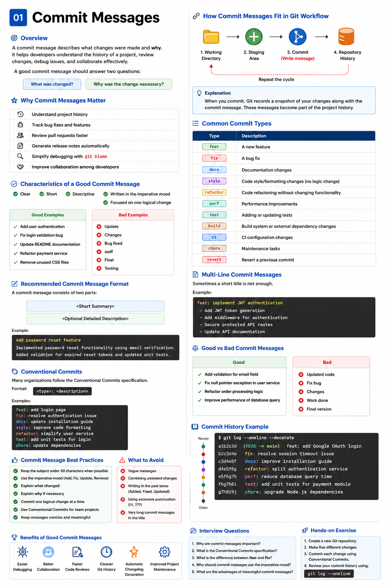

# Commit Messages

## Overview

A commit message describes **what changes were made** and **why they were made**. Writing clear and meaningful commit messages makes it easier for developers to understand the history of a project, review changes, debug issues, and collaborate effectively.

A good commit message should answer two questions:

- What was changed?
- Why was the change necessary?

---

# Why Commit Messages Matter

Good commit messages help teams:

- Understand project history
- Track bug fixes
- Review pull requests faster
- Generate release notes automatically
- Simplify debugging with `git blame`
- Improve collaboration among developers

Poor commit messages often make it difficult to understand why a change was introduced.

---

# Characteristics of a Good Commit Message

A good commit message should be:

- Clear
- Short
- Descriptive
- Written in the imperative mood
- Focused on one logical change

Good examples:

```
Add user authentication

Fix login validation bug

Update README documentation

Refactor payment service

Remove unused CSS files
```

Bad examples:

```
Update

Changes

Bug fixed

asdf

Final

Testing
```

---

# Recommended Commit Message Format

A commit message consists of two parts:

```
<Short Summary>

<Optional Detailed Description>
```

Example:

```
Add password reset feature

Implemented password reset functionality using email verification.
Added validation for expired reset tokens and updated unit tests.
```

---

# Conventional Commits
[>77;30801;0c]10;rgb:bfbf/bfbf/bfbf]11;rgb:0000/0000/0000
Many organizations follow the **Conventional Commits** specification.

Format:

```
<type>: <description>
```

Example:

```
feat: add login page

fix: resolve authentication issue

docs: update installation guide

style: improve code formatting

refactor: simplify user service

test: add unit tests for login

chore: update dependencies
```

---

# Common Commit Types

| Type | Description |
|-------|-------------|
| feat | New feature |
| fix | Bug fix |
| docs | Documentation changes |
| style | Formatting changes |
| refactor | Code restructuring without changing functionality |
| perf | Performance improvements |
| test | Adding or updating tests |
| build | Build system changes |
| ci | Continuous Integration changes |
| chore | Maintenance tasks |
| revert | Revert previous commit |

---

# Examples

## Feature

```
feat: add user registration
```

## Bug Fix

```
fix: prevent duplicate email registration
```

## Documentation

```
docs: update API documentation
```

## Refactoring

```
refactor: simplify authentication service
```

## Performance

```
perf: optimize database queries
```

---

# Multi-Line Commit Messages

Sometimes a short title is not enough.

Example:

```
feat: implement JWT authentication

- Add JWT token generation
- Add middleware for authentication
- Secure protected API routes
- Update API documentation
```

---

# Writing Better Commit Messages

Instead of writing:

```
Updated login
```

Write:

```
Add validation for invalid login attempts
```

Instead of:

```
Bug Fix
```

Write:

```
Fix null pointer exception in payment service
```

Be specific.

---

# Commit Message Best Practices

✔ Keep the subject under 50 characters when possible

✔ Use the imperative mood

✔ Explain **what** changed

✔ Explain **why** if necessary

✔ Commit one logical change at a time

✔ Use Conventional Commits for team projects

✔ Keep messages concise

---

# What to Avoid

Avoid messages like:

```
Update

Work

Done

Fix

Testing

Final Version

Temporary

asdf
```

Avoid combining unrelated changes into one commit.

Bad:

```
Added login
Updated README
Fixed payment
Removed CSS
```

Instead, create separate commits for each logical change.

---

# Commit Message Template

```
<type>: <short summary>

Detailed explanation (optional)

Reason for the change

Additional notes if required
```

Example:

```
fix: resolve payment timeout

Updated the payment service to retry failed API calls.
This reduces failures caused by temporary network issues.
```

---

# Real-World Examples

```
feat: add Google OAuth login

fix: resolve session timeout issue

docs: improve installation guide

refactor: split authentication service

perf: reduce database query execution time

test: add unit tests for payment module

chore: upgrade Node.js dependencies

ci: add GitHub Actions workflow

build: update Docker configuration
```

---

# Benefits of Good Commit Messages

- Easier debugging
- Better collaboration
- Faster code reviews
- Cleaner Git history
- Automatic changelog generation
- Improved project maintenance

---

# Summary

A well-written commit message communicates the purpose of a change clearly and concisely. Following consistent conventions, such as Conventional Commits, helps teams maintain a clean Git history and improves collaboration.

---

# Interview Questions

### 1. Why are commit messages important?

### 2. What is the Conventional Commits specification?

### 3. What is the difference between `feat` and `fix`?

### 4. Why should commit messages use the imperative mood?

### 5. What are the advantages of meaningful commit messages?

---

# Hands-on Exercise

1. Create a new Git repository.
2. Make five different changes.
3. Commit each change using Conventional Commits.

Example:

```
feat: add login page

fix: resolve validation issue

docs: update README

refactor: simplify authentication logic

test: add login unit tests
```

Review your commit history using:

```bash
igit log --oneline
```
<div align="center">

<table>
<tr>
<td>



</td>
</tr>

<tr>
<td align="center">

<b>Git Commit Messages Best Practices</b><br>
A complete visual guide covering workflow, Conventional Commits,
best practices, common mistakes, and real-world examples.

</td>
</tr>
</table>

</div>


