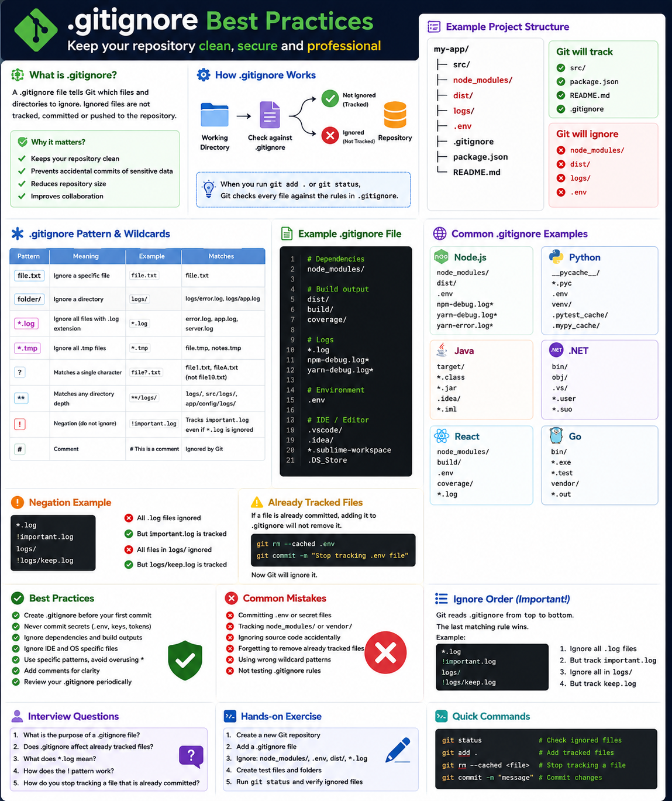
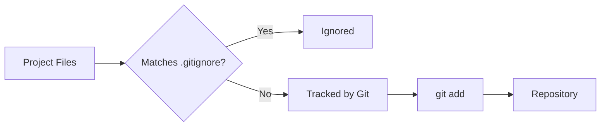

# .gitignore Best Practices

## Overview

A `.gitignore` file tells Git which files and directories should **not** be tracked by version control.

Ignoring unnecessary files keeps your repository clean, secure, and easier to collaborate on.

Without a proper `.gitignore`, you may accidentally commit:

- Temporary files
- Build artifacts
- IDE settings
- Log files
- Dependencies
- Environment variables
- API keys and secrets

---

## Visual Guide

<p align="center">
    
</p>

> **Figure 1:** Visual overview of `.gitignore`, pattern matching, common examples, and best practices.

---

# Why Use .gitignore?

Imagine your project looks like this:

```

my-app/
│
├── src/
├── node_modules/
├── .env
├── package.json
├── package-lock.json
├── dist/
├── logs/
└── README.md

```

Not every file belongs in Git.

Git should track only the source code and project files.

---

# Files You Should Ignore

Typical files include:

```

node_modules/
dist/
build/
coverage/
logs/
*.log
.env
.vscode/
.idea/
.DS_Store

```

---

# How Git Uses .gitignore



Whenever you run:

```bash
git add .
```

Git checks every file against the `.gitignore` rules.

---

# Creating a .gitignore File

Simply create a file named:

```

.gitignore

```

Example:

```gitignore
node_modules/
.env
dist/
build/
coverage/
*.log
```

---

# Understanding Ignore Patterns

## Ignore a Folder

```gitignore
node_modules/
```

Ignore everything inside:

```

node_modules/

```

---

## Ignore a File

```gitignore
.env
```

---

## Ignore All Log Files

```gitignore
*.log
```

Matches:

```

server.log
error.log
application.log

```

---

## Ignore a Specific Extension

```gitignore
*.tmp
```

---

## Ignore an Entire Directory

```gitignore
dist/
```

---

## Ignore Nested Directories

```gitignore
logs/
```

Git ignores:

```

logs/error.log
logs/server.log

```

---

# Wildcards

## *

Matches anything.

Example:

```gitignore
*.log
```

---

## ?

Matches one character.

```gitignore
file?.txt
```

Matches:

```

file1.txt
fileA.txt

```

Not:

```

file10.txt

```

---

## **

Matches any directory depth.

Example:

```gitignore
**/logs
```

Matches:

```

logs/
src/logs/
app/config/logs/

```

---

# Negation (!)

Sometimes you want to ignore everything except one file.

Example:

```gitignore
*.log
!important.log
```

Ignored:

```

debug.log

```

Tracked:

```

important.log

```

---

# Comments

Use comments for readability.

```gitignore
# Ignore dependencies
node_modules/

# Ignore environment
.env

# Ignore logs
*.log
```

---

# Common .gitignore for Node.js

```gitignore
node_modules/
dist/
coverage/
.env
*.log
npm-debug.log*
```

---

# Common .gitignore for Python

```gitignore
__pycache__/
*.pyc
.env
venv/
.pytest_cache/
```

---

# Common .gitignore for Java

```gitignore
target/
*.class
*.jar
.idea/
```

---

# Common .gitignore for .NET

```gitignore
bin/
obj/
.vs/
*.user
```

---

# Common .gitignore for React

```gitignore
node_modules/
build/
.env
coverage/
```

---

# Git Ignore Workflow


---

# Already Tracked Files

If a file was already committed, adding it to `.gitignore` **does not remove it**.

Example:

```bash
git rm --cached .env
git commit -m "Remove tracked environment file"
```

Now Git will ignore it.

---

# Best Practices

✅ Create `.gitignore` before your first commit

✅ Never commit secrets

✅ Ignore build outputs

✅ Ignore IDE settings

✅ Ignore temporary files

✅ Keep `.gitignore` organized

✅ Add comments

---

# Common Mistakes

❌ Committing `.env`

❌ Tracking `node_modules`

❌ Ignoring source code accidentally

❌ Forgetting to remove tracked files

❌ Using incorrect wildcard patterns

---

# Real-World Example

```

Project
│
├── src/
├── node_modules/
├── .env
├── dist/
├── README.md
└── .gitignore

```

Git tracks:

```

src/
README.md
package.json

```

Git ignores:

```

node_modules/
.env
dist/

```

---

# Summary

A properly configured `.gitignore` file prevents unnecessary, temporary, and sensitive files from being committed. It keeps repositories clean, improves collaboration, and protects confidential information.

---

# Interview Questions

### 1. What is the purpose of a `.gitignore` file?

### 2. Does `.gitignore` affect already tracked files?

### 3. What does `*.log` mean?

### 4. What is the purpose of `!` in `.gitignore`?

### 5. How do you stop tracking a file that is already committed?

---

# Hands-on Exercise

1. Create a new Git repository.
2. Add a `.gitignore` file.
3. Ignore:
   - `node_modules/`
   - `.env`
   - `dist/`
   - `*.log`
4. Create test files.
5. Run:

```bash
git status
```

Verify that ignored files do not appear.

