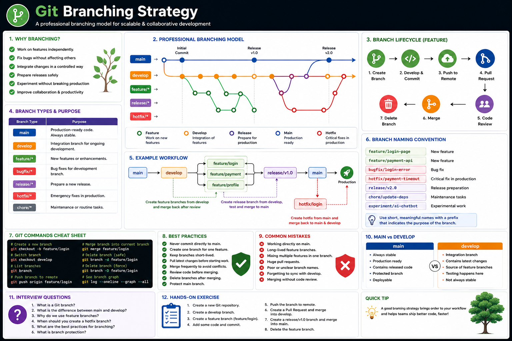
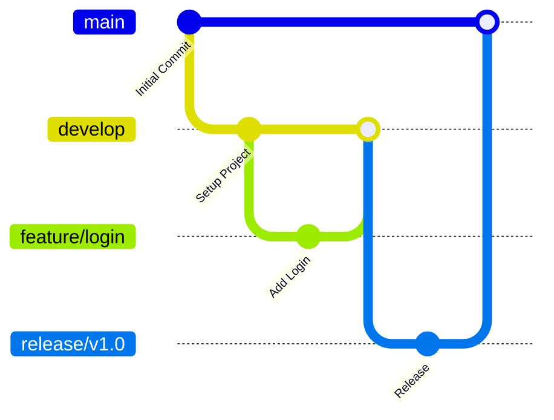
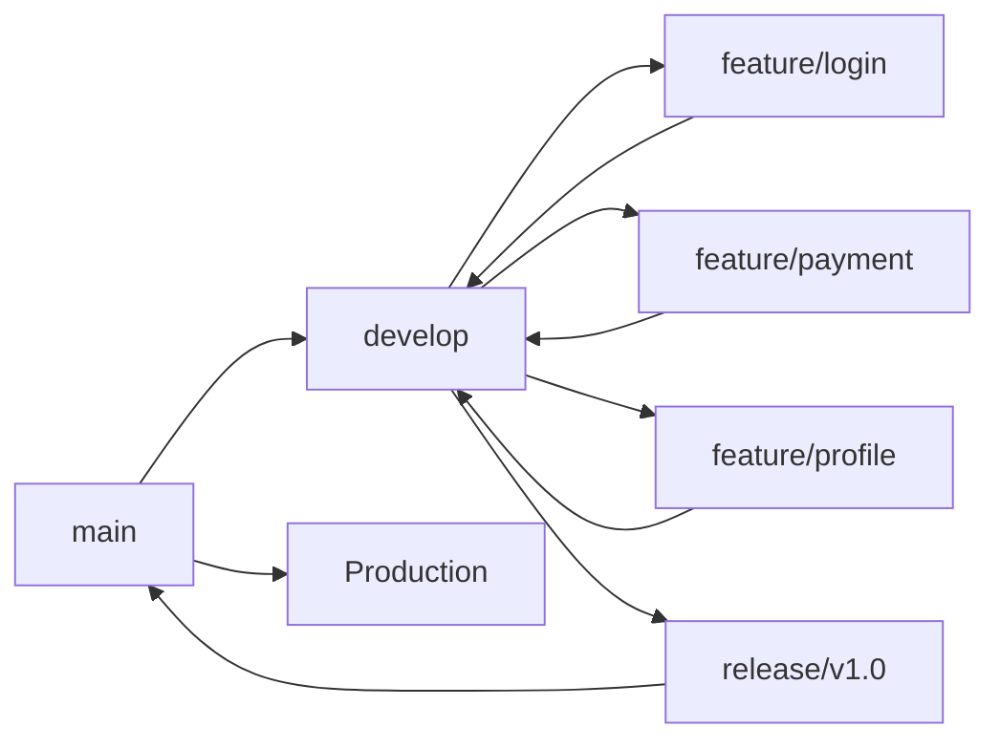
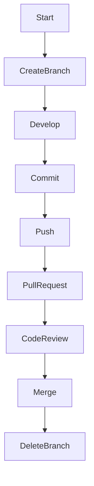

# Git Branching Strategy

## Overview

Git branching is one of the most powerful features of Git. It allows developers to work on new features, bug fixes, and experiments without affecting the stable codebase.

Branches enable teams to work in parallel, making collaboration easier and reducing the risk of introducing bugs into production.

---

## 📊 Visual Guide

<p align="center">
    
</p>

<p align="center">
<b>Figure 1.</b> Professional Git branching strategy showing feature, develop, release, hotfix, and main branches.
</p>

---

# Why Branching Matters

Without branches, every developer would work directly on the same codebase, increasing the chances of conflicts and unstable releases.

Using branches helps teams:

- Develop features independently
- Fix bugs without interrupting development
- Prepare releases safely
- Experiment without affecting production
- Collaborate efficiently

---

# What is a Branch?

A branch is an independent line of development.

Think of it as creating a copy of your project where you can make changes without affecting the main code.

```text
main
 │
 ├── feature/login
 │
 ├── feature/payment
 │
 └── bugfix/navbar
```

---

# How Branching Works



---

# Common Branch Types

| Branch | Purpose |
|---------|----------|
| **main** | Production-ready code |
| **develop** | Integration branch for ongoing development |
| **feature/** | New features |
| **bugfix/** | Bug fixes |
| **release/** | Prepare releases |
| **hotfix/** | Emergency production fixes |

---

# Professional Workflow



---

# Branch Lifecycle



---

# Branch Naming Convention

Use descriptive branch names.

Good examples:

```text
feature/login-page

feature/payment-api

feature/user-profile

bugfix/navbar

bugfix/login-error

hotfix/payment-timeout

release/v2.0
```

Avoid names like:

```text
test

new

branch1

abc

work

temp
```

---

# Common Git Commands

### Create a Branch

```bash
git checkout -b feature/login
```

---

### Switch Branch

```bash
git checkout develop
```

---

### View Branches

```bash
git branch
```

---

### Delete a Branch

```bash
git branch -d feature/login
```

---

### Push a Branch

```bash
git push origin feature/login
```

---

### Merge a Branch

```bash
git checkout develop
git merge feature/login
```

---

# Example Workflow

```text
main
 │
 └── develop
      │
      ├── feature/login
      │      │
      │      └── Merge
      │
      ├── feature/payment
      │      │
      │      └── Merge
      │
      └── release/v1.0
              │
              └── main
```

---

# Best Practices

- Never commit directly to `main`.
- Create one branch for one feature.
- Keep branches short-lived.
- Merge frequently to reduce conflicts.
- Delete branches after merging.
- Use meaningful branch names.
- Protect the `main` branch.
- Review code before merging.
- Pull the latest changes before starting new work.

---

# Common Mistakes

❌ Working directly on `main`

❌ Keeping feature branches alive for months

❌ Mixing multiple features in one branch

❌ Using unclear branch names

❌ Forgetting to pull the latest changes

❌ Merging without code review

---

# Real-World Example

Suppose three developers are working on the same project.

```text
main
 │
 └── develop
      │
      ├── feature/login      ← Developer A
      │
      ├── feature/payment    ← Developer B
      │
      └── feature/profile    ← Developer C
```

Each developer works independently.

Once the feature is complete:

1. Push the branch.
2. Create a Pull Request.
3. Review the code.
4. Merge into `develop`.
5. Delete the feature branch.

---

# Summary

Git branches allow developers to work independently without affecting the main codebase.

A well-defined branching strategy improves collaboration, simplifies releases, and keeps the repository organized.

Following consistent branch naming conventions and workflows helps teams deliver software more efficiently.

---

# Interview Questions

### 1. What is a Git branch?

### 2. Why do teams use feature branches?

### 3. What is the difference between `main` and `develop`?

### 4. When should you create a `hotfix` branch?

### 5. Why should branches be short-lived?

---

# Hands-on Exercise

1. Create a new Git repository.

2. Create a `develop` branch.

```bash
git checkout -b develop
```

3. Create a feature branch.

```bash
git checkout -b feature/login
```

4. Make some changes and commit them.

```bash
git add .
git commit -m "feat: add login page"
```

5. Merge the feature branch into `develop`.

```bash
git checkout develop
git merge feature/login
```

6. Delete the feature branch.

```bash
git branch -d feature/login
```

7. Verify your branches.

```bash
git branch
```

---

## Key Takeaways

- Branches isolate work.
- Never develop directly on `main`.
- Use descriptive branch names.
- Merge frequently.
- Delete merged branches.
- Follow a consistent branching strategy for team projects.
