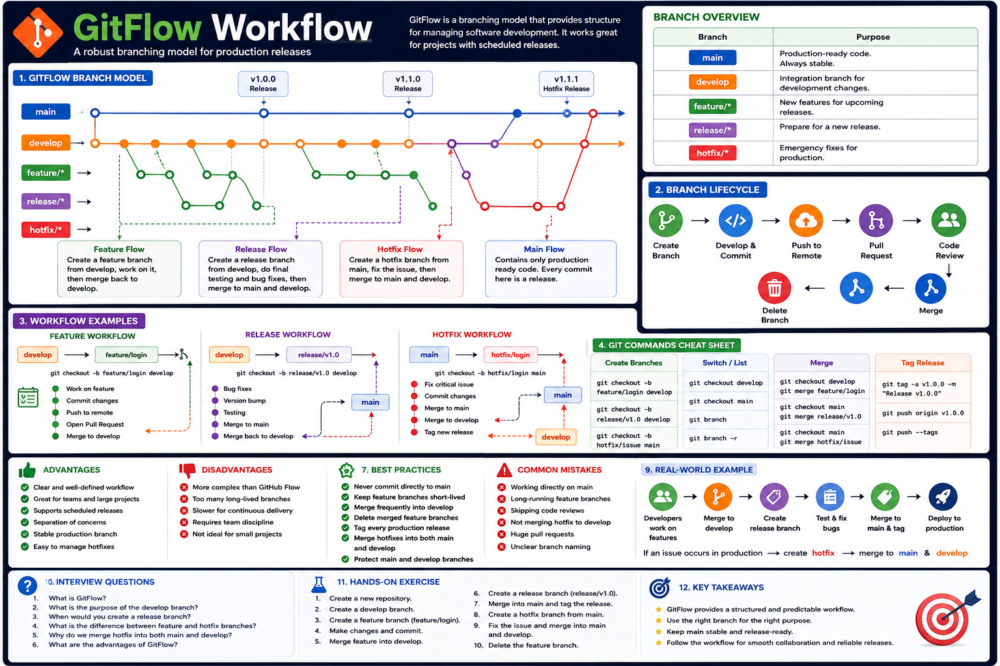
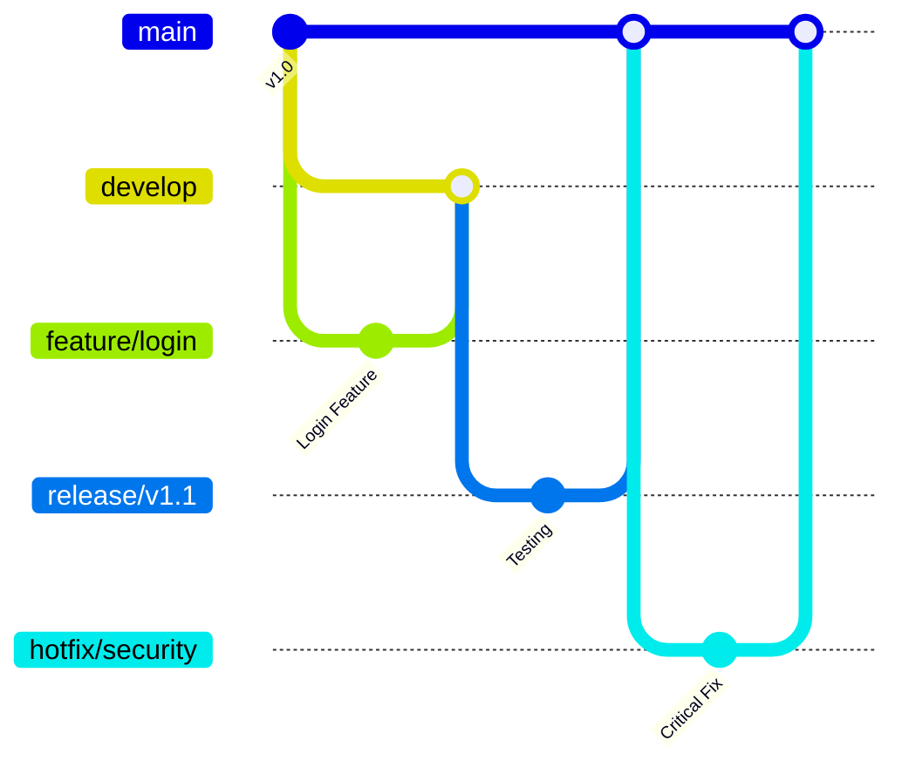
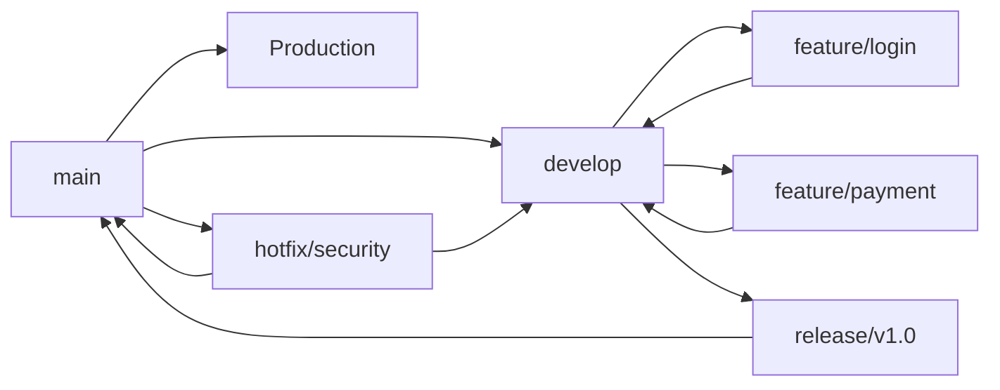

# GitFlow Workflow

## Overview

GitFlow is a branching model introduced by **Vincent Driessen** that provides a structured workflow for managing software development.

It defines dedicated branches for features, releases, and hotfixes, making it ideal for projects with scheduled releases and multiple developers.

---

## 📊 Visual Guide

<p align="center">
    
</p>

<p align="center">
<b>Figure 1.</b> GitFlow workflow showing the relationship between <code>main</code>, <code>develop</code>, <code>feature</code>, <code>release</code>, and <code>hotfix</code> branches.
</p>

---

# What is GitFlow?

GitFlow is a branching strategy that organizes development into separate branches.

Each branch has a specific purpose:

- **main** – Production-ready code
- **develop** – Integration branch
- **feature/** – New features
- **release/** – Release preparation
- **hotfix/** – Emergency fixes

---

# GitFlow Branch Structure

```text
main
 │
 ├───────────────► Production
 │
 ├── develop
 │      │
 │      ├── feature/login
 │      ├── feature/payment
 │      ├── feature/profile
 │      │
 │      └── release/v1.0
 │
 └── hotfix/login
```

---

# GitFlow Lifecycle



---

# GitFlow Workflow



---

# Branch Responsibilities

| Branch | Purpose |
|---------|----------|
| **main** | Stable production code |
| **develop** | Ongoing development |
| **feature/** | Build new features |
| **release/** | Prepare a release |
| **hotfix/** | Fix production issues |

---

# Typical GitFlow Process

### Step 1: Create a Feature Branch

```bash
git checkout develop
git checkout -b feature/login
```

---

### Step 2: Develop the Feature

```bash
git add .
git commit -m "feat: add login page"
```

---

### Step 3: Merge into Develop

```bash
git checkout develop
git merge feature/login
```

---

### Step 4: Create a Release Branch

```bash
git checkout -b release/v1.0
```

Only bug fixes, testing, and documentation updates should be made here.

---

### Step 5: Merge Release into Main

```bash
git checkout main
git merge release/v1.0
```

Tag the release:

```bash
git tag v1.0.0
```

---

### Step 6: Handle Hotfixes

```bash
git checkout -b hotfix/login main
```

Fix the issue:

```bash
git add .
git commit -m "fix: resolve login issue"
```

Merge into both `main` and `develop`.

---

# Advantages of GitFlow

- Clear separation of work
- Organized release process
- Supports multiple developers
- Stable production branch
- Easy maintenance of releases
- Well-suited for enterprise applications

---

# Disadvantages of GitFlow

- More complex than GitHub Flow
- Too many long-lived branches for small projects
- Can slow down rapid deployments
- Requires team discipline

---

# When to Use GitFlow

✅ Enterprise applications

✅ Banking systems

✅ Healthcare software

✅ Government projects

✅ Large development teams

---

# When Not to Use GitFlow

❌ Small personal projects

❌ Continuous deployment pipelines

❌ Fast-moving startup projects

For these cases, **GitHub Flow** is usually a better choice.

---

# Best Practices

- Keep the `main` branch stable.
- Merge feature branches frequently.
- Delete merged feature branches.
- Tag production releases.
- Keep release branches short-lived.
- Merge hotfixes into both `main` and `develop`.
- Protect the `main` branch.

---

# Common Mistakes

❌ Developing directly on `main`

❌ Long-running release branches

❌ Forgetting to merge hotfixes back into `develop`

❌ Mixing multiple features in one branch

❌ Skipping code reviews

---

# Real-World Example

A software company is preparing version **2.0**.

1. Developers create feature branches.
2. Features are merged into `develop`.
3. A `release/v2.0` branch is created.
4. QA tests the release.
5. The release is merged into `main`.
6. The version is tagged.
7. If a production issue occurs, a `hotfix` branch is created.

---

# Summary

GitFlow provides a structured and predictable workflow for teams building software with scheduled releases. It separates feature development, release preparation, and emergency fixes into dedicated branches, making collaboration easier and production more stable.

---

# Interview Questions

### 1. What is GitFlow?

### 2. What is the purpose of the `develop` branch?

### 3. Why are release branches used?

### 4. What is the difference between a feature branch and a hotfix branch?

### 5. When should GitFlow be used instead of GitHub Flow?

---

# Hands-on Exercise

1. Create a new repository.

2. Create a `develop` branch.

```bash
git checkout -b develop
```

3. Create a feature branch.

```bash
git checkout -b feature/login
```

4. Commit your changes.

```bash
git add .
git commit -m "feat: add login feature"
```

5. Merge into `develop`.

```bash
git checkout develop
git merge feature/login
```

6. Create a release branch.

```bash
git checkout -b release/v1.0
```

7. Merge the release into `main`.

```bash
git checkout main
git merge release/v1.0
git tag v1.0.0
```

8. Simulate a hotfix.

```bash
git checkout -b hotfix/login main
git commit -m "fix: resolve login issue"
git checkout main
git merge hotfix/login
git checkout develop
git merge hotfix/login
```

---

## Key Takeaways

- GitFlow organizes development with dedicated branches.
- `main` always contains production-ready code.
- `develop` integrates ongoing work.
- `feature/` branches isolate new features.
- `release/` branches prepare software for deployment.
- `hotfix/` branches quickly fix production issues.
- GitFlow is best suited for large teams and projects with planned releases.
