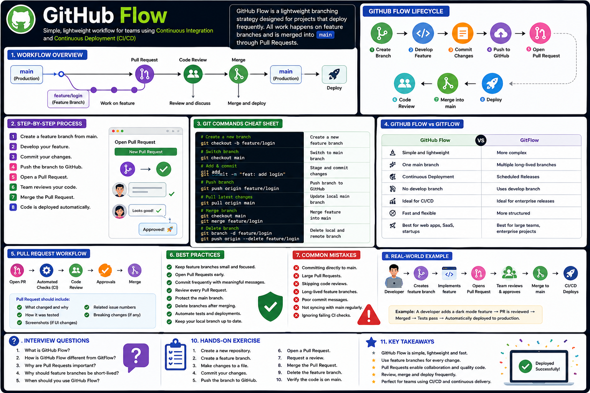
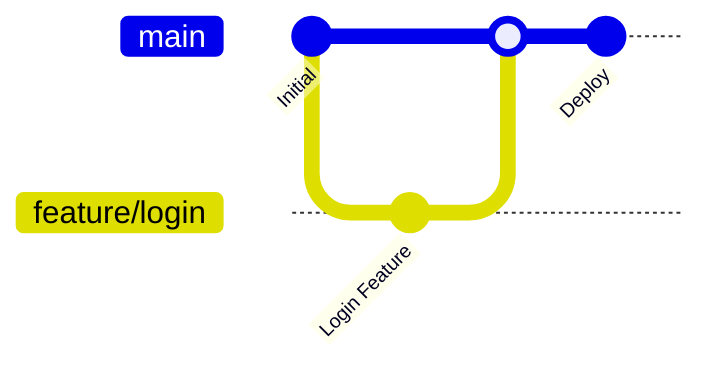

# GitHub Flow

## Overview

GitHub Flow is a simple and lightweight branching strategy designed for teams that deploy code frequently. Unlike GitFlow, it does not use a `develop` branch. Instead, all work starts from the `main` branch, and completed changes are merged back into `main` through Pull Requests after review.

GitHub Flow emphasizes continuous integration, code review, and frequent deployments.

---

## 📊 Visual Guide

<p align="center">
    
</p>

<p align="center">
<b>Figure 1.</b> GitHub Flow showing feature branches, Pull Requests, code review, merge, and deployment.
</p>

---

# Why GitHub Flow?

GitHub Flow is designed for projects that release updates continuously.

Benefits include:

- Simple workflow
- Easy collaboration
- Fast deployments
- Continuous Integration
- Continuous Delivery
- Minimal branching complexity

---

# GitHub Flow Process

```text
main
 │
 ├── Create Feature Branch
 │
 ├── Make Changes
 │
 ├── Commit Changes
 │
 ├── Push Branch
 │
 ├── Open Pull Request
 │
 ├── Code Review
 │
 ├── Merge into main
 │
 └── Deploy
```

---

# GitHub Flow Lifecycle


---

# Workflow Example



---

# Step-by-Step Workflow

## Step 1: Create a Branch

```bash
git checkout -b feature/login
```

---

## Step 2: Make Changes

Modify your project files.

---

## Step 3: Commit Changes

```bash
git add .
git commit -m "feat: add login page"
```

---

## Step 4: Push Branch

```bash
git push origin feature/login
```

---

## Step 5: Open Pull Request

Create a Pull Request on GitHub.

The Pull Request should include:

- What changed
- Why it changed
- Screenshots (if UI changes)
- Testing information

---

## Step 6: Code Review

Team members review:

- Code quality
- Bugs
- Security
- Performance
- Documentation

---

## Step 7: Merge

Merge after approval.

```bash
git checkout main

git pull origin main

git merge feature/login
```

---

## Step 8: Delete Branch

After merging:

```bash
git branch -d feature/login

git push origin --delete feature/login
```

---

# GitHub Flow Diagram

```text
main
 │
 ├───────────── feature/login
 │                  │
 │                  ├── Commit
 │                  ├── Commit
 │                  ├── Push
 │                  │
 │             Pull Request
 │                  │
 │              Review
 │                  │
 └────────────── Merge
                      │
                 Deploy
```

---

# GitHub Flow vs GitFlow

| GitHub Flow | GitFlow |
|--------------|---------|
| Simple | Complex |
| One main branch | Multiple long-lived branches |
| Continuous Deployment | Scheduled Releases |
| No develop branch | Uses develop branch |
| Ideal for CI/CD | Ideal for enterprise releases |

---

# Best Practices

- Keep feature branches small.
- Open Pull Requests early.
- Commit frequently.
- Review every Pull Request.
- Protect the `main` branch.
- Delete merged branches.
- Deploy automatically after merging.

---

# Common Mistakes

❌ Working directly on `main`

❌ Large Pull Requests

❌ Skipping code reviews

❌ Long-lived feature branches

❌ Poor commit messages

❌ Forgetting to sync with `main`

---

# Real-World Example

A developer is assigned to add dark mode.

1. Create `feature/dark-mode`
2. Implement the feature
3. Commit changes
4. Push to GitHub
5. Create Pull Request
6. Team reviews the code
7. Merge into `main`
8. CI/CD deploys the application automatically

---

# Summary

GitHub Flow is a simple and effective workflow for teams that release software frequently. It encourages short-lived feature branches, Pull Requests, and continuous deployment while keeping the repository easy to manage.

---

# Interview Questions

### 1. What is GitHub Flow?

### 2. How is GitHub Flow different from GitFlow?

### 3. Why are Pull Requests important?

### 4. Why should feature branches be short-lived?

### 5. When should GitHub Flow be used?

---

# Hands-on Exercise

1. Create a new repository.

2. Create a feature branch.

```bash
git checkout -b feature/profile
```

3. Make changes.

4. Commit your work.

```bash
git add .
git commit -m "feat: add user profile"
```

5. Push the branch.

```bash
git push origin feature/profile
```

6. Create a Pull Request.

7. Merge the Pull Request.

8. Delete the feature branch.

```bash
git branch -d feature/profile
git push origin --delete feature/profile
```

---

# Key Takeaways

- GitHub Flow is simple and lightweight.
- All work starts from the `main` branch.
- Use feature branches for every change.
- Pull Requests are central to collaboration.
- Review code before merging.
- Deploy frequently using CI/CD.
