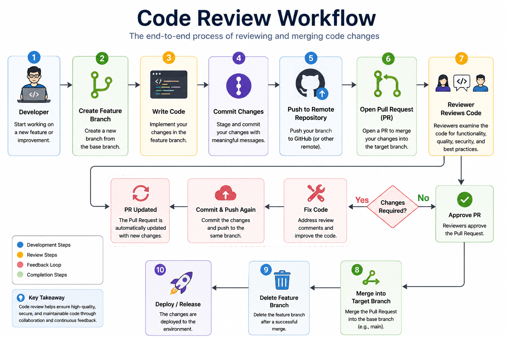
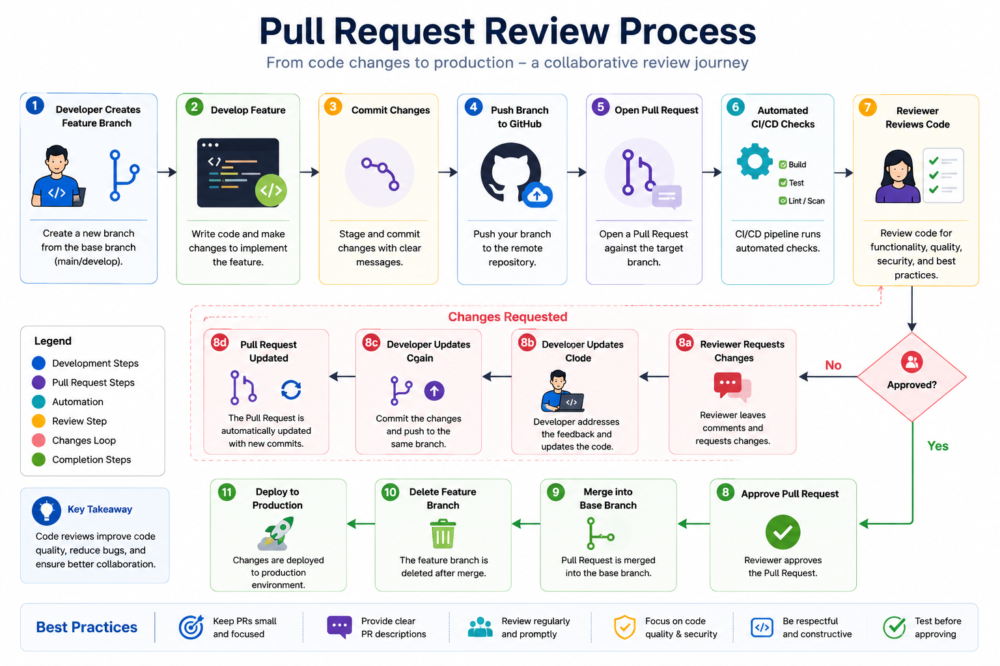
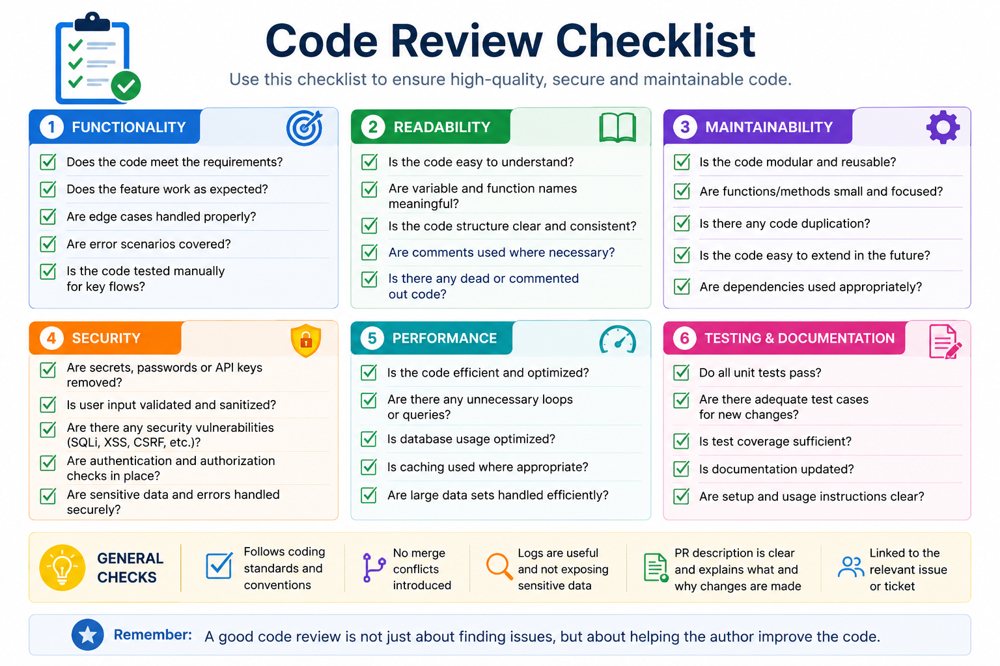
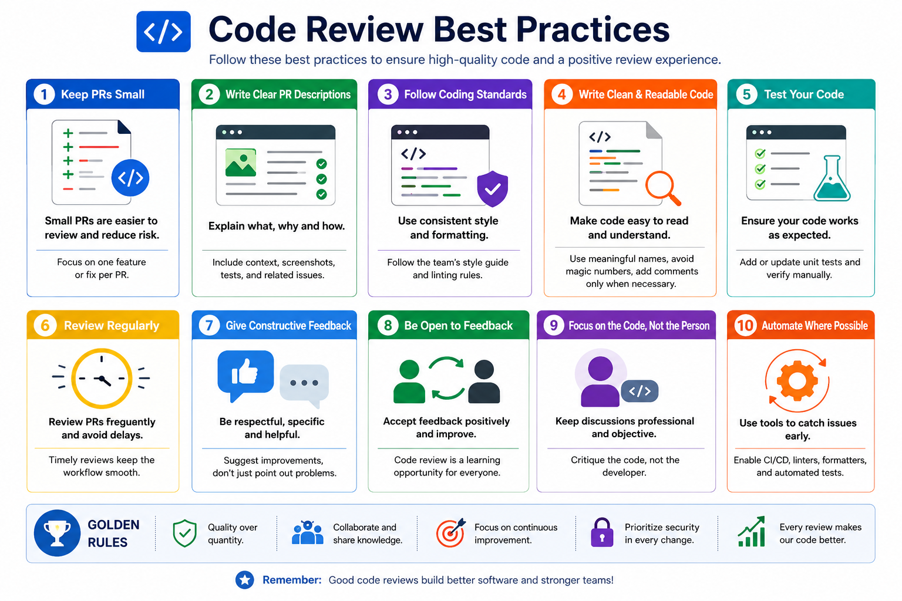

# 👨‍💻 Day 7 – Git Best Practices

# ➡️ 06 - Code Review

## 📖 Introduction

Writing code is only one part of software development. Ensuring that the code is **correct, secure, maintainable, and follows team standards** is equally important.

**Code Review** is the process where one or more developers examine another developer's code before it is merged into the main branch. It helps teams identify bugs, improve code quality, share knowledge, and maintain consistent coding standards.

Modern Git platforms such as **GitHub**, **GitLab**, and **Bitbucket** provide built-in Pull Request (PR) or Merge Request (MR) workflows that make code reviews efficient and collaborative.

---



---

## 🎯 Learning Objectives

By the end of this chapter, you will understand:

- What Code Review is
- Why Code Reviews are important
- Code Review lifecycle
- Pull Request review workflow
- Review checklist
- Common review comments
- Best practices
- Mistakes to avoid
- Interview questions

---

# What is Code Review?

Code Review is the practice of inspecting source code written by another developer before it is merged into the project's main codebase.

It ensures that:

- Code works correctly
- Bugs are detected early
- Coding standards are followed
- Security issues are minimized
- Performance problems are identified
- Knowledge is shared among team members

Instead of directly merging code into the production branch, developers create a Pull Request for teammates to review.

---

# Why Code Reviews Matter

Code reviews provide numerous benefits:

✅ Improves code quality

✅ Reduces bugs

✅ Detects security vulnerabilities

✅ Improves maintainability

✅ Encourages knowledge sharing

✅ Maintains coding standards

✅ Reduces technical debt

✅ Improves team collaboration

---

# Typical Development Workflow

```text
Developer
      │
      ▼
Create Feature Branch
      │
      ▼
Write Code
      │
      ▼
Commit Changes
      │
      ▼
Push Branch
      │
      ▼
Open Pull Request
      │
      ▼
Reviewer Reviews Code
      │
      ▼
Changes Requested?
   │           │
 Yes          No
 │             │
 ▼             ▼
Fix Code     Approve PR
 │             │
 └──────► Merge
```

---



---

# Code Review Lifecycle

## Step 1 — Create Feature Branch

```bash
git checkout -b feature/login
```

---

## Step 2 — Write Code

Implement your feature.

Example:

- Login page
- Authentication
- Password reset

---

## Step 3 — Commit Changes

```bash
git add .
git commit -m "Add login authentication"
```

---

## Step 4 — Push Branch

```bash
git push origin feature/login
```

---

## Step 5 — Open Pull Request

Example:

```
feature/login
      ↓
main
```

Include:

- Description
- Screenshots
- Testing steps
- Related Issue

---

## Step 6 — Reviewer Reviews

The reviewer checks:

- Functionality
- Logic
- Readability
- Security
- Performance
- Tests

---

## Step 7 — Address Feedback

Example review comment:

> Variable name is unclear.

Update:

```python
x = getData()
```

to

```python
user_data = getData()
```

Commit changes:

```bash
git add .
git commit -m "Address review comments"
git push
```

The Pull Request updates automatically.

---

## Step 8 — Approval

Once reviewers approve:

```
✔ Approved
```

The Pull Request can now be merged.

---

# Pull Request Best Practices

A good Pull Request should include:

- Clear title
- Meaningful description
- Linked issue
- Screenshots (if UI changes)
- Testing instructions
- Small focused changes

Good Example

```
Add JWT Authentication

Summary
--------
Implemented JWT login.

Changes
--------
- Added JWT middleware
- Updated login endpoint
- Added unit tests

Testing
--------
✔ Login
✔ Logout
✔ Token Refresh
```

---

# Code Review Checklist

Before approving a Pull Request, verify:

## Functionality

- Feature works correctly
- Requirements satisfied
- Edge cases handled

---

## Readability

- Clean code
- Proper naming
- Comments only where necessary

---

## Maintainability

- Modular design
- Reusable code
- Easy to understand

---

## Security

Check for:

- Hardcoded passwords
- API keys
- SQL Injection
- XSS
- Input validation

---

## Performance

Look for:

- Slow loops
- Duplicate queries
- Large memory usage
- Inefficient algorithms

---

## Testing

Ensure:

- Unit tests pass
- Integration tests pass
- Manual testing completed

---



---

# Common Code Review Comments

Instead of saying:

❌

```
Bad code
```

Say:

✅

```
Can this method be simplified?
```

---

❌

```
Wrong
```

✅

```
Could we rename this variable for better readability?
```

---

❌

```
Doesn't work
```

✅

```
This edge case appears to fail when input is empty.
```

Constructive feedback leads to better collaboration.

---

# Things to Review Carefully

## Naming

Bad

```python
a = 5
```

Good

```python
retry_count = 5
```

---

## Duplicate Code

Avoid repeating logic.

Create reusable functions instead.

---

## Error Handling

Bad

```python
open(file)
```

Good

```python
try:
    open(file)
except Exception:
    ...
```

---

## Logging

Avoid:

```python
print(data)
```

Use proper logging:

```python
logger.info("User logged in")
```

---

## Secrets

Never commit:

```
AWS Keys

Passwords

API Tokens

Private Keys
```

Use:

- Environment Variables
- AWS Secrets Manager
- HashiCorp Vault

---

# Common Code Review Mistakes

❌ Reviewing huge Pull Requests

❌ Personal criticism

❌ Ignoring security

❌ Missing edge cases

❌ Approving without testing

❌ Focusing only on style

❌ Ignoring documentation

---

# Code Review Best Practices

✔ Keep PRs small

✔ Review regularly

✔ Automate formatting

✔ Automate testing

✔ Ask questions politely

✔ Explain suggestions

✔ Test before approval

✔ Encourage discussions

✔ Review security first

✔ Keep documentation updated

---



---

# Example GitHub Review Workflow

Developer

```
Create Branch
```

↓

```
Write Code
```

↓

```
Commit
```

↓

```
Push Branch
```

↓

```
Open Pull Request
```

↓

Reviewer

```
Review Code
```

↓

```
Approve
```

↓

Maintainer

```
Merge Pull Request
```

↓

```
Deploy
```

---

# Advantages of Code Reviews

- Better code quality
- Reduced production bugs
- Improved security
- Better collaboration
- Faster onboarding
- Knowledge sharing
- Consistent coding standards
- Easier maintenance

---

# Real-World Scenario

Imagine two developers working on the same project.

Developer A writes a login feature.

During review, Developer B notices:

- Password stored in plain text
- Missing input validation
- Duplicate logic
- No unit tests

Without code review, these issues could reach production.

After review, the code becomes:

- Secure
- Tested
- Optimized
- Easier to maintain

---

# Interview Questions

### 1. What is Code Review?

Code Review is the process of examining code before merging it into the main branch to improve quality and detect issues.

---

### 2. Why is Code Review important?

It improves quality, reduces bugs, enhances security, and promotes collaboration.

---

### 3. What should be reviewed?

- Logic
- Readability
- Security
- Performance
- Testing
- Documentation

---

### 4. What is a Pull Request?

A Pull Request is a request to merge code changes from one branch into another after review.

---

### 5. What are common Code Review tools?

- GitHub Pull Requests
- GitLab Merge Requests
- Bitbucket Pull Requests
- Gerrit

---

# Key Takeaways

- Code Review improves software quality.
- Pull Requests enable collaborative development.
- Focus on functionality, readability, security, and testing.
- Provide constructive and respectful feedback.
- Keep Pull Requests small and easy to review.
- Automate testing and formatting wherever possible.
