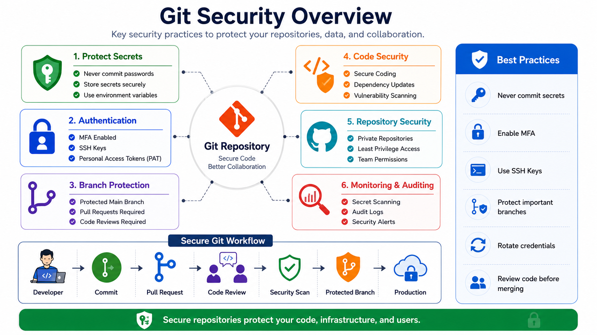
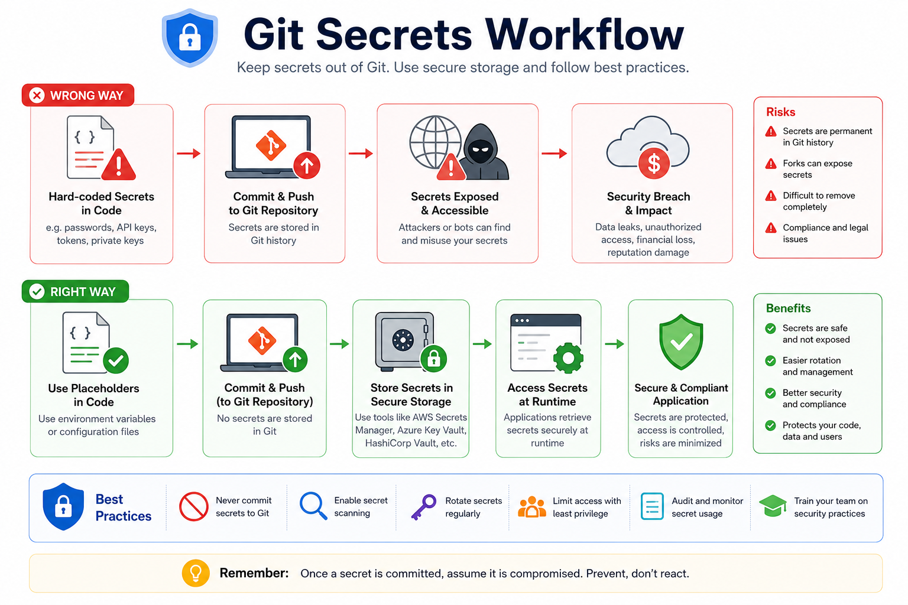
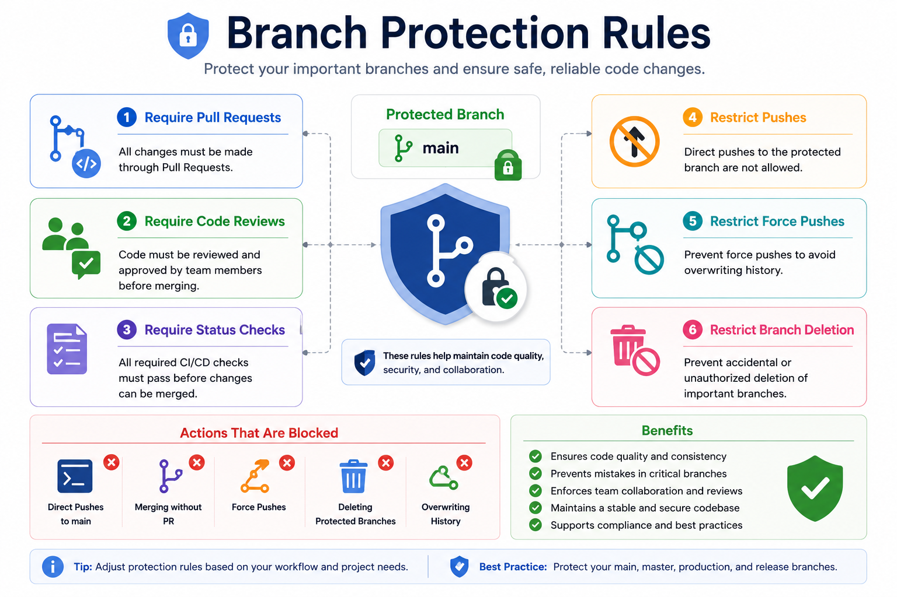
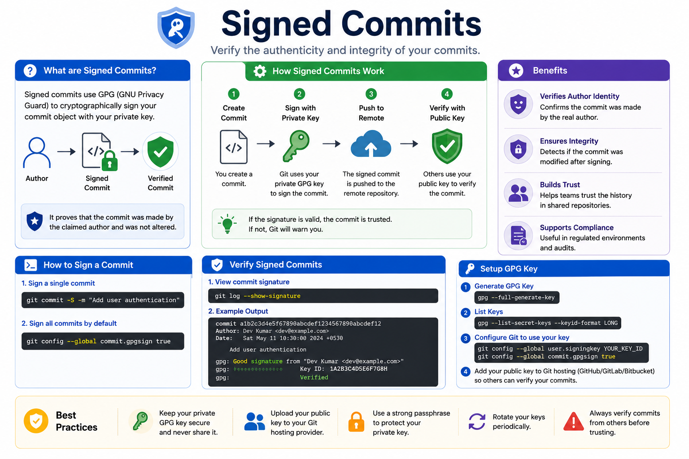
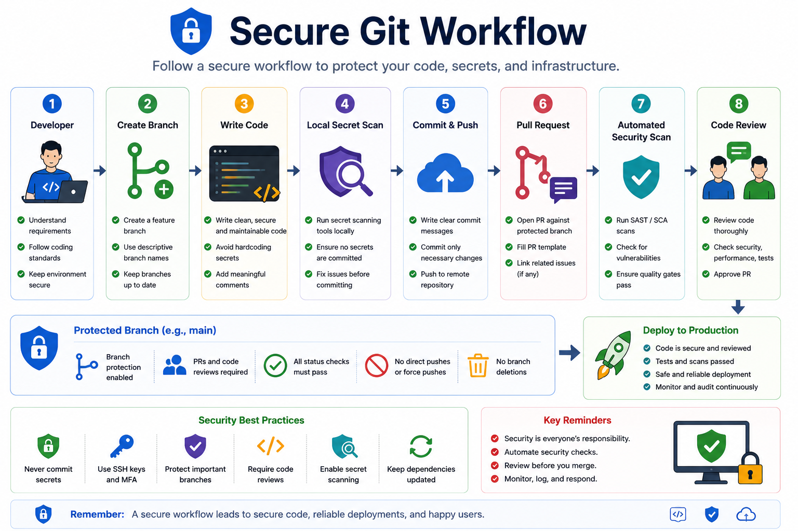

# 🔒 Day 7 – Git Best Practices

# ➡️ 07 - Security Best Practices

## 📖 Introduction

Git is one of the most widely used version control systems, but it can also become a source of security risks if not used properly. Accidentally committing passwords, API keys, SSH keys, or confidential files can expose sensitive information and lead to severe security incidents.

Following Git security best practices helps protect your source code, credentials, infrastructure, and development workflow.

This guide covers essential Git security concepts, common mistakes, and industry best practices to help you build secure repositories and development processes.

---



---

# 🎯 Learning Objectives

After completing this chapter, you will understand:

- Why Git security is important
- Common security risks
- Protecting secrets
- Using .gitignore effectively
- Branch protection
- Signed commits
- Secure authentication
- Secret scanning
- Secure Git workflows
- Industry best practices

---

# Why Git Security Matters

A Git repository may contain:

- Source code
- Infrastructure configurations
- CI/CD pipelines
- Docker files
- Kubernetes manifests
- Cloud deployment scripts
- Application secrets

If these are exposed publicly, attackers can gain access to systems and sensitive data.

---

# Common Git Security Risks

## Accidentally Committing Secrets

Never commit:

❌ AWS Access Keys

❌ Azure Credentials

❌ Google Cloud Keys

❌ Database Passwords

❌ API Tokens

❌ SSH Private Keys

❌ SSL Certificates

❌ Environment Files

---

## Public Repository Exposure

A mistakenly public repository can expose:

- Internal source code
- Business logic
- Customer information
- Infrastructure details

Always verify repository visibility.

---

## Weak Authentication

Avoid:

- Shared accounts
- Weak passwords
- Password-only authentication

Use:

- Multi-Factor Authentication (MFA)
- SSH Keys
- Personal Access Tokens (PAT)

---



---

# Protect Sensitive Files Using .gitignore

A properly configured `.gitignore` prevents unnecessary or sensitive files from being committed.

Example:

```gitignore
# Environment variables
.env

# AWS credentials
.aws/

# SSH Keys
*.pem
*.key

# IDE files
.vscode/

# Logs
*.log

# Node modules
node_modules/

# Python cache
__pycache__/
```

> Note: `.gitignore` only prevents new files from being tracked. It does not remove files already committed.

---

# Never Store Secrets in Git

Bad Example

```text
AWS_ACCESS_KEY=AKIAxxxxxxxxxxxxx
AWS_SECRET_KEY=xxxxxxxxxxxxxxxx
```

Good Example

```text
AWS_ACCESS_KEY=${AWS_ACCESS_KEY}
```

Store secrets securely using:

- Environment Variables
- AWS Secrets Manager
- Azure Key Vault
- HashiCorp Vault

---

# Remove Sensitive Data from Git History

If a secret has already been committed:

Immediately:

- Rotate the secret
- Revoke compromised credentials
- Remove it from Git history
- Notify the security team (if applicable)

Useful tools:

- git filter-repo
- BFG Repo Cleaner

---

# Enable Multi-Factor Authentication (MFA)

Always enable MFA for:

- GitHub
- GitLab
- Bitbucket

Benefits:

- Prevents unauthorized access
- Protects stolen passwords
- Adds an extra authentication layer

---

# Use SSH Keys Instead of Passwords

Generate SSH Key:

```bash
ssh-keygen -t ed25519 -C "your_email@example.com"
```

Add the public key to your Git hosting provider.

Verify connection:

```bash
ssh -T git@github.com
```

Advantages:

- More secure
- Faster authentication
- Passwordless access

---

# Use Personal Access Tokens (PAT)

GitHub no longer supports account passwords for Git operations.

Instead, use:

- Fine-grained Personal Access Tokens
- Least required permissions
- Expiration dates

---

# Protect Important Branches

Protect:

- main
- master
- production
- release

Recommended Rules:

- Require Pull Requests
- Require Code Reviews
- Require Passing CI Checks
- Restrict Force Pushes
- Restrict Branch Deletion

---



---

# Signed Commits

Signed commits verify the identity of the author.

Benefits:

- Prevent impersonation
- Verify commit authenticity
- Improve repository trust

Example:

```bash
git commit -S -m "Add login feature"
```

Verify:

```bash
git log --show-signature
```

---



---

# Enable Secret Scanning

Modern Git platforms automatically detect:

- AWS Keys
- Azure Keys
- GitHub Tokens
- Slack Tokens
- Stripe Keys
- API Keys

If detected:

- Revoke immediately
- Rotate credentials
- Remove from repository

---

# Secure Pull Requests

Before approving:

✔ No secrets

✔ No credentials

✔ No private URLs

✔ Secure dependencies

✔ No debug code

✔ Documentation updated

---

# Keep Dependencies Updated

Use:

- Dependabot
- Renovate

Benefits:

- Security patches
- Vulnerability alerts
- Automatic updates

---

# Secure Git Workflow

Developer

↓

Create Branch

↓

Write Code

↓

Local Secret Scan

↓

Commit

↓

Push

↓

Pull Request

↓

Automated Security Scan

↓

Code Review

↓

Merge

↓

Deploy

---



---

# Security Best Practices

✅ Never commit secrets

✅ Use `.gitignore`

✅ Enable MFA

✅ Use SSH Keys

✅ Use Personal Access Tokens

✅ Protect important branches

✅ Require Pull Requests

✅ Enable Code Reviews

✅ Enable Secret Scanning

✅ Rotate credentials regularly

✅ Keep dependencies updated

✅ Use Signed Commits

---

# Common Mistakes

❌ Committing `.env`

❌ Sharing Personal Access Tokens

❌ Disabling MFA

❌ Force pushing production branches

❌ Using admin accounts daily

❌ Ignoring security warnings

❌ Public repositories containing secrets

---

# Real-World Scenario

A developer accidentally commits an AWS Access Key to a public GitHub repository.

Within minutes:

- Bots detect the exposed key
- Attackers attempt unauthorized access
- AWS resources are abused
- Unexpected cloud charges occur

How to respond:

1. Revoke the key immediately.
2. Generate a new key.
3. Remove the key from Git history.
4. Review CloudTrail logs.
5. Enable secret scanning to prevent future incidents.

---

# Interview Questions

### 1. Why should secrets never be committed to Git?

Git history is permanent, making exposed secrets easy to retrieve even after deletion.

---

### 2. What is `.gitignore`?

A file that prevents specified files and directories from being tracked by Git.

---

### 3. What is Branch Protection?

A repository feature that prevents unsafe changes to important branches by enforcing rules like pull requests, reviews, and status checks.

---

### 4. Why use Signed Commits?

To verify the authenticity and integrity of commits.

---

### 5. What should you do if a secret is accidentally committed?

- Revoke the secret
- Rotate credentials
- Remove it from Git history
- Audit access logs

---

# Key Takeaways

- Never store secrets in Git repositories.
- Protect repositories with MFA, SSH keys, and Personal Access Tokens.
- Use Branch Protection and Code Reviews for safer collaboration.
- Enable Secret Scanning and Signed Commits.
- Follow secure Git workflows to reduce security risks.
