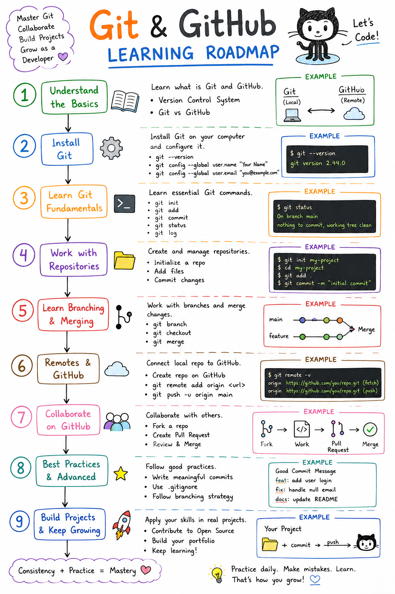

# 📘 Learn_Git

A complete Git & GitHub learning repository containing detailed notes, examples, diagrams, hands-on labs, interview questions, and best practices.


---

## 📌 About This Repository

This repository is designed to help beginners and professionals learn Git and GitHub from the ground up.

The content covers:

* Git Fundamentals
* Installation & Setup
* Basic and Advanced Commands
* Branching & Merging
* Remote Repositories
* Undo Operations
* Best Practices
* Hands-On Labs
* Interview Questions
* Cheat Sheets

---

## 📂 Repository Structure

```text
Learn_Git/
│
├── 00-Introduction/
├── 01-Installation/
├── 02-Basic-Commands/
├── 03-Branching/
├── 04-Remote-Repositories/
├── 05-Undo-Changes/
├── 06-Advanced-Git/
├── 07-Best-Practices/
├── 08-Hands-On-Labs/
├── 09-Interview-Questions/
├── cheat-sheet/
├── images/
├── resources/
└── README.md
```

---

## 🎯 Topics Covered

### 00 - Introduction

* What is Git?
* What is GitHub?
* Version Control System
* Benefits of Git

### 01 - Installation

* Install Git on Linux
* Install Git on Windows
* Install Git on macOS
* Verify Installation

### 02 - Basic Commands

```bash
git init
git clone
git status
git add
git commit
git log
git diff
```

### 03 - Branching

```bash
git branch
git checkout
git switch
git merge
git rebase
```

### 04 - Remote Repositories

```bash
git remote add origin
git push
git pull
git fetch
git clone
```

### 05 - Undo Changes

```bash
git restore
git reset
git revert
```

### 06 - Advanced Git

* Stashing
* Rebase
* Cherry Pick
* Squash Commits
* Tags

### 07 - Best Practices

* Meaningful Commit Messages
* Branch Naming Standards
* Pull Request Workflow
* Repository Organization

### 08 - Hands-On Labs

* Create Local Repository
* Create Feature Branch
* Merge Branches
* Resolve Merge Conflicts
* Push Code to GitHub

### 09 - Interview Questions

Common Git and GitHub interview questions with answers.

---

## 🚀 Quick Start

Clone the repository:

```bash
git clone https://github.com/newton9979/Learn_Git.git
```

Move into the project directory:

```bash
cd Learn_Git
```

Start learning from:

```text
00-Introduction
```

and continue sequentially.

---

## 📝 Most Frequently Used Git Commands

### Configure Git

```bash
git config --global user.name "Your Name"
git config --global user.email "your@email.com"
```

### Create Repository

```bash
git init
```

### Clone Repository

```bash
git clone <repository-url>
```

### Check Status

```bash
git status
```

### Add Changes

```bash
git add .
```

### Commit Changes

```bash
git commit -m "Initial Commit"
```

### Push Code

```bash
git push origin main
```

### Pull Latest Changes

```bash
git pull origin main
```

### Create Branch

```bash
git checkout -b feature-branch
```

### Merge Branch

```bash
git merge feature-branch
```

---

## 🎓 Who Is This Repository For?

* Beginners learning Git
* Students preparing for interviews
* DevOps Engineers
* Cloud Engineers
* Developers
* System Administrators

---

## 🤝 Contributing

Contributions, suggestions, and improvements are welcome.

Feel free to:

* Fork the repository
* Create a branch
* Submit a Pull Request

---

## ⭐ Support

If you find this repository helpful:

⭐ Star the repository

🔁 Share it with others

---

## 👨‍💻 Author

**Newton Babu Nandru**

GitHub: https://github.com/newton9979

---

### Happy Learning 🚀

Master Git, collaborate effectively, and build better software.

# 📘 Learn_Git

<p align="center">
  
</p>

A complete Git & GitHub learning repository containing detailed notes, examples, hands-on labs, interview questions, and best practices.
