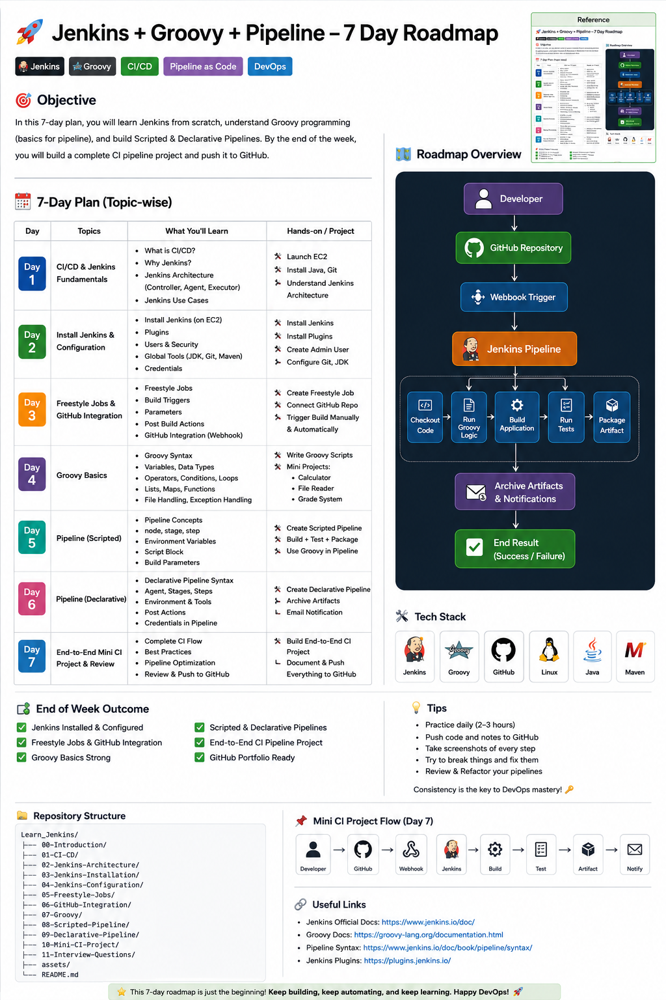

# 🚀 Jenkins + Groovy + Pipeline Fundamentals (7-Day Roadmap)

> **A complete beginner-to-intermediate roadmap to learn Jenkins, Groovy, Scripted Pipelines, Declarative Pipelines, and build your first CI Pipeline.**

<p align="center">
  
</p>

---

# 📖 Overview

This repository is designed for aspiring **DevOps Engineers**, **Cloud Engineers**, **Site Reliability Engineers (SREs)**, and anyone interested in learning modern **CI/CD** practices using **Jenkins**.

Unlike traditional tutorials that only cover Jenkins installation, this roadmap combines:

- ✅ Jenkins Fundamentals
- ✅ CI/CD Concepts
- ✅ GitHub Integration
- ✅ Groovy Programming
- ✅ Scripted Pipelines
- ✅ Declarative Pipelines
- ✅ Production Pipeline Best Practices
- ✅ Mini Projects
- ✅ End-to-End CI Project

By the end of this roadmap, you'll have a **GitHub-ready Jenkins learning repository** and the confidence to build production-style CI pipelines.

---

# 🎯 Learning Objectives

After completing this roadmap, you will be able to:

- Install and configure Jenkins
- Understand Jenkins Architecture
- Configure Jenkins Security
- Create Freestyle Jobs
- Integrate Jenkins with GitHub
- Understand Webhooks
- Write Groovy Scripts
- Develop Scripted Pipelines
- Build Declarative Pipelines
- Automate CI workflows
- Create Jenkinsfiles
- Build production-ready CI pipelines
- Publish your work to GitHub

---

# 🛣️ 7-Day Learning Roadmap

| Day | Topic | Outcome |
|------|--------|----------|
| Day 1 | CI/CD & Jenkins Fundamentals | Understand CI/CD and Jenkins Architecture |
| Day 2 | Jenkins Installation & Configuration | Install Jenkins and configure required tools |
| Day 3 | Freestyle Jobs & GitHub Integration | Build Freestyle Jobs and automate builds |
| Day 4 | Groovy Programming | Learn Groovy required for Jenkins Pipelines |
| Day 5 | Scripted Pipelines | Build CI Pipelines using Scripted Syntax |
| Day 6 | Declarative Pipelines | Build modern Jenkins Pipelines |
| Day 7 | End-to-End Mini CI Project | Complete a production-style CI workflow |

---

# 📅 Day 1 — CI/CD & Jenkins Fundamentals

## 📚 Topics

- What is CI?
- What is CD?
- DevOps Lifecycle
- Jenkins History
- Jenkins Features
- Jenkins Architecture
- Controller vs Agent
- Executors
- Workspace
- Plugins

## 🛠 Hands-on

- Launch AWS EC2
- Install Java
- Install Git

## 📄 Documentation

```
01-Introduction.md
02-What-is-CI-CD.md
03-Jenkins-Architecture.md
```

---

# 📅 Day 2 — Jenkins Installation & Configuration

## 📚 Topics

- Install Jenkins
- Jenkins Plugins
- Security
- Users
- Credentials
- Global Tool Configuration
- Git Configuration
- JDK
- Maven

## 🛠 Hands-on

- Install Jenkins
- Configure Java
- Configure Git
- Configure Maven
- Create Admin User

## 📄 Documentation

```
04-Jenkins-Installation.md
05-Jenkins-Configuration.md
```

---

# 📅 Day 3 — Freestyle Jobs & GitHub Integration

## 📚 Topics

- Freestyle Jobs
- Build Triggers
- Parameters
- Console Output
- Build Artifacts
- Poll SCM
- GitHub Webhooks

## 🛠 Hands-on

```
GitHub
    │
    ▼
Jenkins
    │
    ▼
Clone Repository
    │
    ▼
Execute Shell Script
    │
    ▼
Build Success
```

## 📄 Documentation

```
06-Freestyle-Jobs.md
07-GitHub-Integration.md
```

---

# 📅 Day 4 — Groovy Programming

## 📚 Topics

- Variables
- Data Types
- Operators
- Conditions
- Loops
- Lists
- Maps
- Methods
- Closures
- File Handling
- Exception Handling

## 🛠 Hands-on

Build Groovy scripts for:

- Hello World
- Variables
- Loops
- Functions
- Read File
- Write File

## 💼 Mini Projects

- Employee Salary Calculator
- Student Grade System
- File Reader

## 📄 Documentation

```
08-Groovy-Basics.md
09-Groovy-Examples.md
```

---

# 📅 Day 5 — Scripted Pipeline

## 📚 Topics

- Pipeline
- Node
- Stage
- Step
- Environment
- Script Block
- Build Parameters

## 🛠 Hands-on

Build your first Scripted Pipeline.

```
GitHub
    │
    ▼
Checkout
    │
    ▼
Compile
    │
    ▼
Test
    │
    ▼
Package
    │
    ▼
Success
```

## 💼 Mini Projects

- Java Build Pipeline
- Python Build Pipeline

## 📄 Documentation

```
10-Scripted-Pipeline.md
```

---

# 📅 Day 6 — Declarative Pipeline

## 📚 Topics

- Pipeline Syntax
- Agent
- Stages
- Environment
- Parameters
- Options
- Credentials
- Post Actions

## 🛠 Hands-on

Create a Declarative Pipeline.

```
Checkout
      │
      ▼
Build
      │
      ▼
Test
      │
      ▼
Package
      │
      ▼
Deploy
```

## 💼 Mini Projects

- Java Pipeline
- Python Pipeline
- Docker Pipeline

## 📄 Documentation

```
11-Declarative-Pipeline.md
```

---

# 📅 Day 7 — End-to-End Mini CI Project

## 🎯 Project Flow

```
Developer
      │
      ▼
GitHub Repository
      │
      ▼
Webhook
      │
      ▼
Jenkins
      │
      ▼
Checkout Code
      │
      ▼
Run Groovy Logic
      │
      ▼
Build Application
      │
      ▼
Run Unit Tests
      │
      ▼
Archive Artifacts
      │
      ▼
Email Notification
```

---

# 🧰 Technologies Used

- Jenkins
- Git
- GitHub
- GitHub Webhooks
- Groovy
- Java
- Maven
- Shell Scripting
- Python
- Linux

---

# 📂 Repository Structure

```text
Learn_Jenkins/
│
├── README.md
│
├── 00-Introduction/
├── 01-CI-CD/
├── 02-Jenkins-Architecture/
├── 03-Jenkins-Installation/
├── 04-Jenkins-Configuration/
├── 05-Freestyle-Jobs/
├── 06-GitHub-Integration/
├── 07-Groovy/
│   ├── Variables/
│   ├── Loops/
│   ├── Functions/
│   ├── Closures/
│   ├── Exception-Handling/
│   └── Mini-Projects/
│
├── 08-Scripted-Pipeline/
├── 09-Declarative-Pipeline/
├── 10-Mini-CI-Project/
│
├── assets/
│   └── jenkins-7-day-roadmap.png
│
└── interview-questions/
```

---

# 🎓 Portfolio Projects

Complete these projects to build a strong DevOps portfolio.

## ✅ Project 1

Hello Jenkins

- Install Jenkins
- Create Freestyle Job

---

## ✅ Project 2

Groovy Practice

- 20–30 Groovy Programs

---

## ✅ Project 3

Scripted Pipeline

- Jenkinsfile
- node{}
- stage{}
- loops
- conditions
- functions

---

## ✅ Project 4

Declarative Pipeline

- Build
- Test
- Archive
- Notifications

---

## ✅ Project 5

Docker CI Pipeline

- Build Docker Image
- Push Image
- Archive

---

## ✅ Project 6

Production AWS CI/CD Pipeline

- GitHub
- Jenkins
- Docker
- Terraform
- Amazon ECR
- Amazon EKS
- Kubernetes
- Helm

---

# 🎯 End of Week Outcome

By the end of this roadmap, you will have:

- ✅ Jenkins Installed & Configured
- ✅ GitHub Integration
- ✅ Freestyle Jobs
- ✅ Groovy Fundamentals
- ✅ Scripted Pipelines
- ✅ Declarative Pipelines
- ✅ Jenkinsfile Experience
- ✅ Complete Mini CI Project
- ✅ GitHub Portfolio Ready

---

# 🚀 What's Next?

Continue with the advanced learning roadmap:

1. Jenkins Shared Libraries
2. Docker Integration
3. Jenkins Agents
4. Jenkins on AWS
5. Terraform Integration
6. Amazon ECR
7. Kubernetes (EKS)
8. Helm
9. ArgoCD
10. GitOps
11. DevSecOps (SonarQube, Trivy, Snyk)
12. Production-Grade AWS CI/CD Pipeline

---

## ⭐ If you find this repository helpful, don't forget to Star ⭐ the repository and follow the learning journey!
